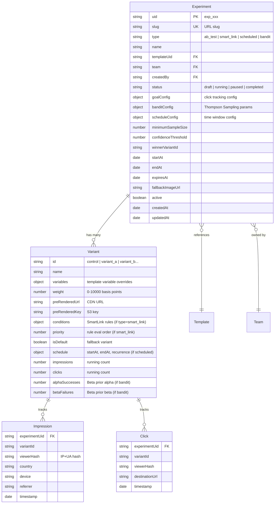

# A/B Test Images, Smart Links, Expiring/Scheduled Images & Variant Auto-Optimization

## Overview

Add four interconnected features to Pictify.io that transform static image generation into a dynamic, intelligent image delivery platform. All four features share a unified routing layer (`/s/:slug.:format`) that resolves a single URL to different content based on test assignment, contextual rules, time schedules, or bandit optimization.

**Key architectural insight:** All four features are variations of "one URL, many possible images." They share: a slug-based public URL, variant resolution logic, pre-rendered CDN images, impression/click tracking, and Redis-cached configs. Building them on a shared foundation maximizes code reuse.

## Problem Statement / Motivation

Currently, Pictify generates static images. Once rendered, an image never changes. Users who want to:

- Test which banner converts better → must manually create two images, split traffic themselves
- Show different images to mobile vs desktop → must create separate URLs and handle routing
- Run a limited-time promotion → must remember to manually swap images
- Optimize image performance → must manually analyze and decide

These are table-stakes features for marketing platforms (Optimizely charges $36k/yr, VWO $199/mo). Building them into Pictify creates a competitive moat, drives render volume (plan upgrades), and justifies premium pricing.

## Proposed Solution

### Unified Architecture: Smart URL Router

All four features resolve through a single public endpoint:

```
GET /s/:slug.:format
    |
    ├── ABTest?       → deterministic hash (A/B) or Thompson Sampling (bandit)
    ├── SmartLink?    → evaluate rules against request context
    ├── Schedule?     → check time windows
    └── fallback      → serve default variant
    |
    v
  Resolve → templateUid + variables + pre-rendered URL
    |
    ├── Pre-rendered? → 302 redirect to CDN URL
    └── Not cached?   → render on-the-fly, cache, serve
```

**Serving flow:** The `/s/:slug` endpoint is `Cache-Control: private, no-cache` (routing decisions must happen at origin). Each resolved variant has its own deterministic S3 key (`s/{slug}/{variantId}.{format}`) with long TTL (`max-age=31536000, immutable`). The 302 redirect pattern means CloudFront caches the actual images efficiently while routing stays dynamic.

### Data Model: ERD



**Design decision: Single `Experiment` model instead of separate ABTest/SmartLink/Schedule models.** The `type` field distinguishes behavior. This avoids code duplication across 4 near-identical models and simplifies the router (one lookup instead of 3 fallback queries).

## Technical Approach

### Phase 1: Foundation & A/B Testing (Priority 1)

The foundation that all other features build on.

#### 1.1 Backend: Experiment Model

**New file:** `/Users/suyashthakur/html-to-gif/models/Experiment.js`

```javascript
const experimentSchema = new mongoose.Schema({
	uid: { type: String, unique: true },
	active: { type: Boolean, default: true },
	slug: { type: String, unique: true, sparse: true, index: true },
	type: {
		type: String,
		enum: ['ab_test', 'smart_link', 'scheduled', 'bandit'],
		required: true
	},
	name: { type: String, required: true, maxlength: 255 },
	status: {
		type: String,
		enum: ['draft', 'running', 'paused', 'completed', 'archived'],
		default: 'draft'
	},
	templateUid: { type: String, ref: 'Template', required: true, index: true },
	team: { type: String, ref: 'Team', index: true },
	createdBy: { type: String, ref: 'User', required: true },

	// Variants (embedded for atomic reads on hot path)
	variants: [
		{
			id: { type: String, required: true },
			name: { type: String },
			variables: { type: mongoose.Schema.Types.Mixed, default: {} },
			weight: { type: Number, default: 5000 }, // basis points (50%)
			preRenderedUrl: { type: String },
			preRenderedKey: { type: String },
			isDefault: { type: Boolean, default: false },

			// Smart Link conditions (only for type=smart_link)
			conditions: {
				operator: { type: String, enum: ['AND', 'OR'], default: 'AND' },
				rules: [
					{
						property: { type: String },
						operator: { type: String },
						value: { type: mongoose.Schema.Types.Mixed },
						paramName: { type: String }
					}
				]
			},
			priority: { type: Number, default: 0 },

			// Schedule (only for type=scheduled)
			schedule: {
				startAt: { type: Date },
				endAt: { type: Date },
				recurrence: {
					type: { type: String, enum: ['none', 'daily', 'weekly', 'cron'] },
					cronExpression: { type: String },
					timezone: { type: String, default: 'UTC' }
				}
			},

			// Stats (updated by periodic BullMQ job from Redis)
			impressions: { type: Number, default: 0 },
			clicks: { type: Number, default: 0 },
			alphaSuccesses: { type: Number, default: 1 },
			betaFailures: { type: Number, default: 1 }
		}
	],

	// Goal tracking
	goalConfig: {
		type: {
			type: String,
			enum: ['impressions_only', 'click_through'],
			default: 'impressions_only'
		},
		destinationUrl: { type: String }
	},

	// Bandit config (only for type=bandit)
	banditConfig: {
		algorithm: {
			type: String,
			enum: ['thompson_sampling', 'epsilon_greedy'],
			default: 'thompson_sampling'
		},
		warmupImpressions: { type: Number, default: 50 },
		recomputeIntervalMinutes: { type: Number, default: 15 }
	},

	// Statistical config
	minimumSampleSize: { type: Number, default: 100 },
	confidenceThreshold: { type: Number, default: 0.95 },
	minimumRunDays: { type: Number, default: 7 },

	// Winner
	winnerVariantId: { type: String },
	winnerDeclaredAt: { type: Date },

	// Scheduling
	startAt: { type: Date },
	endAt: { type: Date },
	expiresAt: { type: Date, index: true },
	fallbackImageUrl: { type: String },

	// Output config
	outputConfig: {
		format: { type: String, enum: ['png', 'jpeg', 'webp'], default: 'png' },
		quality: { type: Number, default: 90 }
	},

	createdAt: { type: Date, default: Date.now },
	updatedAt: { type: Date, default: Date.now }
});
```

**Indexes:**

```javascript
experimentSchema.index({ slug: 1, active: 1 });
experimentSchema.index({ team: 1, active: 1, type: 1 });
experimentSchema.index({ team: 1, templateUid: 1, active: 1 });
experimentSchema.index({ status: 1, type: 1 }); // for scheduler queries
experimentSchema.index({ expiresAt: 1 }, { sparse: true }); // for expiration checks
```

Follow existing patterns: `uid` prefix `exp_`, soft-delete with `filterActive`, `pre('save')` for uid generation.

#### 1.2 Backend: Smart URL Router

**New file:** `/Users/suyashthakur/html-to-gif/routes/experiment-render.js`
**autoPrefix:** `/s`

Public endpoint (no auth, like `/b/:bindingId.:format` in `binding-render.js`).

```
GET /s/:slug.:format       → serve variant image (302 redirect or on-the-fly render)
GET /s/:slug/click         → log click, redirect to destination URL
GET /s/:slug/pixel.gif     → 1x1 tracking pixel for impression counting
```

**Implementation pattern:** Mirror `binding-render.js` architecture:

- Redis LRU cache for experiment config (60s TTL)
- Request coalescing via `inflightRequests` map
- Quota check (team-first, user-fallback)
- 302 redirect to pre-rendered CDN URL when available
- On-the-fly render as fallback
- Fire-and-forget S3 upload with deterministic key

**Variant assignment (A/B mode):**

```javascript
function assignVariant(viewerKey, experiment) {
	const hash = crypto.createHash('md5').update(`${experiment.uid}:${viewerKey}`).digest('hex');
	const bucket = parseInt(hash.substring(0, 8), 16) % 10000;
	let cumulative = 0;
	for (const variant of experiment.variants) {
		cumulative += variant.weight;
		if (bucket < cumulative) return variant;
	}
	return experiment.variants[experiment.variants.length - 1];
}
```

**Viewer key:** `crypto.createHash('sha256').update(ip + userAgent).digest('hex').substring(0, 16)` — deterministic for `` embeds (no cookies needed).

**Impression tracking:** Async Redis `HINCRBY` on hot path, NOT MongoDB. BullMQ job syncs to MongoDB every 15 minutes.

#### 1.3 Backend: Experiment CRUD Routes

**New file:** `/Users/suyashthakur/html-to-gif/routes/experiments.js`
**autoPrefix:** `/experiments`

Cookie-authenticated, team-scoped (same pattern as `routes/bindings.js`).

```
POST   /                  → create experiment
GET    /                  → list experiments (filtered by type, paginated)
GET    /:uid              → get experiment detail with analytics
PUT    /:uid              → update experiment
DELETE /:uid              → soft delete
POST   /:uid/start        → set status=running, pre-render variants
POST   /:uid/pause        → set status=paused
POST   /:uid/complete     → declare winner, redirect 100% traffic
POST   /:uid/duplicate    → clone experiment with new slug
GET    /:uid/analytics     → detailed analytics (impressions, clicks, CTR per variant)
```

**Pre-render on start:** When experiment transitions to `running`, queue a BullMQ job that renders each variant and uploads to S3 with deterministic keys. This uses the existing `renderTemplateWithVariables()` pipeline. Each variant render counts as 1 credit against quota.

#### 1.4 Backend: Analytics Pipeline

**Impression/Click tracking architecture:**

```
Hot path (per request):
  Redis HINCRBY exp:{uid}:var:{id}:impressions 1
  Redis HINCRBY exp:{uid}:var:{id}:clicks 1 (if click endpoint)
  Redis LPUSH exp:{uid}:impressions:{date} {json} (capped list, 1000 entries)

Cold path (BullMQ repeatable job, every 15 min):
  Read Redis counters → update Experiment.variants[].impressions/clicks in MongoDB
  For bandit type: recompute Thompson Sampling weights
  Check significance → auto-declare winner if threshold met
```

**New file:** `/Users/suyashthakur/html-to-gif/service/experiment-analytics.js`

#### 1.5 Backend: Plan Gating

**Modify:** `/Users/suyashthakur/html-to-gif/config/planLimits.js`

Add feature limits:

```javascript
const EXPERIMENT_LIMITS = {
	starter: { ab_test: 0, smart_link: 0, scheduled: 0, bandit: 0, maxVariants: 0 },
	basic: { ab_test: 1, smart_link: 0, scheduled: 0, bandit: 0, maxVariants: 2 },
	standard: { ab_test: 5, smart_link: 3, scheduled: 3, bandit: 0, maxVariants: 5 },
	professional: { ab_test: 5, smart_link: 3, scheduled: 3, bandit: 0, maxVariants: 5 },
	business: { ab_test: 20, smart_link: 10, scheduled: 10, bandit: 5, maxVariants: 10 },
	'business-plus': { ab_test: 50, smart_link: 25, scheduled: 25, bandit: 10, maxVariants: 10 },
	premium: { ab_test: null, smart_link: null, scheduled: null, bandit: null, maxVariants: 10 },
	enterprise: { ab_test: null, smart_link: null, scheduled: null, bandit: null, maxVariants: 10 },
	ultimate: { ab_test: null, smart_link: null, scheduled: null, bandit: null, maxVariants: 10 }
};
```

`null` = unlimited. Starter gets 0 (upgrade prompt). Basic gets 1 A/B test to taste the feature.

#### 1.6 Frontend: Experiment Dashboard

**New route:** `/dashboard/experiments/`

- List all experiments with status, type, impressions, winner
- Filter by type (A/B Test, Smart Link, Scheduled, Bandit)
- Create new experiment flow

**New route:** `/dashboard/experiments/[uid]/`

- Experiment detail: config, variants, analytics
- Live chart: impressions/clicks per variant over time
- Statistical significance indicator (for A/B mode)
- Traffic allocation visualization (for bandit mode)
- Actions: start, pause, complete, duplicate

**New route:** `/dashboard/template/[uid]/experiments/`

- Experiments linked to this template
- Quick create from template context

**New components:**

```
src/lib/components/experiments/
  ExperimentList.svelte
  ExperimentDetail.svelte
  ExperimentCreate.svelte
  VariantEditor.svelte
  AnalyticsChart.svelte
  SignificanceIndicator.svelte
  TrafficSplitVisualizer.svelte
```

**New store:** `src/store/experiment.store.js`
**New API client:** `src/api/experiments.js`

#### 1.7 Frontend: A/B Test Creation Flow

1. User selects template → clicks "Create A/B Test"
2. Variant editor: shows template preview with variable inputs for each variant
3. Configure traffic split (slider, default 50/50)
4. Set goal: "Impressions Only" or "Click-Through" (with destination URL)
5. Set minimum run time (default 7 days)
6. Review → Start test
7. System pre-renders all variants, generates shareable URL
8. User gets: `https://api.pictify.io/s/{slug}.png` to embed anywhere

### Phase 2: Smart Links

Builds on the Experiment model with `type: 'smart_link'`.

#### 2.1 Backend: Smart Link Rule Engine

**New file:** `/Users/suyashthakur/html-to-gif/service/smart-link-engine.js`

```javascript
function evaluateRules(experiment, requestContext) {
	const sortedVariants = experiment.variants
		.filter((v) => !v.isDefault && v.conditions?.rules?.length > 0)
		.sort((a, b) => a.priority - b.priority);

	for (const variant of sortedVariants) {
		if (evaluateConditionGroup(variant.conditions, requestContext)) {
			return variant;
		}
	}
	return experiment.variants.find((v) => v.isDefault) || experiment.variants[0];
}
```

**Supported conditions:**
| Property | Operators | Values |
|----------|-----------|--------|
| `device.type` | eq, in | `mobile`, `desktop`, `tablet` |
| `device.os` | eq, in | `iOS`, `Android`, `Windows`, `macOS`, `Linux` |
| `geo.country` | eq, in, not_in | ISO 3166-1 alpha-2 codes |
| `geo.continent` | eq, in | `NA`, `EU`, `AS`, `AF`, `SA`, `OC`, `AN` |
| `time.hour` | eq, gt, lt, gte, lte | 0-23 (UTC) |
| `time.dayOfWeek` | eq, in | 0-6 (Sunday-Saturday) |
| `browser.language` | eq, in | `en`, `fr`, `de`, etc. |
| `url.param` | eq, contains | query param value (paramName required) |
| `referrer.domain` | eq, contains | referring domain |

#### 2.2 Backend: Request Context Extractor

**New file:** `/Users/suyashthakur/html-to-gif/service/request-context.js`

Extracts viewer context from HTTP request. Uses:

- CloudFront headers (`CloudFront-Is-Mobile-Viewer`, `CloudFront-Viewer-Country`) when available
- `geoip-lite` package as fallback for geo
- User-Agent parsing for device/OS detection
- `Accept-Language` header for language
- `Referer` header for referrer domain

**CloudFront configuration needed:** Forward `CloudFront-Is-Mobile-Viewer`, `CloudFront-Is-Desktop-Viewer`, `CloudFront-Is-Tablet-Viewer`, `CloudFront-Viewer-Country` headers in the cache policy for `/s/*` behavior.

#### 2.3 Frontend: Smart Link Rule Builder

**New component:** `src/lib/components/experiments/RuleBuilder.svelte`

Visual rule builder UI:

- Add condition rows (property dropdown → operator dropdown → value input)
- AND/OR toggle per rule group
- Drag-to-reorder rules for priority
- Live preview: "If this request comes from [mobile] AND [US], show variant A"
- Test mode: simulate different contexts and see which variant resolves

### Phase 3: Expiring & Scheduled Images

Builds on the Experiment model with `type: 'scheduled'`.

#### 3.1 Backend: Schedule Resolver

Integrated into the smart URL router. When `experiment.type === 'scheduled'`:

```javascript
function resolveScheduledVariant(experiment) {
	const now = new Date();

	// Check hard expiry
	if (experiment.expiresAt && now > experiment.expiresAt) {
		return { expired: true, fallbackUrl: experiment.fallbackImageUrl };
	}

	// Find active time window
	const activeVariant = experiment.variants
		.filter((v) => v.schedule?.startAt && v.schedule.startAt <= now)
		.filter((v) => !v.schedule.endAt || v.schedule.endAt > now)
		.sort((a, b) => b.schedule.startAt - a.schedule.startAt)[0];

	return activeVariant || experiment.variants.find((v) => v.isDefault);
}
```

#### 3.2 Backend: Schedule Queue (BullMQ)

**New file:** `/Users/suyashthakur/html-to-gif/service/experiment-scheduler.js`

Jobs:

1. **Pre-render job:** Render variant images 5 minutes before their scheduled `startAt`. Delayed BullMQ job.
2. **Expiration check:** Repeatable job (every 5 min) finds experiments with `expiresAt < now + 5min` and updates status.
3. **Cache invalidation:** At each schedule transition, invalidate the CloudFront path `/s/{slug}*` (first 1000/month free).

Pattern: Follow `service/binding-refresh-queue.js` — repeatable BullMQ scheduler that polls for due experiments.

#### 3.3 CDN Strategy for Scheduled Content

**Routing URL** (`/s/:slug.:format`): `Cache-Control: private, no-cache` — always hits origin for schedule resolution.

**Variant image URLs** (resolved via 302): `Cache-Control: public, max-age=31536000, immutable` — each variant has a unique S3 key that never changes.

**On schedule transition:** The router automatically picks the new variant and 302s to its CDN URL. No invalidation needed for the variant images themselves — only the routing decision changes.

**For true expiration (content becomes inaccessible):** Optional CloudFront Signed URLs with built-in expiry. Simple to add as a premium feature.

#### 3.4 Frontend: Schedule Editor

**New component:** `src/lib/components/experiments/ScheduleEditor.svelte`

- Timeline visualization showing when each variant is active
- Date/time pickers for start/end per variant
- Expiration date picker (hard expiry)
- Fallback image upload or template render
- Recurrence options: daily, weekly, cron expression

### Phase 4: Variant Auto-Optimization (Bandit)

Builds on Phase 1's A/B testing with `type: 'bandit'`.

#### 4.1 Backend: Thompson Sampling Engine

**New file:** `/Users/suyashthakur/html-to-gif/service/bandit-engine.js`

```javascript
const { betaSample } = require('./statistics');

function thompsonSampleVariant(variants) {
	let best = null,
		bestSample = -1;
	for (const v of variants) {
		const sample = betaSample(v.alphaSuccesses || 1, v.betaFailures || 1);
		if (sample > bestSample) {
			bestSample = sample;
			best = v;
		}
	}
	return best;
}

function recomputeBanditWeights(variants) {
	const SIMULATIONS = 10000;
	const wins = Object.fromEntries(variants.map((v) => [v.id, 0]));

	for (let i = 0; i < SIMULATIONS; i++) {
		let bestId = null,
			bestSample = -1;
		for (const v of variants) {
			const s = betaSample(v.alphaSuccesses, v.betaFailures);
			if (s > bestSample) {
				bestSample = s;
				bestId = v.id;
			}
		}
		wins[bestId]++;
	}

	return variants.map((v) => ({
		...v,
		weight: Math.round((wins[v.id] / SIMULATIONS) * 10000)
	}));
}

function checkConvergence(variants, threshold = 0.95) {
	const SIMULATIONS = 50000;
	const wins = Object.fromEntries(variants.map((v) => [v.id, 0]));
	for (let i = 0; i < SIMULATIONS; i++) {
		let bestId = null,
			bestSample = -1;
		for (const v of variants) {
			const s = betaSample(v.alphaSuccesses, v.betaFailures);
			if (s > bestSample) {
				bestSample = s;
				bestId = v.id;
			}
		}
		wins[bestId]++;
	}
	for (const v of variants) {
		const prob = wins[v.id] / SIMULATIONS;
		if (prob >= threshold) return { converged: true, winnerId: v.id, probability: prob };
	}
	return { converged: false };
}
```

**Beta distribution sampling** (no external dependency):

```javascript
// Marsaglia and Tsang's method for Gamma distribution
function gammaSample(alpha) {
	/* ... */
}
function betaSample(alpha, beta) {
	const x = gammaSample(alpha);
	const y = gammaSample(beta);
	return x / (x + y);
}
```

#### 4.2 Backend: Bandit Recompute Job

**Added to:** `service/experiment-analytics.js`

BullMQ repeatable job (every 15 minutes for active bandit experiments):

1. Read Redis impression/click counters per variant
2. Update `alphaSuccesses = 1 + clicks`, `betaFailures = 1 + (impressions - clicks)`
3. Run `recomputeBanditWeights()` — update variant weights in MongoDB
4. Cache new weights in Redis for hot-path reads
5. Check convergence — if `probability >= 0.95`, mark winner and notify user

**Warm-up period:** First `banditConfig.warmupImpressions` per variant use deterministic hash assignment (equal split). After warm-up, switch to Thompson Sampling.

#### 4.3 Frontend: Optimization Dashboard

**New component:** `src/lib/components/experiments/BanditDashboard.svelte`

- Traffic allocation pie chart (live weights)
- Conversion rate per variant with confidence intervals
- "Probability of being best" bar per variant
- Optimization progress indicator (exploration → exploitation phases)
- Convergence notification with "Lock Winner" CTA

## System-Wide Impact

### Interaction Graph

```
User creates experiment
  → POST /experiments → validate plan tier → save Experiment doc
  → User clicks "Start"
    → POST /experiments/:uid/start
      → Update status to 'running'
      → Queue BullMQ job: pre-render all variants
        → For each variant: renderTemplateWithVariables() → uploadToS3WithKey()
        → incrementUsage() per variant render (counts against quota)
      → Cache experiment config in Redis

Visitor hits /s/:slug.png
  → experiment-render.js handler
    → Redis cache lookup (60s TTL) OR MongoDB fallback
    → Type-based resolution:
      → ab_test: deterministic hash → variant
      → smart_link: evaluateRules(context) → variant
      → scheduled: resolveScheduledVariant(now) → variant
      → bandit: thompsonSampleVariant() or warmup hash → variant
    → If variant.preRenderedUrl exists: 302 redirect (no render cost)
    → Else: on-the-fly render → S3 upload → 302 redirect
    → Async: Redis HINCRBY impressions (fire-and-forget)

Visitor clicks /s/:slug/click
  → Log click in Redis
  → 302 redirect to goalConfig.destinationUrl

BullMQ periodic job (every 15 min)
  → Sync Redis counters → MongoDB
  → For bandit experiments: recompute weights
  → For all running experiments: check significance/convergence
  → For scheduled experiments: check transitions, pre-render upcoming
```

### Error Propagation

- **Variant render failure:** Skip failed variant, log error, set `variant.preRenderedUrl = null`. On request, try on-the-fly render. If that fails too, serve next variant or fallback. Never fail the entire experiment for one bad variant.
- **Redis unavailable:** Fall back to MongoDB for config reads. Impressions are lost (acceptable — analytics is best-effort).
- **Thompson Sampling produces NaN:** Guard with `isFinite()` check, fall back to equal weights.
- **CloudFront cache stale after schedule transition:** 302 redirect to new variant URL — no stale content possible since the routing endpoint itself is `no-cache`.

### State Lifecycle Risks

- **Experiment deleted while running:** Soft-delete (`active: false`). Existing CDN-cached variant images continue to work. Router returns the last winner or first variant for 30 days, then 410 Gone.
- **Template modified mid-experiment:** Variants pin to specific variable values, not template version. If the template structure changes (new variables, removed elements), re-render is needed. Add a `templateVersion` field and warn user if template changed since last render.
- **Quota exhausted mid-render:** Pre-render checks quota upfront for all variants. If quota is exhausted after some variants render, the experiment starts with available variants and logs a warning.

### API Surface Parity

| Feature              | Dashboard UI                   | REST API                          | Notes           |
| -------------------- | ------------------------------ | --------------------------------- | --------------- |
| Create experiment    | `/dashboard/experiments/`      | `POST /experiments`               | Both supported  |
| View analytics       | `/dashboard/experiments/[uid]` | `GET /experiments/:uid/analytics` | Both supported  |
| Start/pause/complete | UI buttons                     | `POST /experiments/:uid/{action}` | Both supported  |
| Serve variant image  | N/A (visitor-facing)           | `GET /s/:slug.:format`            | Public, no auth |
| Track click          | N/A (visitor-facing)           | `GET /s/:slug/click`              | Public, no auth |

### Integration Test Scenarios

1. **A/B test full lifecycle:** Create experiment → start → hit URL 100 times from different IPs → verify ~50/50 split → check analytics endpoint → declare winner → verify 100% traffic to winner.
2. **Smart Link device routing:** Create experiment with mobile/desktop rules → hit URL with mobile UA → verify mobile variant served → hit with desktop UA → verify desktop variant served → hit with unknown UA → verify fallback.
3. **Scheduled transition:** Create experiment with variant A starting now, variant B starting in 2 seconds → hit URL → verify A → wait 3 seconds → hit URL → verify B.
4. **Bandit convergence:** Create bandit experiment → simulate 1000 impressions with variant A clicking 20% and variant B clicking 5% → verify weights shift toward A → verify convergence detected.
5. **Quota integration:** Create experiment with 3 variants on starter plan (50 renders) → start → verify 3 renders consumed → verify quota check passes for subsequent impressions (302 redirects, no render cost).

## Acceptance Criteria

### Functional Requirements

- [ ] **Experiment CRUD**: Create, read, update, delete experiments with proper team-scoping
- [ ] **A/B test variant assignment**: Deterministic hash produces stable 50/50 split verified over 1000+ requests
- [ ] **Smart Link rule evaluation**: Rules correctly evaluate device, country, time, params, referrer
- [ ] **Schedule time windows**: Correct variant served based on current time, with fallback
- [ ] **Expiration**: Expired experiments return fallback image or 410 Gone
- [ ] **Thompson Sampling**: Bandit weights shift toward better-performing variant within 15 min of data
- [ ] **Click tracking**: Click endpoint logs event and 302 redirects to destination URL
- [ ] **Impression tracking**: Impressions counted per variant, visible in analytics
- [ ] **Pre-rendering**: All variants pre-rendered on experiment start, uploaded to S3 with deterministic keys
- [ ] **302 redirect pattern**: Router serves `no-cache`, variant images served from CDN with long TTL
- [ ] **Plan gating**: Starter plan blocked from creating experiments, correct limits per tier
- [ ] **Quota charging**: Variant renders count against monthly quota on creation/re-render only (not per impression)
- [ ] **Winner declaration**: Manual and automatic (for bandit) winner declaration redirects 100% traffic
- [ ] **Dashboard UI**: List, detail, create, analytics views for all experiment types
- [ ] **Shareable URL**: Each experiment gets a slug-based URL displayed prominently in UI

### Non-Functional Requirements

- [ ] **Latency**: `/s/:slug` endpoint responds in <50ms for cached configs (Redis hit + 302 redirect)
- [ ] **Throughput**: Router handles 1000+ requests/sec per experiment (Redis only on hot path)
- [ ] **Analytics accuracy**: Impressions/clicks within 1% accuracy (Redis counters, 15-min sync)
- [ ] **No new external dependencies** for Thompson Sampling (implement Beta sampling in pure JS)
- [ ] **Bot filtering**: Exclude known bots from analytics (serve first variant to bots for consistent OG previews)

### Quality Gates

- [ ] Backend API tests for all CRUD operations and routing logic
- [ ] Statistical tests: verify Thompson Sampling converges correctly with known distributions
- [ ] Integration test: full experiment lifecycle (create → start → impressions → analytics → complete)
- [ ] Frontend component tests for experiment creation flow

## Dependencies & Risks

### Dependencies

- `geoip-lite` npm package for geo-IP lookups (or CloudFront headers)
- CloudFront behavior configuration for `/s/*` path pattern (short TTL, forwarded headers)
- Redis available for impression counting and config caching

### Risks

| Risk                                | Impact                                | Mitigation                                                 |
| ----------------------------------- | ------------------------------------- | ---------------------------------------------------------- |
| Redis outage                        | Lost impressions, slower config reads | Fall back to MongoDB; impressions are best-effort          |
| CloudFront caching routing endpoint | Wrong variant served to visitors      | Ensure `/s/*` behavior has `no-cache` origin response      |
| Abuse of public `/s/` endpoint      | DDoS vector, resource exhaustion      | Request coalescing (existing pattern), rate limiting by IP |
| Bot traffic skewing analytics       | False conclusions from A/B tests      | UA-based bot detection, exclude from stats                 |
| Thompson Sampling with tiny samples | Premature exploitation                | Warm-up period (50 impressions/variant) with equal split   |
| Template change mid-experiment      | Stale renders                         | Warn user, offer re-render action                          |

## Implementation Order

| Step | What                             | Files                                             | Depends On |
| ---- | -------------------------------- | ------------------------------------------------- | ---------- |
| 1    | Experiment model                 | `models/Experiment.js`                            | —          |
| 2    | Experiment CRUD routes           | `routes/experiments.js`                           | Step 1     |
| 3    | Smart URL router                 | `routes/experiment-render.js`                     | Step 1     |
| 4    | Variant pre-render service       | `service/experiment-renderer.js`                  | Step 1, 3  |
| 5    | A/B variant assignment (hash)    | `service/ab-router.js`                            | Step 3     |
| 6    | Impression/click tracking        | `service/experiment-analytics.js`                 | Step 3     |
| 7    | Plan gating                      | `config/planLimits.js` (modify)                   | Step 2     |
| 8    | Frontend: store + API client     | `store/experiment.store.js`, `api/experiments.js` | Step 2     |
| 9    | Frontend: experiment list/detail | `routes/dashboard/experiments/`                   | Step 8     |
| 10   | Frontend: A/B test creation      | `components/experiments/ExperimentCreate.svelte`  | Step 9     |
| 11   | Frontend: analytics charts       | `components/experiments/AnalyticsChart.svelte`    | Step 9     |
| 12   | Smart Link rule engine           | `service/smart-link-engine.js`                    | Step 3     |
| 13   | Request context extractor        | `service/request-context.js`                      | Step 12    |
| 14   | Frontend: rule builder           | `components/experiments/RuleBuilder.svelte`       | Step 10    |
| 15   | Schedule resolver                | integrated into Step 3                            | Step 3     |
| 16   | Schedule BullMQ jobs             | `service/experiment-scheduler.js`                 | Step 4, 15 |
| 17   | Frontend: schedule editor        | `components/experiments/ScheduleEditor.svelte`    | Step 10    |
| 18   | Thompson Sampling engine         | `service/bandit-engine.js`                        | Step 6     |
| 19   | Bandit recompute BullMQ job      | integrated into Step 6                            | Step 18    |
| 20   | Frontend: bandit dashboard       | `components/experiments/BanditDashboard.svelte`   | Step 11    |
| 21   | Significance calculator          | `service/statistics.js`                           | Step 6     |

## Sources & References

### Internal References

- Binding model (closest analog): `models/Binding.js`
- Binding renderer (architecture to mirror): `service/binding-renderer.js`
- Template renderer (core render function): `service/template-renderer.js`
- URL-param renderer: `service/url-param-renderer.js`
- Batch processor (BullMQ pattern): `service/batch-processor.js`
- Plan limits: `config/planLimits.js`
- Quota guard: `plugins/quota_guard.js`
- SharedResult view tracking: `models/SharedResult.js`

### External References

- [Optimizely MAB Optimization](https://support.optimizely.com/hc/en-us/articles/4410289035405)
- [Thompson Sampling - Wikipedia](https://en.wikipedia.org/wiki/Thompson_sampling)
- [LaunchDarkly Percentage Rollouts](https://launchdarkly.com/docs/home/releases/percentage-rollouts)
- [CloudFront Cache Invalidation (AWS)](https://docs.aws.amazon.com/AmazonCloudFront/latest/DeveloperGuide/Invalidation.html)
- [BullMQ Job Schedulers](https://docs.bullmq.io/guide/job-schedulers)
- [VWO Multi-Armed Bandit](https://vwo.com/blog/multi-armed-bandit-algorithm/)
