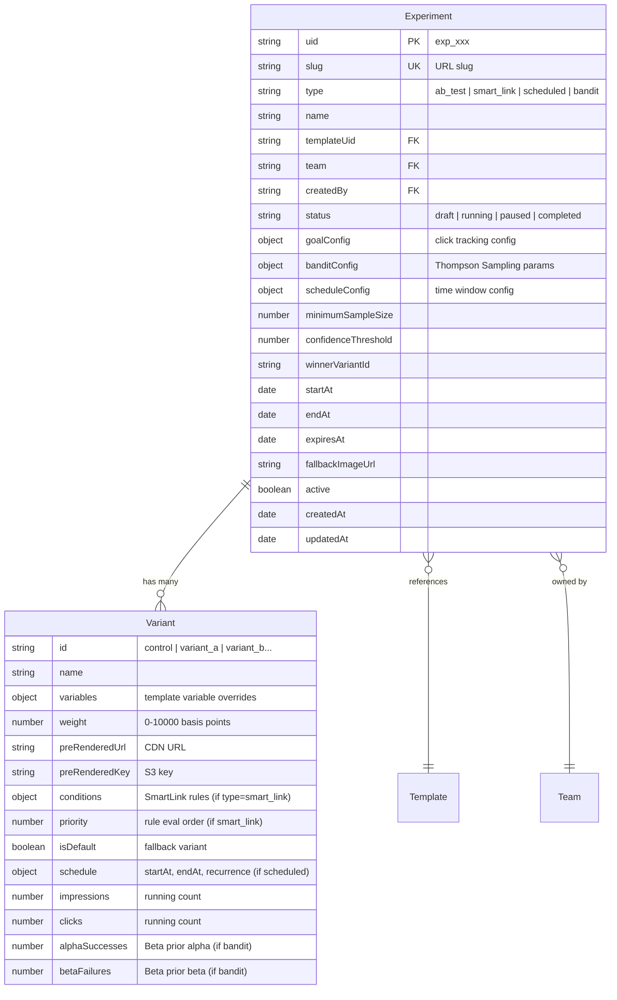

## Enhancement Summary

**Deepened on:** 2026-02-28
**Sections enhanced:** 6
**Research agents used:** ab-test-setup, pricing-strategy, architecture-strategist, security-sentinel

### Key Improvements
1. **Security hardening**: Rate limiting on `/s/` endpoints, remove on-the-fly rendering from public endpoint, SSRF protection on destination URLs, slug enumeration defense
2. **Statistical rigor**: Raise minimumSampleSize to 1000, add hypothesis field, peeking protection (sequential testing), MDE/power settings
3. **Pricing optimization**: Free tier gets 1 A/B test (viral loop), bandit unlocks at Pro (not Business), analytics retention gating by tier
4. **Architecture fixes**: Atomic Redis counter sync (MULTI/EXEC), precompute bandit weights (not live sampling), type-conditional validation, in-memory LRU cache layer

### Critical Security Findings (Must Address)
- Open redirect risk in click tracking -> restrict to configured destinationUrl only (already in plan)
- Resource exhaustion via on-the-fly rendering -> REMOVE from public `/s/` endpoint; pre-rendered only
- Rate limiting missing -> add per-IP rate limits on `/s/` endpoints
- Slug enumeration -> add timing-safe responses, no difference between "not found" and "invalid"

---

# A/B Test Images, Smart Links, Expiring/Scheduled Images & Variant Auto-Optimization

## Overview

Add four interconnected features to Pictify.io that transform static image generation into a dynamic, intelligent image delivery platform. All four features share a unified routing layer (`/s/:slug.:format`) that resolves a single URL to different content based on test assignment, contextual rules, time schedules, or bandit optimization.

**Key architectural insight:** All four features are variations of "one URL, many possible images." They share: a slug-based public URL, variant resolution logic, pre-rendered CDN images, impression/click tracking, and Redis-cached configs. Building them on a shared foundation maximizes code reuse.

## Problem Statement / Motivation

Currently, Pictify generates static images. Once rendered, an image never changes. Users who want to:
- Test which banner converts better -> must manually create two images, split traffic themselves
- Show different images to mobile vs desktop -> must create separate URLs and handle routing
- Run a limited-time promotion -> must remember to manually swap images
- Optimize image performance -> must manually analyze and decide

These are table-stakes features for marketing platforms (Optimizely charges $36k/yr, VWO $199/mo). Building them into Pictify creates a competitive moat, drives render volume (plan upgrades), and justifies premium pricing.

## Proposed Solution

### Unified Architecture: Smart URL Router

All four features resolve through a single public endpoint:

```
GET /s/:slug.:format
    |
    +-- ABTest?       -> deterministic hash (A/B) or Thompson Sampling (bandit)
    +-- SmartLink?    -> evaluate rules against request context
    +-- Schedule?     -> check time windows
    +-- fallback      -> serve default variant
    |
    v
  Resolve -> templateUid + variables + pre-rendered URL
    |
    +-- Pre-rendered? -> 302 redirect to CDN URL
    +-- Not cached?   -> render on-the-fly, cache, serve
```

**Serving flow:** The `/s/:slug` endpoint is `Cache-Control: private, no-cache` (routing decisions must happen at origin). Each resolved variant has its own deterministic S3 key (`s/{slug}/{variantId}.{format}`) with long TTL (`max-age=31536000, immutable`). The 302 redirect pattern means CloudFront caches the actual images efficiently while routing stays dynamic.

### Data Model: ERD



**Design decisions:**

1. **Single `Experiment` model instead of separate ABTest/SmartLink/Schedule models.** The `type` field distinguishes behavior. This avoids code duplication across 4 near-identical models and simplifies the router (one lookup instead of 3 fallback queries).

2. **Variants embedded (not separate collection).** Atomic reads on the hot path -- one MongoDB query gets the full experiment config. Trade-off: updating a single variant requires reading the full document. Acceptable because writes are rare (dashboard CRUD) while reads are frequent (every impression).

3. **Counter-based analytics (not individual Impression/Click documents).** Uses Redis `HINCRBY` for hot-path counting, synced to MongoDB every 15 min. A capped Redis list (`LPUSH`, max 1000 entries per experiment) stores recent impression metadata (country, device, referrer) for dimension breakdowns. This balances cost at scale with sufficient analytics depth.

4. **Slug cleared on soft-delete.** When an experiment is soft-deleted, the `slug` field is set to `null`, freeing the slug for reuse. The `expiresAt` field is set to `now + 30 days` -- the router continues serving the last winner for 30 days using the `uid`-based lookup, then returns 410 Gone.

---

## Technical Approach

### Phase 1: Foundation & A/B Testing (Priority 1)

The foundation that all other features build on.

#### 1.1 Backend: Experiment Model

**New file:** `models/Experiment.js`

```javascript
const experimentSchema = new mongoose.Schema({
  uid: { type: String, unique: true },
  active: { type: Boolean, default: true },
  slug: { type: String, unique: true, sparse: true, index: true },
  type: {
    type: String,
    enum: ['ab_test', 'smart_link', 'scheduled', 'bandit'],
    required: true,
  },
  name: { type: String, required: true, maxlength: 255 },
  status: {
    type: String,
    enum: ['draft', 'running', 'paused', 'completed', 'archived'],
    default: 'draft',
  },
  templateUid: { type: String, ref: 'Template', required: true, index: true },
  team: { type: String, ref: 'Team', index: true },
  createdBy: { type: String, ref: 'User', required: true },

  // Variants (embedded for atomic reads on hot path)
  variants: [{
    id: { type: String, required: true },
    name: { type: String },
    variables: { type: mongoose.Schema.Types.Mixed, default: {} },
    weight: { type: Number, default: 5000 }, // basis points (50%)
    preRenderedUrl: { type: String },
    preRenderedKey: { type: String },
    isDefault: { type: Boolean, default: false },

    // Smart Link conditions (only for type=smart_link)
    conditions: {
      operator: { type: String, enum: ['AND', 'OR'], default: 'AND' },
      rules: [{
        property: { type: String }, // device.type, geo.country, time.hour, etc.
        operator: { type: String }, // eq, in, not_in, gt, lt, gte, lte, contains
        value: { type: mongoose.Schema.Types.Mixed },
        paramName: { type: String }, // for url.param rules
      }],
    },
    priority: { type: Number, default: 0 },

    // Schedule (only for type=scheduled)
    schedule: {
      startAt: { type: Date },
      endAt: { type: Date },
      recurrence: {
        type: { type: String, enum: ['none', 'daily', 'weekly', 'cron'] },
        cronExpression: { type: String },
        timezone: { type: String, default: 'UTC' },
      },
    },

    // Stats (updated by periodic BullMQ job from Redis)
    impressions: { type: Number, default: 0 },
    clicks: { type: Number, default: 0 },
    alphaSuccesses: { type: Number, default: 1 }, // Beta prior alpha (bandit)
    betaFailures: { type: Number, default: 1 },   // Beta prior beta (bandit)
  }],

  // Goal tracking
  goalConfig: {
    type: { type: String, enum: ['impressions_only', 'click_through'], default: 'impressions_only' },
    destinationUrl: { type: String },
  },

  // Bandit config (only for type=bandit)
  banditConfig: {
    algorithm: { type: String, enum: ['thompson_sampling', 'epsilon_greedy'], default: 'thompson_sampling' },
    warmupImpressions: { type: Number, default: 50 },
    recomputeIntervalMinutes: { type: Number, default: 15 },
  },

  // Statistical config (research: raise defaults for rigor)
  hypothesis: { type: String, maxlength: 500 }, // What you expect to happen
  minimumSampleSize: { type: Number, default: 1000 }, // Raised from 100 per research
  confidenceThreshold: { type: Number, default: 0.95 },
  minimumRunDays: { type: Number, default: 7 },
  minimumDetectableEffect: { type: Number, default: 0.05 }, // 5% MDE
  practicalSignificanceThreshold: { type: Number, default: 0.01 }, // Minimum lift to matter

  // Winner
  winnerVariantId: { type: String },
  winnerDeclaredAt: { type: Date },

  // Scheduling
  startAt: { type: Date },
  endAt: { type: Date },
  expiresAt: { type: Date, index: true },
  fallbackImageUrl: { type: String },

  // Output config
  outputConfig: {
    format: { type: String, enum: ['png', 'jpeg', 'webp'], default: 'png' },
    quality: { type: Number, default: 90 },
  },

  createdAt: { type: Date, default: Date.now },
  updatedAt: { type: Date, default: Date.now },
})
```

**Indexes:**
```javascript
experimentSchema.index({ slug: 1, active: 1 })
experimentSchema.index({ team: 1, active: 1, type: 1 })
experimentSchema.index({ team: 1, templateUid: 1, active: 1 })
experimentSchema.index({ status: 1, type: 1 }) // for scheduler queries
experimentSchema.index({ expiresAt: 1 }, { sparse: true }) // for expiration checks
```

**Slug validation:** URL-safe, lowercase, alphanumeric + hyphens, 3-60 characters, no leading/trailing hyphens. Regex: `/^[a-z0-9][a-z0-9-]{1,58}[a-z0-9]$/`

**Variant weight validation:** Weights must sum to exactly 10000 basis points. Validated on create and update.

Follow existing patterns: `uid` prefix `exp_`, soft-delete with `filterActive`, `pre('save')` for uid generation. On soft-delete, set `slug = null` and `expiresAt = now + 30 days`.

#### 1.2 Backend: Smart URL Router

**New file:** `routes/experiment-render.js`
**autoPrefix:** `/s`

Public endpoint (no auth, like `/b/:bindingId.:format` in `binding-render.js`).

```
GET /s/:slug.:format       -> serve variant image (302 redirect or on-the-fly render)
GET /s/:slug/click         -> log click, redirect to destination URL
GET /s/:slug/pixel.gif     -> 1x1 tracking pixel for impression counting
```

**Implementation pattern:** Mirror `binding-render.js` architecture:
- In-memory LRU cache (100 entries, 30s TTL) -> Redis cache (60s TTL) -> MongoDB fallback
- Request coalescing via `inflightRequests` map
- 302 redirect to pre-rendered CDN URL (ONLY pre-rendered; no on-the-fly rendering on public endpoint)
- **SECURITY: No on-the-fly rendering on `/s/` endpoint.** If variant not pre-rendered, return fallback image or 404. This prevents resource exhaustion attacks.
- **Rate limiting:** 100 req/IP/min on `/s/:slug`, 20 req/IP/min on `/s/:slug/click`. Use `@fastify/rate-limit`.
- **Timing-safe responses:** Return identical 404 response shape for missing slug vs invalid slug (prevents enumeration)

**Variant assignment (A/B mode):**
```javascript
function assignVariant(viewerKey, experiment) {
  const hash = crypto.createHash('md5')
    .update(`${experiment.uid}:${viewerKey}`)
    .digest('hex')
  const bucket = parseInt(hash.substring(0, 8), 16) % 10000
  let cumulative = 0
  for (const variant of experiment.variants) {
    cumulative += variant.weight
    if (bucket < cumulative) return variant
  }
  return experiment.variants[experiment.variants.length - 1]
}
```

**Viewer key:** `crypto.createHash('sha256').update(ip + userAgent).digest('hex').substring(0, 16)` -- deterministic for `` embeds (no cookies needed).

**Bot filtering:** Detect known bots via User-Agent (Googlebot, Bingbot, Twitterbot, etc.). Serve the first (default/control) variant to bots for consistent OG previews. Exclude bots from impression/click counting.

**Impression tracking:** Async Redis `HINCRBY` on hot path, NOT MongoDB. BullMQ job syncs to MongoDB every 15 minutes.

**Redis cache invalidation:** On any experiment write (PUT, POST /start, POST /pause, POST /complete, DELETE), invalidate the Redis cache key for that experiment. This ensures state changes propagate within 1 request, not up to 60 seconds.

**Click destination URL validation:** Allow any HTTPS URL. Block `javascript:`, `data:`, and non-HTTPS schemes. Log a warning for redirect targets. The click endpoint is NOT an open redirect -- it only redirects to the experiment's configured `goalConfig.destinationUrl`, not to arbitrary user-supplied query params.

#### 1.3 Backend: Experiment CRUD Routes

**New file:** `routes/experiments.js`
**autoPrefix:** `/experiments`

Cookie-authenticated, team-scoped (same pattern as `routes/bindings.js`).

```
POST   /                   -> create experiment
GET    /                   -> list experiments (filtered by type, paginated)
GET    /quota              -> current experiment counts vs plan limits
GET    /check-slug         -> check slug availability (?slug=my-slug)
GET    /:uid               -> get experiment detail with analytics summary
PUT    /:uid               -> update experiment (name, goalConfig, confidenceThreshold mutable while running)
DELETE /:uid               -> soft delete (slug cleared, expiresAt set)
POST   /:uid/start         -> validate quota, pre-render all variants, set status=running
POST   /:uid/pause         -> set status=paused
POST   /:uid/complete      -> declare winner, redirect 100% traffic
POST   /:uid/duplicate     -> clone experiment with new slug
GET    /:uid/analytics     -> detailed analytics
```

**API-token authenticated routes** (for external API consumers):
Register a second block with `verifyApiToken` and `teamContext`, same pattern as `routes/webhook-subscriptions.js` lines 410-418. All CRUD endpoints available via API token with `/api` prefix.

**Mutable fields per status:**
- `draft`: All fields mutable
- `running`: Only `name`, `goalConfig.destinationUrl`, `confidenceThreshold`, `minimumRunDays` mutable. Variants, weights, type immutable.
- `paused`: Same as draft (but warns user that restarting may invalidate collected data)
- `completed`: Only `name` mutable

**Pre-render on start:** When experiment transitions to `running`:
1. Check quota upfront for N variant renders (synchronous, in the POST handler)
2. Decrement quota for N renders
3. Queue a BullMQ job that renders each variant via `renderTemplateWithVariables()` and uploads to S3 with deterministic keys `s/{slug}/{variantId}.{format}`
4. Cache experiment config in Redis
5. Return immediately with `status: 'rendering'` and `renderProgress: { total: N, completed: 0 }`

**Render progress polling:** `GET /:uid` returns `renderProgress` field showing how many variants have been rendered. Frontend polls every 2 seconds until all variants are done, then status becomes `running`.

**Analytics response schema for `GET /:uid/analytics`:**
```javascript
{
  summary: {
    totalImpressions: number,
    totalClicks: number,
    overallCtr: number,
    isSignificant: boolean,     // for ab_test type
    winnerVariantId: string,    // null if not yet determined
    confidenceLevel: number,    // 0-1
  },
  variants: [{
    id: string,
    name: string,
    impressions: number,
    clicks: number,
    ctr: number,
    weight: number,             // current traffic allocation
    pValue: number,             // for ab_test type
    probabilityOfBeingBest: number, // for bandit type
  }],
  timeSeries: [{
    date: string,               // YYYY-MM-DD
    variantId: string,
    impressions: number,
    clicks: number,
  }],
  dimensions: {
    countries: [{ country: string, impressions: number }],
    devices: [{ device: string, impressions: number }],
    referrers: [{ referrer: string, impressions: number }],
  },
}
```

#### 1.4 Backend: Analytics Pipeline

**Impression/Click tracking architecture:**

```
Hot path (per request):
  Redis HINCRBY exp:{uid}:var:{id}:impressions 1
  Redis HINCRBY exp:{uid}:var:{id}:clicks 1 (if click endpoint)
  Redis LPUSH exp:{uid}:impressions:{date} {json} (capped list, 1000 entries)

Cold path (BullMQ repeatable job, every 15 min):
  ATOMIC Redis MULTI/EXEC: Read + reset counters (prevents double-counting)
  -> update Experiment.variants[].impressions/clicks via MongoDB arrayFilters
  For bandit type: PRECOMPUTE Thompson Sampling weights, write to Redis (not live sampling on hot path)
  Check significance -> apply peeking protection (sequential testing) -> auto-declare winner if threshold met
  Build time-series buckets from capped lists
```

**New file:** `service/experiment-analytics.js`

**Redis key cleanup:** When experiment is soft-deleted, queue a delayed BullMQ job (runs 31 days later) to delete all Redis keys matching `exp:{uid}:*`.

#### 1.5 Backend: Plan Gating

**Modify:** `config/planLimits.js`

Add experiment limits covering ALL plan tiers:
```javascript
// REVISED per pricing research: Free tier gets 1 A/B test (viral loop), bandit unlocks at Pro
const EXPERIMENT_LIMITS = {
  starter:          { ab_test: 1, smart_link: 0, scheduled: 0, bandit: 0, maxVariants: 2, analyticsRetentionDays: 7 },
  basic:            { ab_test: 3, smart_link: 1, scheduled: 1, bandit: 0, maxVariants: 3, analyticsRetentionDays: 30 },
  standard:         { ab_test: 5, smart_link: 3, scheduled: 3, bandit: 1, maxVariants: 5, analyticsRetentionDays: 90 },
  professional:     { ab_test: 10, smart_link: 5, scheduled: 5, bandit: 1, maxVariants: 5, analyticsRetentionDays: 90 },
  advanced:         { ab_test: 10, smart_link: 5, scheduled: 5, bandit: 3, maxVariants: 5, analyticsRetentionDays: 90 },
  'pro-plus':       { ab_test: 15, smart_link: 10, scheduled: 10, bandit: 3, maxVariants: 5, analyticsRetentionDays: 90 },
  business:         { ab_test: null, smart_link: null, scheduled: null, bandit: 5, maxVariants: 10, analyticsRetentionDays: 365 },
  'business-plus':  { ab_test: null, smart_link: null, scheduled: null, bandit: 8, maxVariants: 10, analyticsRetentionDays: 365 },
  premium:          { ab_test: null, smart_link: null, scheduled: null, bandit: 10, maxVariants: 10, analyticsRetentionDays: 365 },
  'premium-plus':   { ab_test: null, smart_link: null, scheduled: null, bandit: null, maxVariants: 15, analyticsRetentionDays: 365 },
  enterprise:       { ab_test: null, smart_link: null, scheduled: null, bandit: null, maxVariants: 15, analyticsRetentionDays: 365 },
  'enterprise-plus':{ ab_test: null, smart_link: null, scheduled: null, bandit: null, maxVariants: 20, analyticsRetentionDays: 365 },
  elite:            { ab_test: null, smart_link: null, scheduled: null, bandit: null, maxVariants: 20, analyticsRetentionDays: 365 },
  'elite-plus':     { ab_test: null, smart_link: null, scheduled: null, bandit: null, maxVariants: 20, analyticsRetentionDays: 365 },
  ultimate:         { ab_test: null, smart_link: null, scheduled: null, bandit: null, maxVariants: 20, analyticsRetentionDays: 365 },
}
```

`null` = unlimited. **Key pricing decisions (per research):**
- Starter gets 1 A/B test (viral loop — users share test URLs, recipients see Pictify branding)
- Bandit unlocks at Standard tier (not Business) to drive Pro→Standard upgrades
- `analyticsRetentionDays` gates how far back analytics data is visible (7d free, 90d pro, 365d business+)
- `maxVariants` raised to 20 for Enterprise+ (was capped at 10)

**Quota for variant renders:** Variant renders on experiment start consume from the regular monthly render quota. Overage billing applies per existing overage rules.

#### 1.6 Backend: Audit Log & Webhook Updates

**Modify:** `models/AuditLog.js`
- Add `'experiment'` to `category` enum (line 27)
- Add `'experiment'` to `resourceType` enum (line 51)

**Modify:** `service/audit-service.js`
Add functions (following existing patterns):
- `logExperimentCreate(userId, experiment, req)` -- category: experiment, action: create
- `logExperimentUpdate(userId, experiment, changes, req)` -- category: experiment, action: update
- `logExperimentDelete(userId, experiment, req)` -- category: experiment, action: delete
- `logExperimentStart(userId, experiment, req)` -- category: experiment, action: start
- `logExperimentPause(userId, experiment, req)` -- category: experiment, action: pause
- `logExperimentComplete(userId, experiment, winnerId, req)` -- category: experiment, action: complete
- `logExperimentRender(userId, experiment, variantId)` -- category: experiment, action: render

**Modify:** `models/WebhookSubscription.js`
- Add to `event` enum (line 32): `'experiment.started'`, `'experiment.completed'`, `'experiment.winner_declared'`
- Add to `filters` object: `experimentId: { type: String, index: true }`

**Modify:** `service/webhook-delivery.js`
Fire webhook events at:
- `experiment.started` -- when all variants are pre-rendered and status becomes `running`
- `experiment.completed` -- when winner is declared (manual or auto)
- `experiment.winner_declared` -- specifically for auto-convergence in bandit mode

#### 1.7 Frontend: Experiment Dashboard

**New files:**

```
src/api/experiments.js                                    -- API client
src/store/experiment.store.js                             -- Svelte store + actions
src/routes/dashboard/experiments/+page.svelte             -- Experiment list
src/routes/dashboard/experiments/+layout.svelte            -- Layout wrapper
src/routes/dashboard/experiments/create/+page.svelte      -- Create experiment
src/routes/dashboard/experiments/[uid]/+page.svelte       -- Experiment detail + analytics
src/lib/components/experiments/ExperimentList.svelte       -- List component
src/lib/components/experiments/ExperimentDetail.svelte     -- Detail component
src/lib/components/experiments/ExperimentCreate.svelte     -- Create form
src/lib/components/experiments/VariantEditor.svelte        -- Variant config
src/lib/components/experiments/AnalyticsChart.svelte       -- Charts
src/lib/components/experiments/SignificanceIndicator.svelte -- Stats badge
src/lib/components/experiments/TrafficSplitVisualizer.svelte -- Weight visualization
```

**Modify:** `src/lib/components/dashboard/SideNav.svelte`
Add "Experiments" nav item after "Dynamic Media" with a beaker/flask icon. Active state matches `/dashboard/experiments`.

**Modify:** `src/config/plan-features.js`
Add feature identifiers:
```javascript
// Experiments
AB_TESTING: 'abTesting',
SMART_LINKS: 'smartLinks',
SCHEDULED_IMAGES: 'scheduledImages',
AUTO_OPTIMIZATION: 'autoOptimization',
```

Add to `PLAN_FEATURES` for each tier matching the backend `EXPERIMENT_LIMITS`.

**Empty state for experiment list:**
- Starter plan: Upgrade wall with feature explanation and pricing
- Paid plans with 0 experiments: Illustration + "Create your first experiment" CTA + 3-step explanation (1. Pick template, 2. Create variants, 3. Share URL)

**URL copy/share UX:**
After experiment is started, show a prominent card at the top:
- Full URL displayed: `https://api.pictify.io/s/{slug}.png`
- Copy URL button
- Copy `` tag button
- Copy click-tracking link (if goal is click_through)

#### 1.8 Frontend: A/B Test Creation Flow

1. User selects template -> clicks "Create A/B Test"
2. Variant editor: shows template preview with variable inputs for each variant
3. Configure traffic split (slider, default 50/50)
4. Set goal: "Impressions Only" or "Click-Through" (with destination URL)
5. Set minimum run time (default 7 days)
6. Review -> Start test
7. System pre-renders all variants, generates shareable URL
8. User gets: `https://api.pictify.io/s/{slug}.png` to embed anywhere

**Pre-render progress UX:** After clicking "Start", show a modal with:
- Progress bar ("Rendering variant 2 of 3...")
- Poll `GET /:uid` every 2 seconds for `renderProgress`
- On completion, reveal the shareable URL with copy buttons
- On partial failure, show which variants failed with retry option

---

### Phase 2: Smart Links

Builds on the Experiment model with `type: 'smart_link'`.

#### 2.1 Backend: Smart Link Rule Engine

**New file:** `service/smart-link-engine.js`

```javascript
function evaluateRules(experiment, requestContext) {
  const sortedVariants = experiment.variants
    .filter(v => !v.isDefault && v.conditions?.rules?.length > 0)
    .sort((a, b) => a.priority - b.priority)

  for (const variant of sortedVariants) {
    if (evaluateConditionGroup(variant.conditions, requestContext)) {
      return variant
    }
  }
  return experiment.variants.find(v => v.isDefault) || experiment.variants[0]
}
```

**Supported conditions:**

| Property | Operators | Values |
|----------|-----------|--------|
| `device.type` | eq, in | `mobile`, `desktop`, `tablet` |
| `device.os` | eq, in | `iOS`, `Android`, `Windows`, `macOS`, `Linux` |
| `geo.country` | eq, in, not_in | ISO 3166-1 alpha-2 codes |
| `geo.continent` | eq, in | `NA`, `EU`, `AS`, `AF`, `SA`, `OC`, `AN` |
| `time.hour` | eq, gt, lt, gte, lte | 0-23 (UTC) |
| `time.dayOfWeek` | eq, in | 0-6 (Sunday-Saturday) |
| `browser.language` | eq, in | `en`, `fr`, `de`, etc. |
| `url.param` | eq, contains | query param value (paramName required) |
| `referrer.domain` | eq, contains | referring domain |

#### 2.2 Backend: Request Context Extractor

**New file:** `service/request-context.js`

Extracts viewer context from HTTP request. Uses:
- CloudFront headers (`CloudFront-Is-Mobile-Viewer`, `CloudFront-Viewer-Country`) when available
- `geoip-lite` npm package as fallback for geo
- User-Agent parsing for device/OS detection
- `Accept-Language` header for language
- `Referer` header for referrer domain

#### 2.3 Frontend: Smart Link Rule Builder

**New component:** `src/lib/components/experiments/RuleBuilder.svelte`

Visual rule builder UI:
- Add condition rows (property dropdown -> operator dropdown -> value input)
- AND/OR toggle per rule group
- Drag-to-reorder rules for priority
- Live preview: "If this request comes from [mobile] AND [US], show variant A"

---

### Phase 3: Expiring & Scheduled Images

Builds on the Experiment model with `type: 'scheduled'`.

#### 3.1 Backend: Schedule Resolver

Integrated into the smart URL router. When `experiment.type === 'scheduled'`:

```javascript
function resolveScheduledVariant(experiment) {
  const now = new Date()

  // Check hard expiry
  if (experiment.expiresAt && now > experiment.expiresAt) {
    return { expired: true, fallbackUrl: experiment.fallbackImageUrl }
  }

  // Find active time window
  const activeVariant = experiment.variants
    .filter(v => v.schedule?.startAt && v.schedule.startAt <= now)
    .filter(v => !v.schedule.endAt || v.schedule.endAt > now)
    .sort((a, b) => b.schedule.startAt - a.schedule.startAt)[0]

  return activeVariant || experiment.variants.find(v => v.isDefault)
}
```

**Schedule overlap handling:** If multiple variants are active at the same time, the one with the latest `startAt` wins (most recently scheduled takes priority). The UI should warn about overlaps but allow them.

#### 3.2 Backend: Schedule Queue (BullMQ)

**New file:** `service/experiment-scheduler.js`

Jobs:
1. **Pre-render job:** Render variant images 5 minutes before their scheduled `startAt`. Delayed BullMQ job.
2. **Expiration check:** Repeatable job (every 5 min) finds experiments with `expiresAt < now + 5min` and updates status.

Pattern: Follow `service/binding-refresh-queue.js` -- repeatable BullMQ scheduler that polls for due experiments.

#### 3.3 CDN Strategy for Scheduled Content

- **Routing URL** (`/s/:slug.:format`): `Cache-Control: private, no-cache` -- always hits origin for schedule resolution.
- **Variant image URLs** (resolved via 302): `Cache-Control: public, max-age=31536000, immutable` -- each variant has a unique S3 key that never changes.
- **On schedule transition:** The router automatically picks the new variant and 302s to its CDN URL. No invalidation needed.

#### 3.4 Frontend: Schedule Editor

**New component:** `src/lib/components/experiments/ScheduleEditor.svelte`

- Timeline visualization showing when each variant is active
- Date/time pickers for start/end per variant (display in browser timezone, store UTC)
- Expiration date picker (hard expiry)
- Fallback image upload or template render
- Recurrence options: daily, weekly, cron expression (validated against safe patterns)

---

### Phase 4: Variant Auto-Optimization (Bandit)

Builds on Phase 1's A/B testing with `type: 'bandit'`.

#### 4.1 Backend: Thompson Sampling Engine

**New file:** `service/bandit-engine.js`

```javascript
function thompsonSampleVariant(variants) {
  let best = null, bestSample = -1
  for (const v of variants) {
    const sample = betaSample(v.alphaSuccesses || 1, v.betaFailures || 1)
    if (!isFinite(sample)) continue // Guard against NaN
    if (sample > bestSample) {
      bestSample = sample
      best = v
    }
  }
  return best || variants[0] // Fallback to first variant if all NaN
}
```

**New file:** `service/statistics.js`

Pure-JS Beta distribution sampling (Marsaglia and Tsang's method for Gamma distribution). No external dependencies.

Also includes:
- `calculatePValue(variantA, variantB)` -- chi-squared test for A/B significance
- `calculateConfidenceInterval(successes, trials, confidence)` -- Wilson score interval

#### 4.2 Backend: Bandit Recompute Job

**Added to:** `service/experiment-analytics.js`

BullMQ repeatable job (every 15 minutes for active bandit experiments):
1. Read Redis impression/click counters per variant
2. Update `alphaSuccesses = 1 + clicks`, `betaFailures = 1 + (impressions - clicks)`
3. Run `recomputeBanditWeights()` -- update variant weights in MongoDB
4. **Immediately write new weights to Redis** cache (don't wait for 60s TTL to expire)
5. Check convergence -- if `probability >= 0.95`, mark winner and notify user

**Warm-up period:** First `banditConfig.warmupImpressions` per variant use deterministic hash assignment (equal split). After warm-up, switch to Thompson Sampling.

**Notification on convergence:** Send email via Plunk integration (`service/plunk.js`) to the experiment creator. Email includes: experiment name, winning variant name, probability, link to dashboard.

#### 4.3 Frontend: Optimization Dashboard

**New component:** `src/lib/components/experiments/BanditDashboard.svelte`

- Traffic allocation pie chart (live weights)
- Conversion rate per variant with confidence intervals
- "Probability of being best" bar per variant
- Optimization progress indicator (exploration -> exploitation phases)
- Convergence notification with "Lock Winner" CTA

---

## System-Wide Impact

### Interaction Graph

```
User creates experiment
  -> POST /experiments -> validate plan tier -> save Experiment doc -> audit log
  -> User clicks "Start"
    -> POST /experiments/:uid/start
      -> Check quota for N variants (synchronous)
      -> Decrement quota for N renders
      -> Update status to 'rendering'
      -> Queue BullMQ job: pre-render all variants
        -> For each variant: renderTemplateWithVariables() -> uploadToS3WithKey()
      -> Cache experiment config in Redis
      -> Emit webhook: experiment.started (after all renders complete)
      -> Audit log: experiment start

Visitor hits /s/:slug.png
  -> experiment-render.js handler
    -> Redis cache lookup (60s TTL) OR MongoDB fallback
    -> Bot detection: if bot, serve default variant, skip analytics
    -> Type-based resolution:
      -> ab_test: deterministic hash -> variant
      -> smart_link: evaluateRules(context) -> variant
      -> scheduled: resolveScheduledVariant(now) -> variant
      -> bandit: thompsonSampleVariant() or warmup hash -> variant
    -> If variant.preRenderedUrl exists: 302 redirect (no render cost)
    -> Else: on-the-fly render -> S3 upload -> 302 redirect (counts as 1 render)
    -> Async: Redis HINCRBY impressions (fire-and-forget)

Visitor clicks /s/:slug/click
  -> Validate destination URL (HTTPS only, no javascript:/data: schemes)
  -> Log click in Redis
  -> 302 redirect to goalConfig.destinationUrl

BullMQ periodic job (every 15 min)
  -> Sync Redis counters -> MongoDB
  -> For bandit experiments: recompute weights, write to Redis immediately
  -> For all running experiments: check significance/convergence
  -> For scheduled experiments: check transitions, pre-render upcoming
  -> Auto-declare winner if threshold met -> webhook, email notification
```

### Error Propagation

- **Variant render failure:** Skip failed variant, log error, set `variant.preRenderedUrl = null`. On request, try on-the-fly render. If that fails too, serve next variant or fallback.
- **Redis unavailable:** Fall back to MongoDB for config reads. Impressions are lost (best-effort analytics).
- **Thompson Sampling produces NaN:** Guard with `isFinite()` check, fall back to equal weights.
- **Destination URL unreachable:** Not our problem -- the 302 redirect simply sends the browser there. No fallback needed.

### State Lifecycle Risks

- **Experiment deleted while running:** Soft-delete (`active: false`), slug cleared to `null`, `expiresAt` set to 30 days. Router continues serving last winner/first variant for 30 days via uid-based lookup, then 410 Gone. Redis keys cleaned up by delayed BullMQ job after 31 days.
- **Template modified mid-experiment:** Variants pin to specific variable values, not template version. If template structure changes, renders may be stale. The `GET /:uid` response includes a `templateModifiedSinceRender: boolean` flag. UI shows warning with "Re-render variants" action.
- **Quota exhausted mid-render:** Quota checked upfront for all N variants. If quota is insufficient, the start request is rejected with a clear error message.
- **Plan downgrade with existing experiments:** Existing experiments continue to run. New experiments are blocked if limit is exceeded. No retroactive enforcement.
- **Concurrent experiment edits:** Standard MongoDB update -- last write wins. No optimistic locking needed for this MVP.

### API Surface Parity

| Feature | Dashboard UI | REST API | Notes |
|---------|-------------|----------|-------|
| Create experiment | `/dashboard/experiments/create` | `POST /experiments` | Both supported |
| View analytics | `/dashboard/experiments/[uid]` | `GET /experiments/:uid/analytics` | Both supported |
| Start/pause/complete | UI buttons | `POST /experiments/:uid/{action}` | Both supported |
| Check quota | Inline in create form | `GET /experiments/quota` | Both supported |
| Serve variant image | N/A (visitor-facing) | `GET /s/:slug.:format` | Public, no auth |
| Track click | N/A (visitor-facing) | `GET /s/:slug/click` | Public, no auth |

---

## Acceptance Criteria

### Functional Requirements

- [ ] **Experiment CRUD**: Create, read, update, delete experiments with proper team-scoping
- [ ] **Slug validation**: URL-safe slugs, uniqueness check endpoint, slugs freed on delete
- [ ] **A/B test variant assignment**: Deterministic hash produces stable split verified over 1000+ requests
- [ ] **Smart Link rule evaluation**: Rules correctly evaluate device, country, time, params, referrer
- [ ] **Schedule time windows**: Correct variant served based on current time, with fallback
- [ ] **Expiration**: Expired experiments return fallback image or 410 Gone
- [ ] **Thompson Sampling**: Bandit weights shift toward better-performing variant within 15 min
- [ ] **Click tracking**: Click endpoint validates URL, logs event, and 302 redirects
- [ ] **Impression tracking**: Impressions counted per variant, visible in analytics
- [ ] **Bot filtering**: Known bots served default variant, excluded from analytics
- [ ] **Pre-rendering**: All variants pre-rendered on start, progress visible in UI
- [ ] **302 redirect pattern**: Router serves `no-cache`, variant images from CDN with long TTL
- [ ] **Plan gating**: All plan tiers covered, correct limits enforced
- [ ] **Quota charging**: Variant renders count against monthly quota at start time
- [ ] **Winner declaration**: Manual and automatic (bandit) with webhook + email notification
- [ ] **Dashboard UI**: List, detail, create, analytics for all experiment types
- [ ] **Empty states**: Starter upgrade wall, first-time CTA, no-data analytics
- [ ] **URL sharing**: Copy URL, copy img tag, copy click-tracking link
- [ ] **SideNav entry**: Experiments accessible from main navigation
- [ ] **Audit logging**: All CRUD operations and renders logged
- [ ] **Webhooks**: experiment.started, experiment.completed, experiment.winner_declared events
- [ ] **API token access**: All CRUD endpoints available via API token

### Non-Functional Requirements

- [ ] **Latency**: `/s/:slug` responds in <50ms for cached configs (Redis hit + 302)
- [ ] **Throughput**: Router handles 1000+ req/sec per experiment (Redis only on hot path)
- [ ] **Analytics accuracy**: Within 1% (Redis counters, 15-min sync)
- [ ] **No new external dependencies** for Thompson Sampling (pure JS)
- [ ] **Redis key cleanup**: No orphaned keys from deleted experiments

---

## Dependencies & Risks

### Dependencies
- `geoip-lite` npm package for geo-IP lookups (Smart Links phase)
- CloudFront behavior configuration for `/s/*` path pattern (short TTL)
- Redis available for impression counting and config caching

### Risks

| Risk | Impact | Mitigation |
|------|--------|------------|
| Redis outage | Lost impressions, slower reads | Fall back to MongoDB; analytics is best-effort |
| CloudFront caching routing endpoint | Wrong variant served | Ensure `/s/*` has `no-cache` origin response |
| Abuse of public `/s/` endpoint | Resource exhaustion | Request coalescing, rate limiting by IP |
| Bot traffic skewing analytics | False A/B test conclusions | UA-based bot detection, exclude from stats |
| Thompson Sampling with tiny samples | Premature exploitation | Warm-up period (50 impressions/variant) |
| Template change mid-experiment | Stale renders | Detect and warn, offer re-render action |
| Slug namespace pollution | Popular slugs unavailable | Clear slug on soft-delete |
| GDPR (viewerHash = pseudonymized data) | Compliance risk | Document in privacy policy, no PII stored, hash is not reversible |

---

## Implementation Order

| Step | What | Files | Depends On |
|------|------|-------|------------|
| 1 | Experiment model | `models/Experiment.js` | -- |
| 2 | AuditLog + WebhookSubscription enum updates | `models/AuditLog.js`, `models/WebhookSubscription.js` | -- |
| 3 | Audit service functions | `service/audit-service.js` | Step 2 |
| 4 | Experiment CRUD routes | `routes/experiments.js` | Step 1, 3 |
| 5 | Plan gating (EXPERIMENT_LIMITS) | `config/planLimits.js` | Step 4 |
| 6 | Smart URL router | `routes/experiment-render.js` | Step 1 |
| 7 | Variant pre-render service | `service/experiment-renderer.js` | Step 1, 6 |
| 8 | A/B variant assignment (hash) | integrated into Step 6 | -- |
| 9 | Impression/click tracking | `service/experiment-analytics.js` | Step 6 |
| 10 | Frontend: plan-features.js updates | `src/config/plan-features.js` | Step 5 |
| 11 | Frontend: API client + store | `src/api/experiments.js`, `src/store/experiment.store.js` | Step 4 |
| 12 | Frontend: SideNav update | `src/lib/components/dashboard/SideNav.svelte` | -- |
| 13 | Frontend: experiment list/detail pages | `src/routes/dashboard/experiments/` | Step 11 |
| 14 | Frontend: A/B test creation flow | `src/lib/components/experiments/ExperimentCreate.svelte` | Step 13 |
| 15 | Frontend: analytics charts | `src/lib/components/experiments/AnalyticsChart.svelte` | Step 13 |
| 16 | Smart Link rule engine | `service/smart-link-engine.js` | Step 6 |
| 17 | Request context extractor | `service/request-context.js` | Step 16 |
| 18 | Frontend: rule builder | `src/lib/components/experiments/RuleBuilder.svelte` | Step 14 |
| 19 | Schedule resolver | integrated into Step 6 | -- |
| 20 | Schedule BullMQ jobs | `service/experiment-scheduler.js` | Step 7, 19 |
| 21 | Frontend: schedule editor | `src/lib/components/experiments/ScheduleEditor.svelte` | Step 14 |
| 22 | Thompson Sampling engine | `service/bandit-engine.js` | Step 9 |
| 23 | Statistics utilities | `service/statistics.js` | -- |
| 24 | Bandit recompute BullMQ job | integrated into Step 9 | Step 22, 23 |
| 25 | Frontend: bandit dashboard | `src/lib/components/experiments/BanditDashboard.svelte` | Step 15 |
| 26 | Frontend: significance indicator | `src/lib/components/experiments/SignificanceIndicator.svelte` | Step 23 |

---

## Sources & References

### Internal References
- Binding model (closest analog): `models/Binding.js`
- Binding renderer (architecture to mirror): `service/binding-renderer.js`
- Template renderer (core render function): `service/template-renderer.js`
- URL-param renderer: `service/url-param-renderer.js`
- Batch processor (BullMQ pattern): `service/batch-processor.js`
- Plan limits: `config/planLimits.js`
- Quota guard: `plugins/quota_guard.js`
- Audit service: `service/audit-service.js`
- Webhook delivery: `service/webhook-delivery.js`
- Webhook subscriptions: `models/WebhookSubscription.js`
- Frontend plan features: `src/config/plan-features.js`
- SideNav: `src/lib/components/dashboard/SideNav.svelte`
- Plunk email service: `service/plunk.js`
