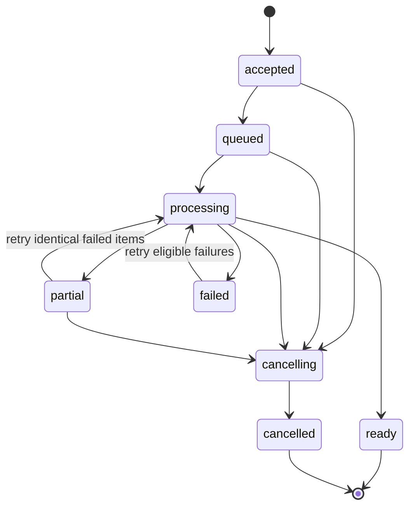

# Customer value campaigns — product, design and engineering specification

> **Consolidated authority:** [Pictify AI-native product specification](pictify-ai-native-product-spec-2026-09-05.md) now governs product scope, architecture, sequencing and estimates. This document remains a detailed implementation reference; conflicting earlier decisions are superseded.

**Version:** 1.3 · **Date:** September 5, 2026  
**Status:** implementation specification; proposed behavior is not shipped capability  
**Primary release:** a reliable static customer-value campaign workflow for up to 250 accounts  
**Delivery boundary:** Pictify prepares media and exports; the customer's existing tool sends messages  
**Agreed architecture:** one Pictify product on the existing host; focused Campaigns and platform experiences, shared accounts/teams, separate preferences and access controls; no host migration in R1  
**Frontend baseline:** `worktree-redesign-v2`, HEAD `008962d`, including uncommitted changes  
**Backend baseline:** `/Users/suyashthakur/Developer/Personal/html-to-gif`, HEAD `ada2883`; deployed configuration remains to be verified

This document translates the [strategy](/Users/suyashthakur/Developer/Personal/front-end-html-to-gif/.claude/worktrees/redesign-v2/plans/customer-value-campaigns-strategy-2026-09-05.md) and [capability audit](/Users/suyashthakur/Developer/Personal/front-end-html-to-gif/.claude/worktrees/redesign-v2/plans/customer-value-campaigns-evidence-2026-09-05.md) into changes a designer and engineer can implement. It incorporates the subsequent decision to make the product ready before accepting live campaign delivery commitments. It specifies screens and interactions; it does not claim that visual mockups or application changes have already been created.

## Approved editor scope update — September 5, 2026

The user approved the AI-first visual HTML prototype. [AI-first visual HTML template studio spec](ai-visual-template-studio-spec-2026-09-05.md) is the implementation authority for template creation/editing, design states, HTML compatibility, history/persistence, AI concurrency and editor release gates. Templates are editable assets; OUT-01/02 are starters. This replaces the former controlled-preset-only restriction. Delivery remains media/export only, within one Pictify product and the existing host.

**Combined planning envelope:** 250–384 engineering hours (original campaign scope 142–220h plus incremental builder 108–164h), approximately 8–12 weeks at 32 planned hours/week within the agreed 40-hour allocation. Re-estimate after the authenticated AI/manual/renderer feasibility gate. This is not a remaining-work estimate or a delivery commitment.

## 1. Release outcome and boundaries

An authorized operator can upload account metrics, resolve validation problems, approve representative previews, generate the full audience, recover from an interruption, and export correctly matched files without database edits or copying individual URLs.

**Release acceptance scenario:** 250 synthetic eligible accounts; one selected PNG or PDF format; ten representative previews; frozen approval; injected worker/orchestrator interruption; safe recovery; reconciled ZIP and manifest; preview of the correct asset for test recipients in the buyer's tool; demonstrated access and deletion controls.

### Scope decisions

| Included in R1, before live customer campaigns | Later, separately gated | Outside this product slice |
|---|---|---|
| Saved campaign, reporting period, one to three approved metrics | Native API/webhook-triggered next-period campaigns | Native email sending or recipient-list management |
| One selected format per edition: email card PNG **or** one-page PDF | PNG+PDF or video pairs in one edition | CRM/CDP, warehouse cleanup or metric discovery |
| AI-first template creation, visual HTML customization and brand setup | More templates, languages and narrative variants | Financial ROI modeling, health scores, renewal prediction |
| Strict CSV validation, ten representative previews, explicit approval | Automated recipient delivery adapters | Interactive Wrapped microsites or editable QBR decks |
| Durable execution, failed-only retry, cancellation and reconciliation | Scheduled campaigns and advanced period comparisons | Avatars and voice recording |
| Private files, verified retention/deletion, ZIP/manifest/text handoff | Customer-owned storage connectors beyond manual transfer | Whole-site repositioning or removal of existing API use cases |
| Manual “New period” using saved configuration and fresh data | Self-serve subscription packaging | Unverified retention/ROI claims |
| Pilot access control, entitlement and cost recording | Multi-stage approval portal | Automatic outreach or customer email sends |

R0 is synthetic-only design/engineering validation, not a customer release. R1 is the complete static release above. R1.1 improves repeat automation after paid use. R2 adds paired media only after paid demand and capacity verification. Existing legacy workflows remain available under their existing contracts.

## 2. Vocabulary, ownership and invariants

Use these nouns consistently in UI, API and docs:

| Term | Meaning |
|---|---|
| Campaign | Reusable configuration: purpose, metric definitions, brand, template revision and output format |
| Edition | One reporting period and one approved revision of a campaign, with its own dataset and audience |
| Account | Buyer's customer account, identified by `external_account_id`; not necessarily a person |
| Preview | A rendered sample from the edition's exact candidate content and input |
| Approval | Recorded acceptance of the dataset, audience, snapshot and reviewed sample |
| Run | Durable execution of an approved edition; retries continue this run rather than create another campaign |
| Artifact | One account's generated file, belonging to a specific approved edition revision |
| Export | A complete, immutable package/manifest describing the approved release audience |
| Ready | Every required account artifact is present and verified; it does not mean sent or delivered |

Mandatory invariants:

- **INV-01:** an output always joins to tenant, campaign, edition revision and external account ID. Row order and filenames never establish identity.
- **INV-02:** a running edition uses immutable template, asset, configuration and data snapshots. Editing a draft cannot change an approved or running edition.
- **INV-03:** repeated requests/jobs may execute more than once internally, but produce one canonical artifact and one metered outcome per identity. Do not promise exactly-once worker execution.
- **INV-04:** `ready` requires complete reconciliation. Partial success must not appear as a completed campaign.
- **INV-05:** render/retry/export operations never send email.
- **INV-06:** all campaign data and outputs are private by default. An opaque URL alone is not an access policy.
- **INV-07:** changing source data, membership of the approved audience, metrics, copy, brand, format or template invalidates approval for the changed revision.
- **INV-08:** no real customer input is accepted until the private-data gate passes. No live delivery commitment is accepted until its release gate passes.

Account-to-person relationships, eligibility for messages, subscriptions and sending remain in the buyer's system. Pictify must not request recipient email addresses for this export-only release.

## 3. Information architecture and entry points

**UX-01 — Campaigns workspace.** Give pilot-enabled campaign users a directly visible “Campaigns” destination and campaign home. They must not discover it inside generic Workflows. Existing Workflows remains the destination for legacy runs/hooks; do not show a duplicate campaign list there. Keep shared Brand assets, Team and Billing accessible. Templates, renders, callers and API tools remain accessible through the platform navigation; the campaign default view emphasizes the guided workflow. Navigation preference is remembered per user/team and never acts as authorization. This supersedes v1.0's Campaigns-within-Workflows navigation proposal.

**UX-02 — Entry and activation.** Provide “Create customer value update” on the Campaigns page and the relevant dashboard start card. Pilot users can use “Try sample data” before uploading. The demo is visibly synthetic and never mixed with a live edition. An explicit campaign signup intent returns to this setup rather than requiring API-key/caller onboarding. Known platform/API intent retains existing onboarding; unknown-intent new signup gets the one-time experience choice in section 11.4. There is one Pictify account/team system; entering Campaigns never creates a second subscription or tenant automatically.

Proposed frontend routes (new unless marked existing):

| Route | Responsibility |
|---|---|
| `/dashboard/campaigns` | Campaign list and campaign-user home |
| `/dashboard/campaigns/new` | Guided setup and first edition |
| `/dashboard/campaigns/[campaignUid]` | Saved configuration, edition history, New period |
| `/dashboard/campaigns/[campaignUid]/editions/[editionUid]` | Resume setup, review, execution and export according to server state |
| `/dashboard/workflows` — existing | Legacy workflow list |
| `/dashboard/workflows/new` and `/dashboard/workflows/[uid]` — existing | Legacy flows; do not silently migrate their meaning |

Carry only a safe intent slug and approved same-origin return path through authentication. Reject protocol-relative redirects such as `//host`; do not put dataset values or artifact access tokens in URLs. Entitlement enforcement is server-side, not dependent on query parameters or a UI flag.

These paths stay on the existing `pictify.io` application origin. Section 11 defines the focused experiences and entry routing. No shared-app subdomain migration is required. A dedicated `campaigns.pictify.io` is a future option only if independent operation or identity becomes useful. The v1.0 nested campaign paths were proposed, not known shipped routes; only redirect them if an inventory finds they were actually released or shared.

## 4. Design reference and screen specifications

### 4.1 Visual system

Use the current redesigned shell and code tokens. [DESIGN.md](/Users/suyashthakur/Developer/Personal/front-end-html-to-gif/.claude/worktrees/redesign-v2/DESIGN.md) is stale relative to [tailwind.config.js](/Users/suyashthakur/Developer/Personal/front-end-html-to-gif/.claude/worktrees/redesign-v2/tailwind.config.js) and [RailV2.svelte](/Users/suyashthakur/Developer/Personal/front-end-html-to-gif/.claude/worktrees/redesign-v2/src/lib/components/dashboard/v2/RailV2.svelte). Update that document as part of design delivery. Do not reproduce the old coral CTA, DynaPuff headings and heavy hard shadows on new campaign screens.

| Role | Existing v2 token / requirement |
|---|---|
| Shell / surface | `brand-canvas`, `brand-paper`, `brand-subtle` |
| Primary text / body | `brand-ink`, `brand-slate`; verify contrast for muted labels |
| Primary action | `brand-plum` with readable light text; selection/emphasis uses `brand-field` |
| Failure / attention | `brand-alarm`, plus icon and explanatory text; never color alone |
| Success | Existing v2 proof/status treatment with a text label |
| Typography | Bricolage Grotesque display; Inter UI/body; JetBrains Mono for IDs, numbers and variable names |
| Shape | `rounded-btn`, `rounded-tile`, `rounded-card`, `rounded-pane` according to current component role |
| Focus | Clearly visible keyboard focus; verify the legacy focus utility's appearance against v2 rather than importing obsolete shadows |

Campaign output styling is the buyer's brand, not the Pictify interface. No forced Pictify mark on private paid outputs. Synthetic examples display “Sample data” in their surrounding UI and exported demo package.

### 4.2 Screen inventory

| ID / screen | Required content and primary action | States that must be designed |
|---|---|---|
| D01 Campaign list | Name, cadence, last period, last status, next action; “Create customer value update” | No campaigns; loading skeleton; failed load with retry; active campaign; expired/deleted edition; permission restriction |
| D02 Campaign setup | Name, period start/end, timezone, locale, format choice, metric definitions and CTA | New; saved draft; missing required fields; invalid dates; concurrent edit |
| D03 Brand and template | One controlled layout per format, logo/font/colors, metric ordering and live synthetic example | No brand; loading asset; unsupported font/logo; text overflow; missing asset |
| D04 Data upload and mapping | Sample CSV, drag/drop and file picker, required fields, typed mapping, row counts; “Validate data” | Uploading; malformed CSV; duplicate headers; duplicate IDs; missing/invalid values; over limit; safe re-upload |
| D05 Data review | Valid/invalid/excluded counts; searchable row table; field errors and exclusion reasons | All valid; blocking errors; warnings requiring decision; no eligible accounts; validation expired after edit |
| D06 Preview and approve | Ten representative renders, sample rationale, full-size inspector, final audience and retention summary; “Approve this version” | Queued previews; preview failure; empty artifact; text clipping; warning unresolved; approved; approval stale |
| D07 Generation | Correct edition/period/version, account progress, queued/working/failed/ready counts, per-account actions | Queued; working; reconnecting; partial failure; blocked entitlement; cancel requested; cancelled; ready |
| D08 Export and handoff | Reconciliation counts, package download, manifest, text fallback, expiry notice and handoff instructions | Building package; ready; failed export; source expired but artifacts available; artifacts expired; no export permission |
| D09 Campaign detail / New period | Saved configuration, edition history, “New period” with dates and empty dataset | First edition; repeated edition; configuration changed; archived campaign; draft already exists |
| D10 Access and deletion | Retention deadlines, owner, delete/archive distinction, typed confirmation for purge | Deletion requested; purge running; purge failed; deleted tombstone; denied permission |

Design deliverables: desktop layouts for all ten screens, responsive variants for D04/D06/D07/D08, reusable components, approved PNG/PDF template examples, and a click-through of happy path plus validation/partial-failure recovery. Use existing design tooling; this spec does not require a new design platform.

### 4.3 Layout and interaction rules

The edition page has a compact persistent header with campaign, period, status and last saved time. Below it: Setup → Data → Review → Generate → Export. Steps show completed/current/blocked states, not only ordinal numbers. The primary action stays visible without covering content; explain why it is disabled beside the relevant field.

At desktop width, use a main work area and a narrow summary/preview panel. At 1440×900 the primary action and current task must be usable without a giant marketing heading. At 1024 pixels collapse the side summary below the form. At mobile widths stack panels and keep account/issue identity visible while horizontally scrolling only the necessary table area. Support 200% zoom, keyboard-only navigation, labeled controls, focus restoration after dialogs, reduced motion and status announcements without announcing every polling tick.

R1 includes the approved AI-first visual HTML studio. Open it from Setup → Template and return through “Use this design.” Users can generate, select or visually customize a template without editing code. Use the shared redesign-v2 studio in Campaigns context; require its compatibility, saved-revision and proof gates before campaign use. See the companion studio specification for exact behavior.

### 4.4 Exact behavior by workflow step

**Setup:** require one chosen format; no video choice in R1. Explain: “Email card: place it inside your existing message” and “PDF summary: attach or share from your own tool.” Period is campaign-edition configuration, not a field users repeat in every row. Save explicitly on Continue; show save status. Avoid silent per-keystroke storage of sensitive row content.

**Metrics:** allow one to three slots. Each has an internal key, label, unit, display precision, source owner, observed/estimated classification and desired direction. Estimated values require a short approved-method explanation. R1 accepts prepared values; it does not derive revenue or time savings from activity counts. An optional comparison uses supplied prior values from a comparable period. Disable percentage change when the denominator is zero or periods are incompatible. Show a factual neutral alternative instead.

**Brand:** select existing logo/font or upload supported files. Validate brand asset readiness before previews. Copy logo/font/template dependencies into versioned private assets so later edits or remote URL changes cannot alter approved output. Brand color cannot make required text unreadable. Provide a reset-to-starter action as an undoable draft edit.

**Upload:** accept UTF-8 CSV, including BOM and quoted fields. Start with a proposed 2 MiB upload limit, at most 250 input account rows and 32 columns; enforce server-side and revise only from measured need. R1 does not auto-split larger files or silently truncate them. Limit unknown columns through explicit selection: show ignored-column names and do not persist their values. Explain the privacy implications before upload; never ask for customer email addresses.

**Mapping:** show the source header, destination field, sample value and expected type. Suggestions must be confirmed. IDs remain strings; `00042` must not become `42`. CSV errors link to an identifiable row and field. Re-upload creates a new draft data revision and warns that current previews/approval will become stale.

**Data review:** block on ambiguous IDs, duplicate headers, malformed CSV and invalid required values. Valid data warnings can be resolved by correcting values, choosing the approved neutral variant, or explicitly excluding the account with a reason. All exclusions happen before approval. No auto-celebration or undisclosed dropping of rows. Offer a spreadsheet-safe error report.

**Preview:** choose `min(10, eligible accounts)` deterministically from valid rows, prioritizing longest names, Unicode, numeric extremes, zero/negative/comparison edge cases and each narrative variant; fill remaining slots using a stable sample. Show why each was selected. Invalid/excluded rows are tested separately and do not count toward ten accepted proof outputs. User may inspect additional rows within the preview allowance. Every selected preview must have a nonempty verified artifact and a text equivalent.

**Approval:** show total input, eligible, excluded and required outputs; format; revision; retention; and sample IDs. Require an authorized approver's explicit acknowledgment of metrics, audience and content. Store the actor/time/version server-side. An operator may record buyer approval obtained outside the app, with a short reference; do not build an external approver portal. Separate “Approve this version” from “Generate 250 summaries.”

**Generate:** display verified status/counts, not an invented time-to-finish. Failed-only retry does not require fresh approval when retrying identical approved inputs; corrected data creates a new edition revision and requires approval. Disabling a button alone is not duplicate-request protection. Browser closure does not stop work.

**Cancel:** stop accepting new row work for the run; already leased work may complete but cannot publish the campaign as ready. Report actual completed/cancelled counts. R1 cancelled runs are terminal; “Create revised edition” is the recovery path. Do not imply that cancel deletes source/output data.

**Export:** one “Download campaign package” action plus separate canonical manifest download. No individual manual URL copying as the principal workflow. Export only when ready. For a failed account the primary route is retry or correct/reapprove; R1 does not have a hidden “export successes as complete” action. A revised audience must be approved explicitly.

**New period:** copy configuration only; require new dates and fresh uploaded values. Do not copy old audience/metrics into a new period without explicit re-upload. Show template/configuration changes since the previous edition; every period needs approval. This manual recurrence is part of R1, even though scheduled recurrence is deferred.

## 5. Output design and handoff contract

**OUT-01 — PNG starter and output contract:** 1200-pixel source width, intended for roughly 600-pixel email display; height follows the approved compact layout. Include sender brand, account name, reporting period, one to three values, valid comparison and one factual next action. Proposed email-card file budget ≤750 KiB; test actual fonts/logos and simplify rather than make unreadable. These are design targets, not claims about all email clients.

**OUT-02 — PDF starter and output contract:** one page; choose A4 or Letter at setup, fixed for the edition. Preserve real text where the existing renderer supports it; do not claim tagged-PDF accessibility before testing. Include the same facts with additional methodology/footer space if needed. No unbounded text that silently creates a second page. File-size target ≤2 MiB, to be verified with actual rendering.

**OUT-03 — Shared facts:** PNG/PDF templates use the same typed metric contract but are separate layouts. R1 renders one selected format. Templates have “normal” and “neutral” narrative treatments, with fact-based copy and a useful action that the buyer approves. A decrease is interpreted using metric direction, not generic positive/negative colors.

**OUT-04 — Text equivalent:** deterministic plain text for each account includes reporting period, values, units, optional valid comparison, methodology note when needed and CTA. Provide this with the package so essential information is not trapped inside an image. Escape all source values for their output context.

**OUT-05 — Package:** `manifest.json`, `manifest.csv`, `README.txt`, and `assets/<opaque-artifact-id>.<ext>` plus per-account text equivalents. Names are generated from internal IDs, never raw account names or filesystem paths supplied in CSV. ZIP is generated on the server or streamed with bounded memory; the browser does not fetch and combine 250 private assets itself.

Authoritative manifest schema, with API fields in camelCase and CSV columns in snake_case:

```json
{
  "schemaVersion": 1,
  "campaignId": "cmp_demo",
  "editionId": "ed_demo",
  "revision": 1,
  "period": { "start": "2026-08-01", "end": "2026-08-31", "timezone": "UTC" },
  "counts": { "input": 250, "eligible": 248, "excluded": 2, "ready": 248 },
  "format": "png",
  "items": [
    {
      "externalAccountId": "00042",
      "status": "ready",
      "artifactId": "art_demo",
      "file": "assets/art_demo.png",
      "sha256": "<verified-content-digest>",
      "textFile": "assets/art_demo.txt"
    }
  ],
  "exclusions": [{ "externalAccountId": "acc_omitted", "reasonCode": "buyer_excluded" }]
}
```

The example contains one illustrative item/exclusion; a real export includes all 248 ready items and both exclusions. Counts reconcile to the approved snapshot. JSON is canonical; CSV uses exact safe account IDs, status, artifact ID, relative filename, text filename, format and revision. Use normal CSV quoting. Spreadsheet-safe human-facing names/error messages must not introduce formula execution. Do not silently alter an account ID to escape it: R1 permits 1–128 characters, beginning with an ASCII letter/digit and continuing with letters/digits/underscore/dot/colon/hyphen; reject other identifiers with instructions to supply a safe stable surrogate. Preserve case and leading zeroes.

**OUT-06 — Private download versus email URL:** authenticated Pictify download URLs are not email image URLs. The R1 manifest defaults to files, not temporary signed links that the customer might mistake for durable campaign hosting. Buyer uploads assets to its own approved host/tool or uses attachments. If an integration later supplies public email URLs, it must preserve the account join and record the agreed lifetime/access policy. Never promise a confidential image remains private after being published to a public email host.

**OUT-07 — Handoff instructions:** explain joining by account ID, selecting intended recipients in the buyer's system, placing real text/CTA alongside imagery, hosting/attachment choices, and testing at least two distinct account recipients. Provide a generic HTML layout/example with placeholder hosted URL, not an automatic sender. A user can record “Launch confirmed in my tool” with date/tool; that is a user report, not verified delivery telemetry.

## 6. Domain model and server source of truth

Create campaign-specific records and services rather than changing the meaning of every legacy `Run`. Reuse renderer primitives, brand assets and BullMQ infrastructure. The precise storage implementation is validated in W00; these logical identities and invariants are required.

| Record | Minimum fields / responsibilities |
|---|---|
| Campaign | UID, authoritative tenant, creator, name, kind `customer_value_update`, saved template revision/brand/metric config, format, config version, archive state |
| CampaignEdition | UID, campaign UID, period, revision, optimistic-lock version, input expiry, raw/normalized dataset refs, field mapping, validation result, approved audience, snapshot digest, state, approver/time, artifact expiry policy |
| CampaignItem | Edition/revision, opaque item UID, external account ID, normalized values ref, eligibility, narrative variant, row status, canonical artifact ref, safe error code, attempt metadata |
| CampaignRun | Edition/revision, approved digest, state, enqueue/reconciliation state, cancellation marker, persisted counters, acceptance/idempotency ref, timestamps |
| Artifact | Tenant, edition/revision/item/role, object key, content type/size/digest, state, expiry/purge state; no permanent public URL field as authority |
| Export | Edition/revision, manifest digest, package object ref, state, created/expiry times; tied to exact audience/artifact set |
| IdempotencyRecord | Tenant, operation, client key, canonical request digest, operation/result ID and lifecycle/expiry |
| UserTeamExperiencePreference | User/team key, default experience, safe onboarding intent/completion, optimistic-lock version; UX only, not access authority |
| CampaignEntitlement / metering | Server-managed pilot grant, account/format/preview allowance, permitted edition/run, reservation and consumed outcomes, audit record |

Create uniqueness constraints before accepting traffic: `(tenant, edition, revision, externalAccountId)` for items; `(tenant, edition, revision)` for the final production run; `(tenant, edition, revision, item, outputRole)` for canonical artifacts; `(tenant, operation, idempotencyKey)` for request handling; `(tenant, artifactIdentity)` for metered outcome. Starting the same approved revision with a different request key returns the existing production run; it cannot create a second campaign charge or parallel production run. Additional attempts create attempt records or attempt-specific object keys, not a second canonical artifact identity. Preview runs have a separate identity and bounded allowance.

Keep large raw/normalized datasets in owned private storage with explicit lifecycle. Do not allow campaign model documents or lists to accumulate unrestricted raw CSV. Project response fields intentionally: external IDs must never disappear because they were the fourth source column. Lists return metadata and counts, not full datasets or signed access URLs.

### Typed data rules

Canonical account IDs are strings. Canonical numeric values use a defined decimal representation and precision limit; reject NaN, Infinity, ambiguous locale input and unsafe magnitudes. CSV instructions use dot-decimal values without currency/grouping symbols; output formatting uses the selected locale. Required numeric zero is valid; empty required value is an error. Optional blank suppresses that metric; it is not coerced to zero. Account names are bounded and escaped; rendering failure from overflow is surfaced before approval.

Do not mutate approved data to rescue a failed render. Rendering uses the immutable normalized snapshot, not current profile data, remote mutable URLs or the latest template UID lookup. Pin logo/font/other asset bytes or an immutable version owned by the campaign. If an asset cannot be fetched/pinned, approval is blocked.

### State machine

Edition content lifecycle: `draft → validating → needs_correction / previewing → in_review → approved`. A new content/audience revision starts as draft; the old approval remains historical, not silently overwritten. `archived` is campaign visibility metadata, not a deletion or render state.

Run lifecycle:



`accepted` means the database durably owns the work even if Redis is temporarily unavailable. `ready` requires every eligible canonical artifact to pass verification; at least one success is insufficient. Zero eligible accounts cannot be approved or started. Export lifecycle is separate: `building → ready / failed → expired/deleted`. Deletion uses its own `requested → purging → purged / purge_failed` lifecycle and takes precedence over active work.

## 7. Proposed API contract

All routes below are **new proposed endpoints**, not existing public promises. Use the current backend's cookie/API authentication and server-derived tenant context; accept only allowlisted fields. Apply the role rules in section 10 on every action. Use consistent error shape `{ code, message, requestId, fieldErrors? }`; never return raw customer values in generic errors/logs.

| Method / route | Purpose | Main response / constraint |
|---|---|---|
| `GET /campaigns/capabilities` | Feature/format/limits and pilot access | Authoritative limits, supported template profiles/revisions, starter versions and permission flags |
| `POST /campaigns` | Save campaign config | `201 { campaign }`; validate kind/metric definitions |
| `GET /campaigns` | Cursor-paginated metadata list | No full input rows or secrets |
| `GET /campaigns/:id` | Config/history summary | Ownership/permission checked |
| `PATCH /campaigns/:id` | Edit future configuration/archive | Optimistic-lock expected version; existing editions unaffected |
| `POST /campaigns/:id/editions` | Create new period or correction revision | Server revision/identity; no automatic copy of old data |
| `GET /campaigns/:id/editions/:eid` | Resume an edition at its current step | Authorized configuration, versions, validation/approval summaries and active run references; no raw dataset |
| `PATCH /campaigns/:id/editions/:eid` | Save draft mapping/config/decisions | Only mutable draft; version conflict requires reload/merge |
| `POST /campaigns/:id/editions/:eid/data` | Upload CSV | Bounded multipart; private ingest, no public CSV URL; replace only draft data |
| `POST /campaigns/:id/editions/:eid/validate` | Authoritative validation | Summary + paginated issues; validation digest/version |
| `GET /campaigns/:id/editions/:eid/items` | Paginated authorized data/status inspection | Explicit account IDs, safe projection, filters |
| `POST /campaigns/:id/editions/:eid/previews` | Render representative preview set | `202 { previewRunId }`; capped server-side |
| `GET /campaign-preview-runs/:pid` | Poll representative preview progress | Counts, per-sample state/rationale, safe errors and authenticated artifact gateway references; no public links |
| `POST /campaigns/:id/editions/:eid/approve` | Persist exact approval | Expected config/data/preview digest; stale state is `409` |
| `POST /campaigns/:id/editions/:eid/runs` | Start approved work | `202 { runId, status, statusUrl }`; idempotency required |
| `GET /campaign-runs/:rid` | Counts/state and reconciliation | No raw private object keys or long-lived bearer links |
| `POST /campaign-runs/:rid/retry` | Retry selected/all eligible failures | Idempotency required; same approved revision; ready items untouched |
| `POST /campaign-runs/:rid/cancel` | Request terminal cancellation | `202`; reports actual settled state later |
| `POST /campaign-runs/:rid/exports` | Build complete campaign package | `202 { exportId }`; only ready reconciled audience |
| `GET /campaign-exports/:xid` | Export metadata/state | Expiry, digest, counts; ownership checked |
| `GET /campaign-exports/:xid/download` | Authenticated package access | Stream with private/no-store response; deny expired/purged/unauthorized |
| `GET /campaign-artifacts/:aid/download` | Authenticated preview/individual artifact access | Same isolation/expiry policy; scoped to campaign reads |
| `POST /campaigns/:id/editions/:eid/launch-confirmation` | Record buyer-reported external launch | Tool/date and actor; does not claim actual email delivery |
| `POST /campaigns/:id/editions/:eid/handoff-confirmation` | Record authorized acceptance of the exported package | Server `deliveryAcceptedAt`, actor and export digest; separate from email launch or mere download |
| `DELETE /campaigns/:id/editions/:eid` | Request edition input/output purge | `202 { deletionId }`; distinguish from archive; immediately deny further data access |
| `GET /campaign-deletions/:did` | Show purge status/deadline | No success until verified cleanup completes |

API examples:

```json
{
  "kind": "customer_value_update",
  "name": "Monthly customer value",
  "format": "png",
  "templateRevisionUid": "trev_example_immutable",
  "templateDigest": "sha256:example",
  "starterVersion": "value-update-card-v1",
  "metrics": [
    {
      "key": "workflows_completed",
      "label": "Workflows completed",
      "unit": "count",
      "classification": "observed",
      "desiredDirection": "higher",
      "sourceOwner": "Customer operations"
    }
  ]
}
```

Start request body: `{ "approvalId": "apr_demo", "expectedRevision": 1 }`, with `Idempotency-Key` supplied in the header. Proposed accepted response: `{ "runId": "crun_demo", "status": "accepted", "statusUrl": "/campaign-runs/crun_demo" }`. It contains no artifact URL because generation is asynchronous.

Required errors: `400 malformed_request`, `401 unauthenticated`, `403 campaign_not_enabled/permission_denied`, `404 not_found`, `409 stale_revision/idempotency_conflict/invalid_state`, `413 upload_too_large`, `422 invalid_dataset/unsupported_format/empty_audience`, `429 capacity_limited`, and `503 temporarily_unavailable`. Missing campaign entitlement can use the existing payment-required pattern (`402`) with a clear explanation, not a false claim that a render failed. Ownership failures should not reveal another tenant's entity existence.

## 8. Durable execution and recovery

**REL-01 — Acceptance and dispatch.** Persist the accepted run and its dispatch intent before acknowledging. A database-backed dispatcher/reconciler finds accepted but unqueued items and publishes jobs. Do not depend on `setImmediate` or a successful Redis enqueue in the same request to preserve accepted work. If multi-record transactions are unavailable, the spike must prove an equivalent recoverable write ordering using unique identities and compare-and-set transitions.

**REL-02 — Worker ownership.** Jobs identify tenant/run/item/revision, not arbitrary URLs or a full replicated customer dataset. Worker rechecks run validity, cancellation/deletion and snapshot ownership, then fetches approved private inputs. Use a lease/attempt token with a monotonically advancing version. Only the current valid attempt may publish a canonical outcome; a late stale attempt is rejected and its temporary artifact scheduled for cleanup.

**REL-03 — Object publication.** Write attempt output to a temporary owned key, verify nonempty content/type/dimensions/page count/digest, then atomically claim the canonical artifact pointer under the item identity. Recover an upload-success/database-failure boundary by reconciling known attempt keys. Never overwrite a newer approved revision or resurrect a cancelled/deleted edition.

**REL-04 — Retries.** Retry transient storage/network/worker errors with bounded backoff, initially at most two automatic retries beyond the first attempt. Invalid data/template/font failures are terminal until corrected. Persist attempt counts/errors. A manual retry is authorized and metered against a bounded compute allowance; it is not an unlimited free render loop. Charge the customer-facing artifact once, not once per retry.

**REL-05 — Reconciliation.** Rebuild counts from durable item states after crashes; do not trust only incremented counters. Recover accepted-not-enqueued, leased-but-stale, uploaded-not-published and published-not-metered items. Surface unrecoverable work as an actionable failure. Retry dispatch after Redis downtime without requiring the browser to stay open.

**REL-06 — Preview reuse.** Preview compute is limited and observed separately. A final artifact may reuse a preview only when its normalized row, snapshot, format and quality digest exactly match the approved item. If reuse is not implemented, regenerate with identical inputs, but do not charge twice for the same accepted campaign item. Repeated previews are capped by the pilot grant.

**REL-07 — Capacity.** R1 campaign API rejects more than 250 input accounts and formats other than PNG/PDF. Keep existing legacy 1,000-row workflow and 25-video-row rules explicit. Define tenant concurrency/backpressure from a controlled benchmark and configuration; do not assume each process's worker concurrency is the global limit. Polling UI starts at a short interval and backs off on idle/error; no claimed render ETA until measured.

**REL-08 — Timeout semantics.** API acceptance latency target is under two seconds in controlled tests. Worker timeouts are separate from request timeouts. Completion is persisted by the worker; removing an HTTP waiter or closing the browser must not discard a later successful outcome.

## 9. Privacy, assets and lifecycle

**SEC-01 — Feasibility gate.** Before real input, verify deployed storage, private generation, authenticated download, queue payloads, logs, backups and purge behavior. First choice: private temporary campaign storage → authenticated export → buyer-owned final hosting. Use a new private prefix/bucket policy as needed; do not globally break public OG-image URLs. A shared upload helper that always emits public one-year cache headers cannot be reused unchanged.

**SEC-02 — Access.** Keep object storage nonpublic and do not route campaign objects through a public CDN. R1 browser previews and downloads use an authenticated gateway with private/no-store cache behavior and server authorization on each request. If short-lived signed transport URLs are later introduced, document their bearer-access/revocation limitations and do not export them as durable links. Tenant switching clears in-memory previews and invalidates outstanding UI requests; it cannot expose prior-team source data.

**SEC-03 — Asset fetching.** Campaign templates use validated, pinned fonts/assets, including user-customized designs under the studio compatibility policy. Any uploaded or fetched logo must pass type/size checks; server-side remote fetches reject internal/link-local addresses and unsafe redirects. Raw source values never become executable template fragments. No real customer data is sent to AI template generation or written into analytics/session replay. Explicitly mask sensitive forms/tables; project-level defaults are not sufficient evidence.

**SEC-04 — Retention deadlines.** Store absolute expiry timestamps at upload/generation. Raw and normalized input expire at the earlier of 30 days after upload or seven days after `deliveryAcceptedAt`: an authorized user explicitly accepts a particular export through handoff confirmation. A download or buyer-reported email launch does not imply that acceptance; without confirmation the 30-day ceiling still applies. Failed/cancelled work expires within seven days of terminal failure/cancellation, subject to the same 30-day ceiling. Abandoned and superseded draft data expire without approval; replacement cannot reset the original data's deadline. Outputs, text equivalents, ZIPs and data-bearing manifests expire 30 days after generation unless an explicit authorized extension sets another deadline. Approval delays do not implicitly extend either policy. Persist acceptance time, actor and export digest on the edition's audit record and show the resulting deadline before confirmation.

**SEC-05 — Purge.** Deletion immediately denies access, prevents new leases/exports and marks the edition for cleanup. Cleanup covers raw files, normalized records, rendered outputs, ZIP/manifests, private preview copies, temporary attempts, queued payloads and sensitive log material according to documented policy. A deletion tombstone/epoch prevents an in-flight worker from recreating content. Show `purge_failed` with operator action if any owned object remains; never display “Deleted” merely because a library record vanished.

**SEC-06 — Tombstones and backups.** Metadata kept after purge contains only non-content operational identifiers and minimum audit/metering facts. External account IDs, account names, metric values, error reports and manifest identity joins must be purged or irreversibly disassociated with the data, not mislabeled harmless metadata. Verify the actual backup lifetime; restore must reapply purge tombstones before serving data. State honestly what cannot be removed immediately from immutable backups. These are release requirements, not a compliance certification claim.

**SEC-07 — Archive is not delete.** Archive hides a campaign and prevents new editions; it does not change existing retention deadlines or remove files. Deleting one edition does not delete the buyer's reusable template/configuration unless requested separately. Ownership deletion on workspace/account closure must include campaign objects and pending work.

## 10. Permissions, paid access and metering

**AUTH-01:** derive tenant from authenticated identity and validated membership. Never accept `tenantId`, role, price, quota or approved status from the client as authoritative. Team-bound requests with invalid membership fail; do not silently fall back into a personal tenant. Solo workspaces retain explicit personal ownership.

| Actor | Allowed in R1 |
|---|---|
| Owner / authorized admin | Manage configuration, source data, approve, generate, retry, export, archive and request purge |
| Content operator | Configure/upload/review/generate after valid approval; cannot grant entitlements, change financial limits or purge without the appropriate capability |
| View-only member | Read campaign status and approved outputs when content-view access permits; no upload, approval, generation or raw-source download |
| Unauthenticated/external buyer | No direct app access by URL alone; review is performed through existing authorized workspace membership or operator-recorded external approval |

Map these actions deliberately to the existing `request.can(...)` model; add a campaign approval capability or restrict approval to Owner/admin in the pilot. Do not treat team ownership filtering as sufficient authorization for mutations. Recheck permissions on artifact/ZIP downloads and every retry/delete action.

**BILL-01 — Pilot grant.** R1 uses a server-managed campaign entitlement linked to the recorded paid order/proof, with the maximum account count, permitted format, preview allowance and eligible edition/run. Do not invent permanent subscription pricing or show a self-serve purchase button that is not implemented. Grant/revoke is an audited operator action.

**BILL-02 — One financial authority.** Reserve the edition allowance atomically before accepted generation. Fixed-price campaign payment is separate from raw render quota. Campaign work must not both consume its paid allowance and unexpectedly debit the ordinary plan counter again. The first implementation may use dedicated campaign grant/metering records and display separate campaign usage; it must not blindly invoke the legacy increment function on every worker attempt.

**BILL-03 — Recovery.** Unique metering identity per canonical account artifact; retries/preview reuse cannot double-charge. If grants cover multiple runs, demonstrate safe reservation under simultaneous requests or constrain the initial grant to one approved run plus its retries. Failed/cancelled items release unconsumed reservation after settling; already-created correct artifacts retain their metered outcome under the published pilot policy. No unexpected automatic card charge or overage.

**OBS-01 — Operational truth.** Record accepted, eligible, excluded, previewed, generated, verified-ready, failed, cancelled, exported and buyer-launch-confirmed separately. Keep order/payment events separate from application usage. “Downloaded,” “rendered,” “sent” and “delivered” are not interchangeable.

**OBS-02 — Cost evidence from the first proof.** A manual ledger starts in R0/R1: direct operator hours, attempts, render/queue time, storage/egress, export costs, payment fees and corrections. Automated cost dashboards are later. Log correlation IDs and sanitized error codes; never source rows, signed links, webhook secrets or account metric values. Failed dispatch, stalled jobs, purge failures and count mismatches require an operator-visible alert.

## 11. Marketing, onboarding and legacy compatibility

**COMP-01:** keep the main platform proposition until the wedge is commercially validated. Add one truthful value-update example and start path in the active `components/landing/*` surfaces; do not redesign the entire homepage again. The example shows the exact input facts, output and sample-data label. Remove claims unsupported by the new release rather than promising future functionality.

**COMP-02:** campaign-intent signup enters this guided workflow; known platform intent retains existing onboarding, while unknown-intent new signup gets the one-time experience choice. Returning pilot users resume the server-side draft. Do not require these operators to create an API key, prompt an agent or integrate a caller to reach their first campaign.

**COMP-03:** preserve `/workflow` and its legacy format/billing/email semantics. New campaign-specific routes/services and records must not reinterpret old `Run` documents as approved/private campaigns. Existing histories can be labeled legacy; do not silently backfill approval or claim old public assets became private.

**COMP-04:** fix legacy run-to-hook `outputFormat` omission as a small separate correctness change if included in the release. New pack IDs must not be pushed into the existing backend `packType` enum without explicit compatibility work; the campaign model uses its own kind.

**COMP-05:** the recap flow has Export/Handoff, no sender setup, recipient email mapping, Send or Resend action. Existing backend email functionality and ongoing frontend sender-settings removal need a separate compatibility decision based on current use. Do not delete email functionality for other workflows as a side effect of this feature.

**COMP-06:** campaign previews/assets are excluded from legacy public media galleries/share APIs unless those surfaces enforce the new access policy. No `/r/:uid` public sharing for private campaign outputs. Existing connectors/MCP operations are not advertised as campaign operations until implemented and tested.

### 11.1 Product and brand structure

**Decision: one Pictify product, two focused entry experiences.** Use “Pictify Campaigns” as a descriptive workspace/offer name, with “Customer value updates” as its first specific use case. It is not a separate company, login, billing account, repository or backend. Existing API/template users retain their workflows. Do not promise a general email campaign manager through the workspace name: page titles and descriptions must explicitly say that Pictify creates personalized media and the buyer's tool sends it.

| Layer | Structure | User-facing consequence |
|---|---|---|
| Brand | Pictify | One trusted identity, support relationship and account |
| Public offer | Customer value updates, under Pictify Campaigns | Specific outcome, sample and scope for CS/Lifecycle buyers |
| Application | Campaigns workspace alongside existing platform capabilities | Guided steps with the shared visual studio; no compulsory API/code onboarding |
| Commercial | Campaign allowance/order attached to the existing team | Separate usage explanation without a second account or accidental quota charge |
| Technology | Shared auth, teams, brand assets and renderer primitives; dedicated campaign domain/privacy controls | Reuse infrastructure while enforcing campaign-specific invariants |

Revisit separate-product status only after repeat paid use and evidence that shared navigation, buying process or roadmap constrains adoption. A separate hostname alone is not evidence that a new product is needed.

### 11.2 Domain architecture and layout boundary

**Agreed target: retain the existing host and separate the experience inside the product.** Campaign marketing lives at `pictify.io/campaigns/customer-value-updates`; the focused application lives at `pictify.io/dashboard/campaigns`. Existing platform routes, authentication, API/media endpoints and deployment stay in place. This supersedes v1.1's shared `app.pictify.io` migration and removes it from required scope.

| Address | Purpose | Indexing / access |
|---|---|---|
| `pictify.io/` | Platform homepage with a visible Campaigns entry | Public, indexable, own canonical URL |
| `pictify.io/campaigns/customer-value-updates` | Primary acquisition page for this wedge | Public, indexable; campaign outreach links here |
| `pictify.io/campaigns` | Initially redirect to the value-update page | Build a hub only when multiple real workflows exist |
| `pictify.io/pricing` | Existing pricing plus a separate campaign pilot explanation | Clear allowances; no invented subscription checkout |
| `pictify.io/dashboard/campaigns` | Focused campaign home | Authenticated, authorized, non-indexable |
| `pictify.io/dashboard/...` | Existing platform, shared team and billing destinations | Existing contracts and one account system |
| `pictify.io/login`, `/signup` | Shared auth carrying a safe experience intent | Non-indexable; intent does not grant access |

Check the proposed marketing URL against existing content/redirects and reuse an established equivalent where appropriate. Avoid competing recap/wrapped/value-update pages with identical content. Preserve useful resources, docs paths and backlinks.

Use separate marketing, Campaigns and platform layouts in the current SvelteKit repository. Shared identity, accessible components, account menu, team selection and brand assets remain consistent. Marketing may use expressive storytelling and animation; campaign operations need stable controls and a focused task layout. Keep marketing-only animation and advertising dependencies outside authenticated layouts. Different layouts do not require different hostnames or a new framework.

Centralize campaign entry/link construction rather than scattering absolute URLs through components. Keep authentication, domain services and permissions independent of layout selection. These boundaries allow a future dedicated `campaigns.pictify.io` without implementing DNS, cross-origin sessions, duplicate deployments or callback migration now. Revisit that option only for a demonstrated need for distinct identity or independent releases; it is neither an R1 gate nor a scheduled migration.

### 11.3 Marketing navigation and page specification

**Homepage/navigation:** retain the existing platform proposition. Add a visible “Campaigns” link in the current product navigation and one concrete customer-value example on the homepage. Keep “Log in” as a utility action pointing to the app. The primary platform CTA can retain its general onboarding; the campaign page has its own campaign-intent CTA. Do not add a second giant homepage hero or force every visitor to choose a persona before exploring.

**Campaign landing page, in this order:**

1. **Outcome and buyer.** Proposed headline: “Turn customer metrics into branded value updates.” Explain that CS and Lifecycle teams can prepare account-specific PNG cards or one-page PDFs from approved metrics, then use their existing sending tool. Show an actual synthetic input/output example above the fold.
2. **Output demonstration.** Show two named synthetic accounts with different values and corresponding output. Offer PNG/PDF tabs only for formats that passed release checks. Keep a readable static/reduced-motion version. Do not imply the page is connected to a visitor's account or is generating live files unless it is.
3. **Workflow.** Describe a design → customize visually → upload approved metrics → review and approve → generate → export to the existing workflow. Show interface excerpts that match shipped behavior. Label prototype screenshots if published before release.
4. **Practical fit.** State required inputs, one-to-three metrics, account-ID matching, supported formats and tested account limits. Explain that Pictify does not discover metrics, calculate unsupported ROI or manage recipient lists.
5. **Handoff and trust.** Explain the ZIP/manifest/text package and private in-app handling. Say “Use with your existing sending workflow”; do not show “native integration” badges for manual file transfer. Publish retention/security claims only after the relevant tests pass.
6. **Commercial offer and FAQ.** State pilot scope, approval process and how to request access. Explain credits/allowances, deletion and what is delivered. Use measured case studies later; no unverified renewal, retention or time-saved claims.
7. **One repeated primary CTA.** Its wording and destination reflect the actual release state below. The secondary CTA is “See a sample.”

The campaign page may have a more editorial composition, generous examples and restrained motion than the app. Reuse brand primitives and accessible components; do not create a second logo/design system. Avoid loading marketing-only animation, advertising tags or public demos in authenticated campaign pages.

| Release state | Primary campaign CTA | Destination and promise |
|---|---|---|
| Product not ready | Request pilot access | Existing or newly implemented short inquiry flow; research/access request, no payment or promised delivery date |
| Private pilot ready | Request a pilot; invited users can sign in | Qualified buyer gets an audited entitlement; authorized user enters campaign setup |
| Self-serve later | Create a value update | App signup with `intent=customer-value-update`, then entitlement-aware setup; only after self-serve access/billing exists |

An access request asks only for relevant qualification, such as work contact, use case, approximate account count and current sending tool. It does not solicit customer CSVs or customer metrics. Form success/error/spam handling and the owner's response process must exist before publishing the CTA. No paid campaign delivery commitment before R1 acceptance.

### 11.4 User experience, entitlement and permission separation

**One identity can use Campaigns, platform tools or both.** Do not create permanent “campaign user” versus “API user” account types, duplicate tenants or a second billing relationship. Separate these three concerns:

| Concern | Source of truth | What it controls |
|---|---|---|
| Entry intent | Allowlisted signup/link intent, temporary until onboarding completes | Initial setup flow; never authorization |
| Experience preference | Authenticated user/team preference, `campaigns` or `platform` | Default home and navigation; never API access |
| Access | Server-side team campaign entitlement plus existing membership/capabilities | Whether the user may enter, prepare, approve, generate, export or delete |

**Entry behavior:**

| Entry / user state | Required result |
|---|---|
| Campaign landing CTA, new user | Shared signup with `intent=customer-value-update`; resolve/create the normal team, check entitlement, then campaign setup or access-request state |
| Campaign link, existing user | Authenticate if necessary; retain the current authorized team or ask the user to select a team; never create another team automatically |
| Existing platform/API entry | Preserve current platform onboarding and tools |
| New generic signup with unknown intent | Ask once: “What do you want to create?” Offer “Customer value updates” and “Images, GIFs or PDFs with templates/API”; allow “Explore first” to use the platform default |
| Returning user at generic dashboard/login | Use saved preference for the active team; existing users with no preference retain the platform default |
| Explicit authorized deep link | Open that destination and resume server state; do not override it with the default home |
| Campaign intent without pilot access | Explain pilot access and show a working request/status flow; no unusable wizard or claim that signup activated access |
| Multi-team user | Resolve membership and chosen team before fetching drafts; remember experience separately per team |

Intent determines the initial flow, not a permanent classification. Store the initial preference after authenticated team resolution; opening a campaign marketing link must not silently overwrite an existing preference. An explicit experience switch can update it. A validated invitation/deep link takes precedence over generic signup intent, and must not be redirected into a different team's campaign.

**Navigation:** Campaigns uses Campaigns, Brand assets, Team and Billing as its core destinations. Show actions only where the member's permissions allow them. Keep API keys and callers out of this primary navigation. Open the shared studio through Setup → Template in campaign context; users do not need to switch to Platform tools to edit their design. Put “Switch experience” in the account/workspace menu, with “Campaigns” and “Platform tools.” Shared pages retain the chosen navigation context. Users with both capabilities switch without a new login, losing work or changing team. Prompt to save/discard unsaved edits when necessary; do not silently discard them.

A platform user can discover Campaigns through that secondary menu. If unavailable, label it “Request access” and route to the access state. Do not imply that selecting a menu item buys a plan. Existing platform permissions still apply when a campaign user switches to platform tools.

**Preference model and API (proposed):** reuse an appropriate existing membership-preference store or add a `UserTeamExperiencePreference` keyed uniquely by `(userUid, teamUid)` with `defaultExperience`, `onboardingIntent`, `onboardingCompletedAt`, `version` and timestamps. Do not overload TeamRole, billing tier or auth claims with a UX preference. Existing users need no forced backfill: missing preference means platform. Persist no raw marketing query strings in this record.

Provide authenticated `GET /me/experience?teamUid=...` and `PATCH /me/experience` with `{ teamUid, defaultExperience, expectedVersion }`; return a safe versioned preference and server-derived available experiences. Validate membership, allowlisted values and version; users can change only their own preference. This endpoint cannot grant entitlement, change role or switch authoritative tenant context. Authorization for every campaign operation remains with the backend checks in sections 7 and 10.

If campaign entitlement is revoked or expires, preserve the preference and show an access state without a redirect loop; allow switching to the platform. Existing-output access follows the documented grant/retention policy and server capabilities, not menu visibility. Membership removal denies that team's data immediately. Clear team-specific data, previews and pending requests when switching teams; preserve only authorized drafts on the server.

### 11.5 Routing, attribution and implementation checks

Use safe relative paths on the current origin. Reject external/protocol-relative return URLs and never put auth tokens, customer IDs, metrics or artifact access links in signup/marketing queries. Entitlement must be checked server-side even if the user edits `intent` or the local preference.

Keep the existing analytics system with explicit `surface=marketing|app`, `experience=campaigns|platform` and a safe `entry_intent`. Preserve allowlisted attribution under applicable consent settings and use the supported authenticated identification flow. Measure landing CTA → access request/signup → authorized setup → approved edition → reconciled export → next period. Lead qualification and pilot grants are not activation; downloads and buyer-reported launch are not verified email delivery. Mask source data and previews in telemetry and distinguish synthetic/staging traffic.

Keep public canonical URLs and sitemaps on marketing routes. Authenticated pages are non-indexable and private responses cannot inherit public marketing cache rules; indexing controls do not replace authorization. No DNS, cookie-domain, auth-provider callback or deployment migration is included in this release.

One existing integration detail still needs implementation regardless of hostname: `src/service/backend.js` uses credentialed API calls, and backend `server.js` restricts allowed CORS headers. Add and test the campaign contract's `Idempotency-Key` and any required team/version headers against exact approved origins. CORS is not authorization or CSRF protection. Preserve existing auth controls and require authorization for preference endpoints as well as campaign data.

### 11.6 Work ownership, release gates and estimate impact

W01 covers the two focused layouts, switcher, generic intent question and access states. W02 covers entry routing, default-home resolution and navigation. W06 covers the user/team preference contract and persistence; W10 covers entitlement/capability evaluation. W11 verifies the experience scenarios below alongside the product acceptance run. These refine the already-budgeted entry, domain and permissions work; re-estimate those packages after design rather than treating them as unlimited scope.

| ID | Additional package | Dependencies / gate | Incremental effort |
|---|---|---|---:|
| M01 | Campaign landing page, homepage/nav entry, actual samples, access-request states, pricing explanation and attribution | Claims tied to R1 capability; promotion waits for a truthful offer and working CTA | 12–20h |

The superseding campaign-plus-builder product envelope is **250–384h**; adding M01 marketing work (12–20h) gives **262–404h**, roughly **9–13 weeks at 32 planned engineering/design hours per week**. These are scope estimates, not remaining-work estimates. Keep eight weekly contingency hours and the separate 20 GTM hours. The prior H01 host-migration package and its 24–40h allowance are removed; the former 178–280h total no longer applies. No host migration is required before either pilots or broader promotion. Product readiness, truthful marketing and eventual self-serve access/billing remain their respective gates.

| Acceptance ID | Required evidence |
|---|---|
| MA-01 | Campaign CTA leads new, existing, multi-team and non-entitled users to the correct state without duplicate accounts or compulsory API onboarding |
| MA-02 | Page examples, limits, privacy/format claims, pricing and CTA match the deployed release; inquiry success/error handling works |
| MA-03 | Homepage/platform onboarding, public tools, mobile, keyboard and reduced-motion paths remain usable |
| UXA-01 | Unknown-intent new signup gets the one-time choice; existing users without preferences keep platform home; explicit deep links override defaults |
| UXA-02 | Preference persists per user/team across sessions; switching experiences preserves the team and prompts for unsaved work; no repeat login |
| UXA-03 | Changing URL intent or preference never grants access; revoked entitlement gives an access state; removed membership denies data; no redirect loops |
| UXA-04 | Multi-team switching clears previous-team data; invitation/deep-link team conflicts are resolved before loading an edition; cross-user preference writes fail |
| UXA-05 | Prepare/approve/generate/delete permissions remain distinct in both layouts; preference/version errors recover without changing authorization |
| UXA-06 | Attribution is consent-aware and excludes private data; credentialed preflights accept required campaign headers only for approved origins; private responses bypass public caches |

M01 requires MA-01–03 before promotion. W11 requires UXA-01–06 before the focused experience is released. These supplement the 25 product acceptance scenarios in section 13. No application, authentication or public-site behavior was changed by this document update.

## 12. Implementation map and work packages

Suggested new paths below are design targets, not claims that files exist. Keep frontend JavaScript/Svelte conventions; this spec does not introduce TypeScript into the app. Reuse current validation/rendering/queue libraries rather than adding parallel infrastructure.

| Area | Existing files to extend or integrate | Proposed additions |
|---|---|---|
| Navigation/entry | `src/lib/components/dashboard/v2/RailV2.svelte`, `NextStepCard.svelte`; auth redirect | Direct Campaigns destination/list and safe intent handling; preserve legacy Workflows |
| Setup/UI | Workflow wizard patterns, brand-assets APIs, v2 shell/components | `src/lib/components/campaigns/` with Setup, DataMapping, ValidationIssues, PreviewReview, RunProgress, ExportPanel |
| Validation | `src/lib/workflows/csv.js`; backend schema utilities | Campaign-specific parser/normalizer/validator with shared fixtures and identical field rules |
| State/API client | `src/api/workflow.js` as reference | `src/api/campaign.js`, campaign draft/run store and proposed nested routes |
| Templates and studio | Existing redesign TemplateStudio, HTML rendering and variable tooling | AI-first visual editor (B00–B06), immutable template revisions, editable card/PDF starters and sample fixtures |
| Domain/backend | `models/Run.js` and `routes/workflow.js` as legacy references | Campaign/Edition/Item/Run/Artifact/Export records; `routes/campaign.js`; campaign services |
| Execution | `service/run-executor.js`, video queue patterns, rendering primitives | Campaign queue, dispatcher, worker, reconciler, lifecycle cleanup, idempotency/metering service |
| Storage | `service/aws.js`, template renderer upload boundary | Private campaign artifact adapter and authenticated access gateway |
| Authorization | `plugins/team_context.js`, TeamRole/membership model | Explicit campaign capability checks and grant administration |
| Verification | Existing backend Jest unit/integration structure | Campaign fixtures, contract tests, restart/purge tests, manual browser acceptance script |

### Ordered backlog

Each package is complete only when its acceptance evidence is attached. The estimates include implementation work and specified design/QA tasks, not automatic calendar commitments. Dependencies are hard unless deliberately revised.

| ID | Change | Depends on | Effort | Completion evidence |
|---|---|---|---:|---|
| W00 | Inspect deployment/storage/Redis/database guarantees; fix domain/API decisions and acceptance fixture | — | 6–10h | Private synthetic generation/download/purge feasible; dispatch/metering write strategy agreed |
| W01 | D01–D10 interaction layouts, v2 tokens, PNG/PDF output design, stale DESIGN.md update | W00 constraints | 10–16h | Screen/state checklist and click-through; accessible template examples |
| W02 | Campaign feature gate, focused navigation/switcher, intent/default-home routing and team-safe resume | W01, W06 contract | 6–10h | Correct navigation and tenant-safe resume; legacy entry unchanged |
| W03 | Setup/brand/metrics and two editable output starters (builder packages B00–B06 tracked separately) | W01, W06 contract | 10–16h | Sample account produces approved one-page/card output and text equivalent |
| W04 | Private CSV intake, typed mapping/validation, exclusions and correction flow | W00, W06, W08 | 14–20h | Invalid/duplicate fixtures rejected, IDs preserved, only selected values stored |
| W05 | Representative previews, immutable snapshots and explicit approval | W03, W04, W06, W08 | 10–16h | Ten-sample evidence, stale-approval tests and snapshot asset pinning |
| W06 | Campaign domain models, routes, pagination, state/version/idempotency contracts | W00 | 16–24h | Contract/ownership/state tests; old Run API unchanged |
| W07 | Durable dispatcher/worker, recovery, failed-only retry and cancel | W06, W08, W10 | 20–28h | Restart and ambiguous-boundary tests; no lost accepted work or false-ready state |
| W08 | Private storage, preview/download gateway, absolute TTLs and purge/tombstone lifecycle | W00 | 16–28h | Denied public/cross-tenant access; raw/output/export/in-flight purge verified |
| W09 | Verified artifacts, bounded ZIP, canonical manifest/text and external handoff | W05, W07, W08 | 10–16h | Counts/digests/IDs reconcile; actual two-account recipient preview succeeds |
| W10 | Explicit permissions, pilot grant/reservation, deduped metering, cost/ops ledger | W00, W06 | 8–12h | Duplicate/concurrent request tests; no unexpected quota debit; alerts work |
| W11 | New-period path, compatibility checks, full acceptance rehearsal, docs and guarded rollout | W02–W10 | 16–24h | 250-account acceptance run, regression/retention report and release decision |

**Original campaign-only estimate: 142–220 hours, excluding the approved builder**. The superseding combined envelope is **250–384 hours, approximately 8–12 weeks at 32 planned hours/week**, with eight of the founder's 40 engineering hours reserved for uncertainty. This is broader than the strategy's 88–120-hour technical-readiness slice because it explicitly includes complete design, campaign entry/domain, permissions/entitlements, repeated-period UX and release verification. Do not keep the smaller estimate while committing to this full scope. Re-estimate after W00 and W01; privacy, transactional guarantees or asset pinning may expand it.

GTM interviews use the separate 20-hour weekly allocation. When paid production/support begins, reserve that effort inside the existing 40-hour product block; delivery displaces planned engineering rather than adding an invisible third workload. Do not start paid campaigns while the release gate is incomplete to preserve the calendar estimate.

### Release sequencing

1. W00 plus W01 establish viability and screen/API decisions. Stop here if private delivery or execution guarantees require a different architecture.
2. W06/W08/W10 establish authority, storage and identity; W02/W03 can build against reviewed contracts.
3. W04/W05 complete the guided proof; use only synthetic data until the private-data gate is verified.
4. W07/W09/W11 complete full-audience recovery, export, recurrence and compatibility.
5. Enable an internal synthetic workspace, then one designated pilot workspace after the complete release gate. Entitlement and route checks remain server-side.

Do not split identity/approval/reliability into “nice-to-have” features to launch earlier. Scope reductions should instead remove optional formatting, presets or automation. PNG and PDF require separate acceptance rehearsals; if only one passes, enable only that format and make the offer match it.

## 13. Acceptance and test plan

Use synthetic fixtures and a controlled staging backend. Existing backend scripts provide Jest; use unit/integration tests there. Frontend package has no standard test command despite some test files, so document the chosen supported runner for campaign helpers instead of inventing `npm test`. Run targeted frontend lint/build checks and gstack browser verification on changed screens. No production/customer sends are part of automatic tests.

| Test ID | Scenario | Required result |
|---|---|---|
| QA-01 | Empty file, unclosed quote, duplicate headers, uneven rows, over-size/over-count input | Clear blocking errors; no silent trim/overwrite/truncation |
| QA-02 | Duplicate IDs, leading-zero IDs, reordered columns/rows, case-distinct IDs | IDs preserved and uniqueness defined consistently; artifact join independent of order |
| QA-03 | Zero/blank/negative/large/decimal values, incompatible periods, zero comparison denominator | Correct typed result or explicit correction; no invented ROI/celebration |
| QA-04 | Unicode/long names, logo/font failure, oversized text, PDF pagination | Representative preview catches issues; no clipped or extra-page “approved” output |
| QA-05 | Extra source columns containing sensitive data | Values not persisted or sent to logs/analytics; retained field set matches mapping |
| QA-06 | Sample generation returns empty/missing artifact or fails | Cannot approve; recoverable preview error shown |
| QA-07 | Change data, audience, brand, format or template after preview/approval | New revision, stale approval rejected on server, previous version remains historical |
| QA-08 | Edit live template/remote logo while batch executes | All outputs still match pinned approved assets/snapshot |
| QA-09 | Duplicate start/retry request and same key with changed body | Existing operation returned for same body; changed body rejected; no duplicate artifact/charge |
| QA-10 | Crash before queue publish, during render, after upload, after publish before metering | Reconciler converges to one correct outcome or explicit failure; accepted work is not lost |
| QA-11 | Redis outage, database outage, stale worker lease and late completion | Backpressure/recovery works; stale work cannot overwrite canonical state |
| QA-12 | Some failures in 250 eligible accounts | State is partial; only failed items retry; full export blocked until resolved |
| QA-13 | Cancel with in-flight work | Terminal settled counts, no ready event, no unintended email, retained data follows policy |
| QA-14 | Viewer/invalid member/other tenant guesses every entity/download ID | Mutation/read restrictions enforced without cross-tenant disclosure |
| QA-15 | Public object/CDN access, browser cache and team switch | No private campaign leak; old tenant preview cleared; unauthorized reads fail |
| QA-16 | Purge running edition, source, previews, temporary files, package and manifests | Access denied immediately; no worker resurrection; final purge status reflects actual cleanup |
| QA-17 | Abandoned/failed/cancelled inputs reach expiry; backup restore simulation | Absolute expiry respected; deletion records reapplied before serving restored data |
| QA-18 | ZIP/path and CSV formula-like values; manifest counts/digests | Safe generated paths; no formula execution in human reports; exact ID mapping and complete files |
| QA-19 | Simultaneous grant use, automatic/manual retries, reused previews | Atomic reservation; bounded compute; one financial outcome per artifact; no double normal-quota debit |
| QA-20 | Fresh New period | Saved config copied, prior data not silently reused, new approval required |
| QA-21 | Signup intent, unauthorized pilot URL, draft resume and concurrent tabs | Correct route, server access gate, saved state, visible version conflict |
| QA-22 | Keyboard, focus, 200% zoom, 1440×900, mobile review/export, reduced motion | Complete supported task paths, legible errors/status and usable actions |
| QA-23 | Actual external-tool preview for two different accounts; imagery disabled | Correct recipient/account join; text/CTA still readable; private Pictify URLs not pasted as email hosts |
| QA-24 | Legacy CSV/template/email workflows, existing public media and API | Existing contracts preserved; campaign privacy change does not break unrelated delivery |
| QA-25 | Full 250-account rehearsal with measured timing/cost and injected interruption | All approved eligible accounts reconciled; measured evidence supports the sold format/volume |

Record duration, first-pass/final success, unresolved IDs, retry count, memory/queue behavior, object/ZIP sizes, storage/egress estimates and operator time. A technical ≥99% first-pass target does not authorize dropping the remaining 1%; paid delivery requires complete reconciliation or a separately approved revised audience. One test campaign is not a statistical uptime guarantee.

## 14. Rollout, support and completion checklist

Use a server-side `customer_value_campaigns` capability plus per-tenant pilot grants. Add schema/indexes and compatible backend routes before enabling frontend actions. Current uncommitted redesign/email edits must be preserved and reviewed for compatibility; do not reset or overwrite them.

Rollback disables new campaign acceptance, not access to already generated private exports or required purge workers. Drain or explicitly cancel accepted work; never terminate workers in a way that strands paid jobs. Backend schema additions remain backward compatible during rollback. Existing legacy public outputs are not automatically migrated or purged.

The operator runbook covers: stuck dispatch, stale lease, failed render, quota/grant mismatch, failed ZIP, private-download issue, purge failure, and buyer-reported mismatched artifact. Include correlation IDs and safe diagnostics; do not require manual edits to status counters or source data. A suspected identity/privacy failure pauses new campaign acceptance until investigated.

**R1 is ready only when all are checked:**

- [ ] D01–D10 happy/error/loading/permission/expiry states and output designs are reviewed against v2 code tokens.
- [ ] Identity, versioning, typed validation and explicit approval are enforced on the server.
- [ ] Enabled PNG/PDF formats pass their representative and full-audience checks.
- [ ] Durable execution, recovery, cancellation, idempotency and metering pass injected failures.
- [ ] Private storage, source/output/manifest lifecycle, download access and deletion are verified in the intended environment.
- [ ] ZIP, canonical manifest and text equivalents reconcile every approved eligible account.
- [ ] Actual external-tool preview works for distinct accounts; no native sending step is required.
- [ ] New-period flow, pilot grant, safe onboarding and legacy regression checks pass.
- [ ] Measured cost/throughput, operator runbook, current retention/subprocessor details and limitations are documented.
- [ ] UI and marketing claim only what the enabled release supports; no real campaign commitment precedes readiness.

## 15. Deferred changes and their triggers

| Release | Changes | Trigger |
|---|---|---|
| R1.1 | Ready/failure callbacks, authenticated asynchronous campaign ingestion, saved external-tool mapping, expanded change review | At least one paid launch and a buyer whose next campaign is blocked by manual handoff |
| R1.1 | Native campaign operations in the existing n8n node/MCP docs | Stable campaign API and a customer using the recipe; do not build a second community node |
| R2 | Multiple output roles, PNG/PDF pairs, MP4 treatment, pair completeness and version-consistent exports | Paid demand for added format; measured incremental cost and successful video/paired gate |
| R2 | 25 → larger video run limits and throughput promises | Durable orchestration plus benchmarks at the actual proposed volume; no extrapolation from comments |
| Later | Scheduling, storage connectors, external approval portal, more presets/locales and self-serve billing | Repeated paid bottleneck and enough independent customers to justify the maintenance |

Future inbound integrations must acknowledge durable acceptance quickly and wait for an explicit ready event before the buyer's sender proceeds. The previously verified Customer.io contract has a 16-second webhook deadline; do not reuse the current synchronous hook as a video campaign integration. Native email delivery remains outside this roadmap unless paying users establish that their missing sender is the actual adoption blocker.

## 16. Decisions to close during W00, not leave to implementation guesses

1. Which deployed backend branch/configuration will host campaigns, and can private objects bypass the current public upload/CDN path?
2. What database/queue persistence and transaction/compare-and-set guarantees are available for acceptance, leases and grant reservations?
3. What are the actual backup, log and queue retention/deletion mechanics, and which promises can be verified?
4. Which current role capability authorizes approval/purge, and how will paid pilot grants be provisioned and revoked?
5. Which static format/preset passes first, and what tested limits/concurrency can be enabled?
6. Are any existing customers using native workflow email or current public media behavior that must be protected during this change?

The default product and design decisions in this specification are settled enough to begin W00/W01. These six items are implementation/environment checks with explicit consequences, not reasons to reopen the market strategy or postpone all work.
