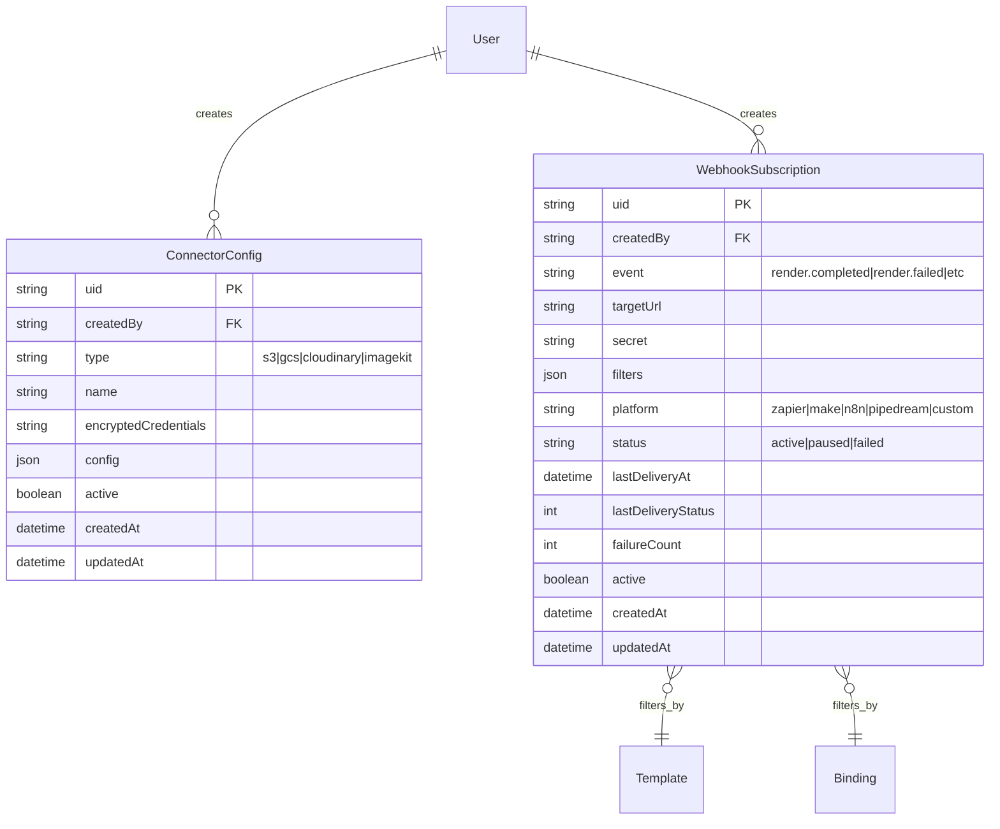

# feat: Automation Connectors with Universal Layer Architecture

**Date:** 2026-01-18
**Type:** Feature
**Complexity:** A LOT (Comprehensive)
**Estimated Scope:** Backend + Frontend + Platform Integrations
**Deepened:** 2026-01-18

---

## Enhancement Summary

**Deepened on:** 2026-01-18
**Research agents used:** architecture-strategist, security-sentinel, performance-oracle, code-simplicity-reviewer, kieran-typescript-reviewer, agent-native-reviewer, data-integrity-guardian, pattern-recognition-specialist

### Key Improvements from Research

1. **Security Hardening** - Use Redis for OAuth state (not in-memory Map), add SSRF protection for webhook URLs, use timing-safe comparisons for signature verification
2. **TypeScript Migration** - Convert all `.js` files to `.ts` with proper type definitions for Universal Core interfaces
3. **Agent-Native Expansion** - Add Template CRUD actions and binding lifecycle controls (Pause/Resume/Refresh) to achieve full API parity
4. **Performance Optimization** - Add Redis-based distributed rate limiting, circuit breaker pattern, compound MongoDB indexes
5. **Data Integrity** - Fix MongoDB `$or` query overwrite bug, add cascading soft-delete on user deletion, scheduled credential cleanup

### Critical Findings to Address

| Priority | Finding                                          | Mitigation                                                          |
| -------- | ------------------------------------------------ | ------------------------------------------------------------------- |
| 🔴 P1    | OAuth state in memory loses data on restart      | Use Redis with TTL for OAuth state storage                          |
| 🔴 P1    | MongoDB `$or` overwrite bug in webhook filtering | Use `$and` to combine multiple `$or` conditions                     |
| 🔴 P1    | No SSRF protection on webhook targetUrl          | Add URL allowlist validation, block private IPs                     |
| 🟡 P2    | Missing 42% of actions for agent parity          | Add Template CRUD and binding lifecycle actions                     |
| 🟡 P2    | No circuit breaker for webhook delivery          | Implement circuit breaker to prevent cascade failures               |
| 🟡 P2    | No compound indexes for WebhookSubscription      | Add indexes for `(event, status, active)` and `(createdBy, active)` |
| 🔵 P3    | JavaScript instead of TypeScript                 | Convert to TypeScript for better type safety                        |

---

## Overview

Build a comprehensive automation connector system for Pictify that enables media generation workflows through integration with automation platforms (Zapier, Make.com, n8n, Pipedream) and storage destinations (S3, GCS, Cloudinary). The architecture follows a **Universal Core + Platform Drivers** pattern, where business logic is centralized in the Universal Core and platform-specific adaptations are handled by thin driver layers.

This approach mirrors how Stripe, Segment, and Clerk manage multiple integrations without drowning in platform-specific code.

---

## Problem Statement / Motivation

**Current State:**

- Pictify has a robust template rendering and dynamic binding system
- Users can create bindings with data sources and render images via API
- Webhook support exists for incoming data (push to binding)
- No automated workflow integrations with popular automation platforms

**User Pain Points:**

1. Users cannot trigger renders from their existing automation workflows
2. No way to automatically push rendered images to cloud storage
3. Manual API integration required for each use case
4. No event-driven triggers when renders complete or fail

**Business Value:**

- Unlock automation workflows for 10,000+ potential users on Zapier/Make/n8n
- Enable "set and forget" media generation pipelines
- Reduce customer support burden for API integration help
- Position Pictify as an automation-first platform

---

## Proposed Solution

### Architecture Overview

```
┌────────────────────────────────────────────────────────────────────────────────┐
│                           PICTIFY AUTOMATION LAYER                              │
├────────────────────────────────────────────────────────────────────────────────┤
│                                                                                 │
│   ┌─────────────────────────────────────────────────────────────────────────┐  │
│   │                         UNIVERSAL CORE                                   │  │
│   │  ┌─────────────┐  ┌─────────────┐  ┌─────────────┐  ┌─────────────┐    │  │
│   │  │   Actions   │  │  Triggers   │  │   Schemas   │  │    Auth     │    │  │
│   │  │ renderStatic│  │ renderDone  │  │ Zod schemas │  │ apiKeyAuth  │    │  │
│   │  │ renderDyn   │  │ renderFail  │  │ JSON Schema │  │ oauth2Auth  │    │  │
│   │  │ listTempls  │  │ bindingUpd  │  │ OpenAPI gen │  │ webhookAuth │    │  │
│   │  │ createBind  │  │ bindingFail │  │             │  │             │    │  │
│   │  │ uploadAsset │  │             │  │             │  │             │    │  │
│   │  └─────────────┘  └─────────────┘  └─────────────┘  └─────────────┘    │  │
│   └─────────────────────────────────────────────────────────────────────────┘  │
│                                      │                                          │
│                                      ▼                                          │
│   ┌─────────────────────────────────────────────────────────────────────────┐  │
│   │                        PLATFORM DRIVERS                                  │  │
│   │                                                                          │  │
│   │  ┌──────────┐  ┌──────────┐  ┌──────────┐  ┌──────────┐  ┌──────────┐  │  │
│   │  │  Zapier  │  │  Make.com│  │   n8n    │  │ Pipedream│  │ Webhooks │  │  │
│   │  │  Driver  │  │  Driver  │  │  Driver  │  │  Driver  │  │  Driver  │  │  │
│   │  └──────────┘  └──────────┘  └──────────┘  └──────────┘  └──────────┘  │  │
│   │                                                                          │  │
│   │  ┌──────────┐  ┌──────────┐  ┌──────────┐  ┌──────────┐               │  │
│   │  │    S3    │  │   GCS    │  │Cloudinary│  │ ImageKit │               │  │
│   │  │  Driver  │  │  Driver  │  │  Driver  │  │  Driver  │               │  │
│   │  └──────────┘  └──────────┘  └──────────┘  └──────────┘               │  │
│   └─────────────────────────────────────────────────────────────────────────┘  │
│                                                                                 │
└────────────────────────────────────────────────────────────────────────────────┘
```

### Key Design Principles

1. **Universal Core owns semantics** - All business logic, validation, and schemas live in the Universal Core
2. **Drivers are thin adapters** - Platform drivers only translate between Universal Core and platform-specific formats
3. **No business logic in drivers** - If you're writing `if/else` logic in a driver, it belongs in Universal Core
4. **Schema-first design** - Zod schemas define the contract; everything else is generated from them

---

## Research Insights (from Multi-Agent Analysis)

### Security Insights (security-sentinel)

**Critical OAuth State Storage Fix:**

```typescript
// ❌ WRONG: In-memory Map loses state on restart
const oauthStateStore = new Map();

// ✅ CORRECT: Use Redis with TTL
import Redis from 'ioredis';
const redis = new Redis(process.env.REDIS_URL);

async function storeOAuthState(state: string, data: OAuthStateData): Promise<void> {
	await redis.setex(`oauth:state:${state}`, 600, JSON.stringify(data)); // 10 min TTL
}

async function getOAuthState(state: string): Promise<OAuthStateData | null> {
	const data = await redis.get(`oauth:state:${state}`);
	if (!data) return null;
	await redis.del(`oauth:state:${state}`); // Single use
	return JSON.parse(data);
}
```

**SSRF Protection for Webhook URLs:**

```typescript
import { URL } from 'url';
import ipaddr from 'ipaddr.js';

function validateWebhookUrl(targetUrl: string): void {
	const url = new URL(targetUrl);

	// Block private/internal IPs
	const hostname = url.hostname;
	if (hostname === 'localhost' || hostname === '127.0.0.1') {
		throw new Error('Webhook URL cannot target localhost');
	}

	// Block private IP ranges
	try {
		const addr = ipaddr.parse(hostname);
		if (addr.range() !== 'unicast') {
			throw new Error('Webhook URL must target public IP');
		}
	} catch {
		// hostname is not an IP, DNS will resolve - that's fine
	}

	// Require HTTPS in production
	if (process.env.NODE_ENV === 'production' && url.protocol !== 'https:') {
		throw new Error('Webhook URL must use HTTPS');
	}
}
```

**Timing-Safe Signature Verification:**

```typescript
import crypto from 'crypto';

function verifyWebhookSignature(
	payload: string,
	signature: string,
	secret: string,
	timestamp: number
): boolean {
	// Check timestamp is within 5 minutes
	const now = Math.floor(Date.now() / 1000);
	if (Math.abs(now - timestamp) > 300) {
		return false;
	}

	const signedPayload = `${timestamp}.${payload}`;
	const expectedSig = crypto.createHmac('sha256', secret).update(signedPayload).digest('hex');

	// Use timing-safe comparison to prevent timing attacks
	return crypto.timingSafeEqual(Buffer.from(signature), Buffer.from(expectedSig));
}
```

### Performance Insights (performance-oracle)

**Distributed Rate Limiting with Redis:**

```typescript
import Redis from 'ioredis';

const redis = new Redis(process.env.REDIS_URL);

async function checkRateLimit(userId: string, limit = 100, windowSec = 60): Promise<boolean> {
	const key = `ratelimit:${userId}:${Math.floor(Date.now() / 1000 / windowSec)}`;

	const multi = redis.multi();
	multi.incr(key);
	multi.expire(key, windowSec);
	const results = await multi.exec();

	const count = results?.[0]?.[1] as number;
	return count <= limit;
}

// Fastify preHandler
async function rateLimitHandler(request: FastifyRequest, reply: FastifyReply) {
	const allowed = await checkRateLimit(request.user.uid);
	if (!allowed) {
		reply.header('Retry-After', '60');
		throw fastify.httpErrors.tooManyRequests('Rate limit exceeded');
	}
}
```

**Circuit Breaker for Webhook Delivery:**

```typescript
interface CircuitBreakerState {
	failures: number;
	lastFailure: number;
	state: 'closed' | 'open' | 'half-open';
}

const circuitBreakers = new Map<string, CircuitBreakerState>();
const FAILURE_THRESHOLD = 5;
const RESET_TIMEOUT_MS = 60000;

async function deliverWithCircuitBreaker(
	subscriptionId: string,
	deliveryFn: () => Promise<void>
): Promise<void> {
	const circuit = circuitBreakers.get(subscriptionId) || {
		failures: 0,
		lastFailure: 0,
		state: 'closed'
	};

	// Check if circuit is open
	if (circuit.state === 'open') {
		if (Date.now() - circuit.lastFailure > RESET_TIMEOUT_MS) {
			circuit.state = 'half-open';
		} else {
			throw new Error('Circuit breaker open');
		}
	}

	try {
		await deliveryFn();
		circuit.failures = 0;
		circuit.state = 'closed';
	} catch (error) {
		circuit.failures++;
		circuit.lastFailure = Date.now();
		if (circuit.failures >= FAILURE_THRESHOLD) {
			circuit.state = 'open';
		}
		throw error;
	} finally {
		circuitBreakers.set(subscriptionId, circuit);
	}
}
```

**MongoDB Compound Indexes for WebhookSubscription:**

```javascript
// In WebhookSubscription model
webhookSubscriptionSchema.index({ event: 1, status: 1, active: 1 });
webhookSubscriptionSchema.index({ createdBy: 1, active: 1 });
webhookSubscriptionSchema.index({ 'filters.templateId': 1, event: 1, status: 1 });
webhookSubscriptionSchema.index({ 'filters.bindingId': 1, event: 1, status: 1 });
```

### Agent-Native Insights (agent-native-reviewer)

**Missing Actions for Full Agent Parity (42% gap):**

Add these actions to achieve full agent accessibility:

```typescript
// connectors/universal/actions/createTemplate.ts
export const createTemplate = {
	key: 'create_template',
	name: 'Create Template',
	description: 'Create a new template from HTML/CSS',
	inputSchema: z.object({
		name: z.string().min(1).max(100),
		html: z.string(),
		css: z.string().optional(),
		variables: z
			.array(
				z.object({
					name: z.string(),
					type: z.enum(['text', 'image', 'number', 'boolean']),
					defaultValue: z.unknown().optional()
				})
			)
			.optional()
	}),
	outputSchema: z.object({
		templateId: z.string(),
		name: z.string(),
		createdAt: z.string().datetime()
	})
};

// connectors/universal/actions/updateTemplate.ts
export const updateTemplate = {
	key: 'update_template',
	name: 'Update Template',
	description: 'Update an existing template',
	inputSchema: z.object({
		templateId: z.string(),
		name: z.string().optional(),
		html: z.string().optional(),
		css: z.string().optional()
	}),
	outputSchema: z.object({
		templateId: z.string(),
		updatedAt: z.string().datetime()
	})
};

// connectors/universal/actions/deleteTemplate.ts
export const deleteTemplate = {
	key: 'delete_template',
	name: 'Delete Template',
	description: 'Delete a template (soft delete)',
	inputSchema: z.object({
		templateId: z.string()
	}),
	outputSchema: z.object({
		success: z.boolean(),
		deletedAt: z.string().datetime()
	})
};
```

**Binding Lifecycle Controls:**

```typescript
// connectors/universal/actions/pauseBinding.ts
export const pauseBinding = {
	key: 'pause_binding',
	name: 'Pause Binding',
	description: 'Temporarily disable a binding from refreshing',
	inputSchema: z.object({ bindingId: z.string() }),
	outputSchema: z.object({ success: z.boolean(), status: z.literal('paused') })
};

// connectors/universal/actions/resumeBinding.ts
export const resumeBinding = {
	key: 'resume_binding',
	name: 'Resume Binding',
	description: 'Re-enable a paused binding',
	inputSchema: z.object({ bindingId: z.string() }),
	outputSchema: z.object({ success: z.boolean(), status: z.literal('active') })
};

// connectors/universal/actions/refreshBinding.ts
export const refreshBinding = {
	key: 'refresh_binding',
	name: 'Refresh Binding',
	description: 'Force refresh binding data from source',
	inputSchema: z.object({
		bindingId: z.string(),
		invalidateCache: z.boolean().default(true)
	}),
	outputSchema: z.object({
		success: z.boolean(),
		refreshedAt: z.string().datetime(),
		dataAge: z.number()
	})
};
```

### Data Integrity Insights (data-integrity-guardian)

**Fix MongoDB $or Overwrite Bug:**

```typescript
// ❌ WRONG: Second $or overwrites first
const query = {
	event,
	status: 'active'
};
if (filters.templateId) {
	query.$or = [
		{ 'filters.templateId': filters.templateId },
		{ 'filters.templateId': { $exists: false } }
	];
}
if (filters.bindingId) {
	// This OVERWRITES the previous $or!
	query.$or = [
		{ 'filters.bindingId': filters.bindingId },
		{ 'filters.bindingId': { $exists: false } }
	];
}

// ✅ CORRECT: Use $and to combine conditions
async function findMatchingSubscriptions(event: string, filters: Filters) {
	const conditions: any[] = [{ event }, { status: 'active' }];

	if (filters.templateId) {
		conditions.push({
			$or: [
				{ 'filters.templateId': filters.templateId },
				{ 'filters.templateId': { $exists: false } }
			]
		});
	}

	if (filters.bindingId) {
		conditions.push({
			$or: [{ 'filters.bindingId': filters.bindingId }, { 'filters.bindingId': { $exists: false } }]
		});
	}

	return WebhookSubscription.find({ $and: conditions });
}
```

**Cascading Soft-Delete on User Deletion:**

```typescript
// When a user is deleted, cascade to their resources
async function softDeleteUser(userId: string): Promise<void> {
	const session = await mongoose.startSession();
	session.startTransaction();

	try {
		// Soft-delete user's webhook subscriptions
		await WebhookSubscription.updateMany(
			{ createdBy: userId },
			{ active: false, deletedAt: new Date() },
			{ session }
		);

		// Soft-delete user's connector configs
		await ConnectorConfig.updateMany(
			{ createdBy: userId },
			{ active: false, deletedAt: new Date() },
			{ session }
		);

		// Soft-delete user
		await User.updateOne({ uid: userId }, { active: false, deletedAt: new Date() }, { session });

		await session.commitTransaction();
	} catch (error) {
		await session.abortTransaction();
		throw error;
	} finally {
		session.endSession();
	}
}
```

### TypeScript Migration (kieran-typescript-reviewer)

**Core Type Definitions:**

```typescript
// connectors/universal/types.ts

import { z } from 'zod';

export interface ActionContext {
	user: {
		uid: string;
		email: string;
		plan: 'free' | 'pro' | 'enterprise';
	};
	services: {
		template: TemplateService;
		renderer: RendererService;
		binding: BindingService;
		storage: StorageService;
	};
}

export interface UniversalAction<TInput extends z.ZodType, TOutput extends z.ZodType> {
	key: string;
	name: string;
	description: string;
	inputSchema: TInput;
	outputSchema: TOutput;
	handler: (input: z.infer<TInput>, context: ActionContext) => Promise<z.infer<TOutput>>;
	sampleOutput?: z.infer<TOutput>;
}

export interface UniversalTrigger<TPayload extends z.ZodType, TSubscription extends z.ZodType> {
	key: string;
	name: string;
	description: string;
	payloadSchema: TPayload;
	subscriptionSchema: TSubscription;
	samplePayload: z.infer<TPayload>;
}

export interface DriverAdapter {
	name: string;
	version: string;
	adaptAction: <T extends UniversalAction<any, any>>(action: T) => unknown;
	adaptTrigger: <T extends UniversalTrigger<any, any>>(trigger: T) => unknown;
}
```

### Architecture Insights (architecture-strategist)

**Unified Credential Management:**

```typescript
// service/credential-manager.ts

import { encryptCredentials, decryptCredentials } from './encryption-service';

export class CredentialManager {
	constructor(private redis: Redis, private encryptionKey: string) {}

	async store(userId: string, provider: string, credentials: unknown): Promise<string> {
		const credentialId = `cred_${uid()}`;
		const encrypted = encryptCredentials(credentials, this.encryptionKey);

		await ConnectorConfig.create({
			uid: credentialId,
			createdBy: userId,
			type: provider,
			encryptedCredentials: encrypted
		});

		return credentialId;
	}

	async retrieve(userId: string, credentialId: string): Promise<unknown> {
		const config = await ConnectorConfig.findOne({
			uid: credentialId,
			createdBy: userId,
			active: true
		});

		if (!config) {
			throw new Error('Credential not found');
		}

		return decryptCredentials(config.encryptedCredentials, this.encryptionKey);
	}

	async rotate(userId: string, credentialId: string, newCredentials: unknown): Promise<void> {
		const encrypted = encryptCredentials(newCredentials, this.encryptionKey);

		await ConnectorConfig.updateOne(
			{ uid: credentialId, createdBy: userId },
			{ encryptedCredentials: encrypted, updatedAt: new Date() }
		);
	}
}
```

### Simplicity Insights (code-simplicity-reviewer)

**MVP Reduction Strategy:**

For faster MVP, consider reducing initial scope:

1. **Phase 1 MVP Actions (4 endpoints):**

   - `RenderWithVariables` - Core value proposition
   - `ListTemplates` - Required for dynamic dropdowns
   - `CreateWebhookSubscription` - Enable triggers
   - `DeleteWebhookSubscription` - Cleanup

2. **Defer to Phase 2:**

   - Storage adapters (S3, GCS, Cloudinary, ImageKit)
   - OAuth2 for Zapier (use API key auth first)
   - Platform-specific drivers (start with generic webhook)

3. **Simplify WebhookSubscription:**
   - Start with `custom` platform only
   - Add platform-specific features after validating core flow

---

## Technical Approach

### Phase 1: Universal Core Foundation

#### 1.1 Directory Structure

```
Backend (/Users/suyashthakur/html-to-gif):
├── connectors/
│   ├── universal/
│   │   ├── actions/
│   │   │   ├── renderStatic.js
│   │   │   ├── renderWithVariables.js
│   │   │   ├── renderDynamic.js
│   │   │   ├── listTemplates.js
│   │   │   ├── getTemplate.js
│   │   │   ├── getTemplateVariables.js
│   │   │   ├── createBinding.js
│   │   │   ├── updateBinding.js
│   │   │   ├── deleteBinding.js
│   │   │   ├── publishBinding.js
│   │   │   └── uploadAsset.js
│   │   ├── triggers/
│   │   │   ├── renderCompleted.js
│   │   │   ├── renderFailed.js
│   │   │   ├── bindingUpdated.js
│   │   │   └── bindingFailed.js
│   │   ├── schemas/
│   │   │   ├── actionSchemas.js
│   │   │   ├── triggerSchemas.js
│   │   │   └── openapi.js
│   │   ├── auth/
│   │   │   ├── apiKeyAuth.js
│   │   │   └── oauth2Auth.js
│   │   └── index.js
│   ├── drivers/
│   │   ├── zapier/
│   │   │   ├── index.js
│   │   │   ├── actionAdapter.js
│   │   │   ├── triggerAdapter.js
│   │   │   └── authAdapter.js
│   │   ├── make/
│   │   │   ├── index.js
│   │   │   ├── moduleAdapter.js
│   │   │   └── authAdapter.js
│   │   ├── n8n/
│   │   │   ├── index.js
│   │   │   ├── nodeAdapter.js
│   │   │   └── credentialAdapter.js
│   │   ├── pipedream/
│   │   │   ├── index.js
│   │   │   └── componentAdapter.js
│   │   ├── webhooks/
│   │   │   ├── incomingHandler.js
│   │   │   └── outgoingEmitter.js
│   │   └── storage/
│   │       ├── s3Adapter.js
│   │       ├── gcsAdapter.js
│   │       ├── cloudinaryAdapter.js
│   │       └── imagekitAdapter.js
│   └── index.js
├── routes/
│   ├── connectors.js          # CRUD for connector configs
│   ├── webhook-subscriptions.js  # Trigger subscriptions
│   └── oauth.js               # OAuth2 endpoints
└── models/
    ├── ConnectorConfig.js     # User's connector settings
    └── WebhookSubscription.js # Trigger subscriptions

Frontend (/Users/suyashthakur/front-end-html-to-gif):
├── src/
│   ├── api/
│   │   ├── connector.js       # Connector API client
│   │   └── webhookSubscription.js
│   ├── store/
│   │   └── connector.store.js
│   └── routes/
│       └── dashboard/
│           └── integrations/
│               ├── +page.svelte
│               ├── [provider]/
│               │   └── +page.svelte
│               └── webhooks/
│                   └── +page.svelte
```

#### 1.2 Universal Action Interface

```javascript
// connectors/universal/actions/renderStatic.js

const { z } = require('zod');

const inputSchema = z.object({
	templateId: z.string().min(1).describe('The template UID to render'),
	format: z.enum(['png', 'jpeg', 'webp', 'pdf']).default('png'),
	quality: z.number().min(1).max(100).default(90),
	width: z.number().positive().optional(),
	height: z.number().positive().optional()
});

const outputSchema = z.object({
	renderId: z.string(),
	url: z.string().url(),
	format: z.string(),
	width: z.number(),
	height: z.number(),
	size: z.number(),
	createdAt: z.string().datetime()
});

async function handler(input, context) {
	const { templateId, format, quality, width, height } = input;
	const { user, services } = context;

	// Validate user has access to template
	const template = await services.template.getById(templateId, user.uid);
	if (!template) {
		throw new ActionError('TEMPLATE_NOT_FOUND', `Template ${templateId} not found`);
	}

	// Render the template
	const result = await services.renderer.render({
		template,
		variables: template.getVariablesWithDefaults(),
		outputConfig: { format, quality, width, height },
		user
	});

	return {
		renderId: result.uid,
		url: result.url,
		format: result.format,
		width: result.width,
		height: result.height,
		size: result.size,
		createdAt: result.createdAt.toISOString()
	};
}

module.exports = {
	key: 'render_static',
	name: 'Render Static Template',
	description: 'Render a template with its default variable values',
	inputSchema,
	outputSchema,
	handler
};
```

#### 1.3 Universal Trigger Interface

```javascript
// connectors/universal/triggers/renderCompleted.js

const { z } = require('zod');

const payloadSchema = z.object({
	event: z.literal('render.completed'),
	timestamp: z.string().datetime(),
	data: z.object({
		renderId: z.string(),
		templateId: z.string(),
		templateName: z.string(),
		bindingId: z.string().optional(),
		url: z.string().url(),
		format: z.string(),
		width: z.number(),
		height: z.number(),
		size: z.number(),
		duration: z.number().describe('Render duration in milliseconds'),
		variables: z.record(z.unknown()).optional()
	})
});

const subscriptionSchema = z.object({
	targetUrl: z.string().url(),
	templateId: z.string().optional().describe('Filter by specific template'),
	bindingId: z.string().optional().describe('Filter by specific binding')
});

module.exports = {
	key: 'render_completed',
	name: 'Render Completed',
	description: 'Triggers when a template render completes successfully',
	payloadSchema,
	subscriptionSchema,
	samplePayload: {
		event: 'render.completed',
		timestamp: '2026-01-18T10:30:00.000Z',
		data: {
			renderId: 'rnd_abc123',
			templateId: 'tpl_xyz789',
			templateName: 'Social Media Banner',
			url: 'https://cdn.pictify.io/renders/abc123.png',
			format: 'png',
			width: 1200,
			height: 630,
			size: 45678,
			duration: 1234
		}
	}
};
```

#### 1.4 Zod Schemas for All Actions

```javascript
// connectors/universal/schemas/actionSchemas.js

const { z } = require('zod');

// Shared schemas
const templateIdSchema = z.string().min(1).regex(/^tpl_/);
const bindingIdSchema = z
	.string()
	.min(1)
	.regex(/^bind_/);
const formatSchema = z.enum(['png', 'jpeg', 'webp', 'pdf']);
const variablesSchema = z.record(z.unknown());

// RenderWithVariables
const renderWithVariablesInput = z.object({
	templateId: templateIdSchema,
	variables: variablesSchema,
	format: formatSchema.default('png'),
	quality: z.number().min(1).max(100).default(90)
});

// RenderDynamic
const renderDynamicInput = z.object({
	bindingId: bindingIdSchema,
	forceRefresh: z.boolean().default(false)
});

// CreateBinding
const createBindingInput = z.object({
	name: z.string().min(1).max(100),
	templateId: templateIdSchema,
	dataSource: z.object({
		type: z.enum(['http', 'webhook', 'static']),
		url: z.string().url().optional(),
		method: z.enum(['GET', 'POST']).default('GET'),
		headers: z.record(z.string()).optional(),
		body: z.unknown().optional(),
		staticData: z.unknown().optional()
	}),
	mapping: z.record(z.string()).describe('Variable name -> JSONPath mapping'),
	defaults: z.record(z.unknown()).optional(),
	refreshPolicy: z
		.object({
			type: z.enum(['ttl', 'etag', 'webhook', 'manual']).default('ttl'),
			ttlSeconds: z.number().min(60).max(604800).default(3600),
			onError: z.enum(['serve_stale', 'serve_error', 'serve_default']).default('serve_stale')
		})
		.optional(),
	outputConfig: z
		.object({
			format: formatSchema.default('png'),
			quality: z.number().min(1).max(100).default(90)
		})
		.optional()
});

// UploadAsset
const uploadAssetInput = z.object({
	destination: z.object({
		type: z.enum(['s3', 'gcs', 'cloudinary', 'imagekit']),
		configId: z.string().optional().describe('Reference to saved storage config'),
		// Or inline credentials (encrypted)
		bucket: z.string().optional(),
		region: z.string().optional(),
		prefix: z.string().optional()
	}),
	source: z.union([
		z.object({ url: z.string().url() }),
		z.object({ renderId: z.string() }),
		z.object({ bindingId: z.string() })
	]),
	filename: z.string().optional()
});

module.exports = {
	templateIdSchema,
	bindingIdSchema,
	formatSchema,
	variablesSchema,
	renderWithVariablesInput,
	renderDynamicInput,
	createBindingInput,
	uploadAssetInput
};
```

### Phase 2: Webhook Subscription System

#### 2.1 WebhookSubscription Model

```javascript
// models/WebhookSubscription.js

const mongoose = require('mongoose');
const { uid } = require('../util/uid');
const crypto = require('crypto');

const webhookSubscriptionSchema = new mongoose.Schema(
	{
		uid: {
			type: String,
			default: () => uid('wsub'),
			unique: true,
			index: true
		},
		createdBy: {
			type: String,
			required: true,
			index: true
		},
		event: {
			type: String,
			required: true,
			enum: ['render.completed', 'render.failed', 'binding.updated', 'binding.failed'],
			index: true
		},
		targetUrl: {
			type: String,
			required: true
		},
		secret: {
			type: String,
			default: () => crypto.randomBytes(32).toString('hex')
		},
		filters: {
			templateId: String,
			bindingId: String
		},
		platform: {
			type: String,
			enum: ['zapier', 'make', 'n8n', 'pipedream', 'custom'],
			default: 'custom'
		},
		status: {
			type: String,
			enum: ['active', 'paused', 'failed'],
			default: 'active'
		},
		lastDeliveryAt: Date,
		lastDeliveryStatus: Number,
		failureCount: {
			type: Number,
			default: 0
		},
		active: {
			type: Boolean,
			default: true
		}
	},
	{
		timestamps: true
	}
);

// Soft delete query middleware
webhookSubscriptionSchema.pre('find', function (next) {
	this.where({ active: true });
	next();
});

webhookSubscriptionSchema.pre('findOne', function (next) {
	this.where({ active: true });
	next();
});

module.exports = mongoose.model('WebhookSubscription', webhookSubscriptionSchema);
```

#### 2.2 Webhook Delivery Service

```javascript
// service/webhook-delivery.js

const crypto = require('crypto');
const WebhookSubscription = require('../models/WebhookSubscription');
const { createQueue } = require('../lib/queue');

const webhookQueue = createQueue('webhook-delivery');

function signPayload(payload, secret) {
	const timestamp = Math.floor(Date.now() / 1000);
	const signedPayload = `${timestamp}.${JSON.stringify(payload)}`;
	const signature = crypto.createHmac('sha256', secret).update(signedPayload).digest('hex');
	return { timestamp, signature };
}

async function emitEvent(event, data, filters = {}) {
	// Find all matching subscriptions
	const query = {
		event,
		status: 'active'
	};

	if (filters.templateId) {
		query.$or = [
			{ 'filters.templateId': filters.templateId },
			{ 'filters.templateId': { $exists: false } }
		];
	}

	if (filters.bindingId) {
		query.$or = [
			{ 'filters.bindingId': filters.bindingId },
			{ 'filters.bindingId': { $exists: false } }
		];
	}

	const subscriptions = await WebhookSubscription.find(query);

	// Queue delivery for each subscription
	const jobs = subscriptions.map((sub) => ({
		name: 'deliver',
		data: {
			subscriptionId: sub.uid,
			payload: {
				event,
				timestamp: new Date().toISOString(),
				data
			}
		},
		opts: {
			attempts: 10,
			backoff: {
				type: 'exponential',
				delay: 1000
			}
		}
	}));

	await webhookQueue.addBulk(jobs);

	return { delivered: jobs.length };
}

// Queue processor
webhookQueue.process('deliver', async (job) => {
	const { subscriptionId, payload } = job.data;

	const subscription = await WebhookSubscription.findOne({ uid: subscriptionId });
	if (!subscription || subscription.status !== 'active') {
		return { skipped: true };
	}

	const { timestamp, signature } = signPayload(payload, subscription.secret);

	const response = await fetch(subscription.targetUrl, {
		method: 'POST',
		headers: {
			'Content-Type': 'application/json',
			'X-Webhook-Signature': `t=${timestamp},v1=${signature}`,
			'X-Webhook-Event': payload.event,
			'X-Webhook-Delivery-Id': job.id
		},
		body: JSON.stringify(payload),
		signal: AbortSignal.timeout(10000) // 10 second timeout
	});

	// Update delivery status
	await WebhookSubscription.updateOne(
		{ uid: subscriptionId },
		{
			lastDeliveryAt: new Date(),
			lastDeliveryStatus: response.status,
			failureCount: response.ok ? 0 : subscription.failureCount + 1,
			status: subscription.failureCount >= 10 ? 'failed' : 'active'
		}
	);

	if (!response.ok) {
		throw new Error(`Delivery failed: ${response.status}`);
	}

	return { delivered: true, status: response.status };
});

module.exports = { emitEvent, signPayload };
```

### Phase 3: Platform Drivers

#### 3.1 Zapier Driver

```javascript
// connectors/drivers/zapier/index.js

const universalCore = require('../../universal');
const { adaptAction } = require('./actionAdapter');
const { adaptTrigger } = require('./triggerAdapter');
const { adaptAuth } = require('./authAdapter');

/**
 * Generates Zapier app definition from Universal Core
 */
function generateZapierApp() {
	const actions = {};
	const triggers = {};

	// Convert universal actions to Zapier format
	for (const [key, action] of Object.entries(universalCore.actions)) {
		actions[key] = adaptAction(action);
	}

	// Convert universal triggers to Zapier format
	for (const [key, trigger] of Object.entries(universalCore.triggers)) {
		triggers[key] = adaptTrigger(trigger);
	}

	return {
		version: '1.0.0',
		platformVersion: '15.0.0',
		authentication: adaptAuth(universalCore.auth.oauth2),
		triggers,
		creates: actions,
		searches: {
			find_template: {
				key: 'find_template',
				noun: 'Template',
				display: {
					label: 'Find Template',
					description: 'Finds a template by name or ID'
				},
				operation: {
					perform: async (z, bundle) => {
						const response = await z.request({
							url: `${process.env.API_URL}/templates`,
							params: {
								search: bundle.inputData.search,
								limit: 1
							}
						});
						return response.data.templates;
					},
					inputFields: [
						{
							key: 'search',
							label: 'Search',
							type: 'string',
							required: true
						}
					]
				}
			}
		}
	};
}

module.exports = { generateZapierApp };
```

```javascript
// connectors/drivers/zapier/actionAdapter.js

const { zodToJsonSchema } = require('zod-to-json-schema');

function adaptAction(universalAction) {
	const { key, name, description, inputSchema, outputSchema, handler } = universalAction;

	// Convert Zod schema to Zapier input fields
	const jsonSchema = zodToJsonSchema(inputSchema);
	const inputFields = jsonSchemaToZapierFields(jsonSchema);

	return {
		key,
		noun: name.split(' ').pop(), // Last word as noun
		display: {
			label: name,
			description
		},
		operation: {
			inputFields,
			perform: async (z, bundle) => {
				// Validate input
				const input = inputSchema.parse(bundle.inputData);

				// Create context from Zapier bundle
				const context = {
					user: bundle.authData.user,
					services: createServicesFromZapier(z, bundle)
				};

				// Execute universal handler
				return handler(input, context);
			},
			sample: outputSchema.parse(universalAction.sampleOutput || {})
		}
	};
}

function jsonSchemaToZapierFields(schema) {
	const fields = [];
	const properties = schema.properties || {};
	const required = schema.required || [];

	for (const [key, prop] of Object.entries(properties)) {
		fields.push({
			key,
			label: prop.title || key.replace(/([A-Z])/g, ' $1').trim(),
			type: mapJsonTypeToZapier(prop.type, prop.enum),
			required: required.includes(key),
			helpText: prop.description,
			default: prop.default,
			choices: prop.enum,
			// Dynamic dropdown for templateId
			dynamic: key === 'templateId' ? 'list_templates.id.name' : undefined
		});
	}

	return fields;
}

function mapJsonTypeToZapier(type, hasEnum) {
	if (hasEnum) return 'string'; // Will use choices
	const typeMap = {
		string: 'string',
		number: 'number',
		integer: 'integer',
		boolean: 'boolean',
		object: 'string', // JSON string
		array: 'string' // JSON string
	};
	return typeMap[type] || 'string';
}

module.exports = { adaptAction };
```

```javascript
// connectors/drivers/zapier/triggerAdapter.js

function adaptTrigger(universalTrigger) {
	const { key, name, description, payloadSchema, subscriptionSchema, samplePayload } =
		universalTrigger;

	return {
		key,
		noun: name.split(' ').pop(),
		display: {
			label: name,
			description
		},
		operation: {
			type: 'hook',
			performSubscribe: async (z, bundle) => {
				const response = await z.request({
					method: 'POST',
					url: `${process.env.API_URL}/webhook-subscriptions`,
					body: {
						event: key.replace(/_/g, '.'),
						targetUrl: bundle.targetUrl,
						platform: 'zapier',
						filters: {
							templateId: bundle.inputData.templateId,
							bindingId: bundle.inputData.bindingId
						}
					}
				});
				return response.data;
			},
			performUnsubscribe: async (z, bundle) => {
				await z.request({
					method: 'DELETE',
					url: `${process.env.API_URL}/webhook-subscriptions/${bundle.subscribeData.uid}`
				});
			},
			perform: async (z, bundle) => {
				// Return the cleaned payload
				return [bundle.cleanedRequest];
			},
			performList: async (z, bundle) => {
				// For testing - return recent events
				const response = await z.request({
					url: `${process.env.API_URL}/audit/logs`,
					params: {
						action: key.replace(/_/g, '.'),
						limit: 5
					}
				});
				return response.data.logs.map((log) => ({
					id: log.uid,
					...log.details
				}));
			},
			inputFields: buildFilterFields(subscriptionSchema),
			sample: samplePayload
		}
	};
}

module.exports = { adaptTrigger };
```

#### 3.2 n8n Driver

```javascript
// connectors/drivers/n8n/index.js

const universalCore = require('../../universal');
const { adaptNode } = require('./nodeAdapter');
const { adaptCredential } = require('./credentialAdapter');

/**
 * Generates n8n node definition from Universal Core
 */
function generateN8nNode() {
	const properties = [];

	// Resource selector
	properties.push({
		displayName: 'Resource',
		name: 'resource',
		type: 'options',
		noDataExpression: true,
		options: [
			{ name: 'Template', value: 'template' },
			{ name: 'Binding', value: 'binding' },
			{ name: 'Render', value: 'render' },
			{ name: 'Asset', value: 'asset' }
		],
		default: 'render'
	});

	// Operations per resource
	const resources = groupActionsByResource(universalCore.actions);

	for (const [resource, actions] of Object.entries(resources)) {
		properties.push({
			displayName: 'Operation',
			name: 'operation',
			type: 'options',
			displayOptions: {
				show: { resource: [resource] }
			},
			options: actions.map((action) => ({
				name: action.name,
				value: action.key,
				description: action.description,
				action: action.name
			})),
			default: actions[0].key
		});

		// Add input fields for each action
		for (const action of actions) {
			properties.push(...adaptNode(action, resource));
		}
	}

	return {
		displayName: 'Pictify',
		name: 'pictify',
		icon: 'file:pictify.svg',
		group: ['transform'],
		version: 1,
		subtitle: '={{$parameter["operation"]}}',
		description: 'Generate images and media with Pictify',
		defaults: { name: 'Pictify' },
		inputs: ['main'],
		outputs: ['main'],
		credentials: [{ name: 'pictifyApi', required: true }],
		requestDefaults: {
			baseURL: '={{$credentials.baseUrl || "https://api.pictify.io"}}',
			headers: {
				Authorization: '=Bearer {{$credentials.apiKey}}',
				'Content-Type': 'application/json'
			}
		},
		properties
	};
}

module.exports = { generateN8nNode };
```

#### 3.3 Storage Drivers

```javascript
// connectors/drivers/storage/s3Adapter.js

const { S3Client, PutObjectCommand } = require('@aws-sdk/client-s3');
const { getSignedUrl } = require('@aws-sdk/s3-request-presigner');

class S3Adapter {
	constructor(config) {
		this.bucket = config.bucket;
		this.prefix = config.prefix || '';
		this.client = new S3Client({
			region: config.region,
			credentials: {
				accessKeyId: config.accessKeyId,
				secretAccessKey: config.secretAccessKey
			},
			endpoint: config.endpoint // For S3-compatible services
		});
	}

	async upload(source, options = {}) {
		const { buffer, contentType, filename } = source;
		const key = `${this.prefix}${filename || `render-${Date.now()}.png`}`;

		const command = new PutObjectCommand({
			Bucket: this.bucket,
			Key: key,
			Body: buffer,
			ContentType: contentType,
			ACL: options.public ? 'public-read' : 'private'
		});

		await this.client.send(command);

		return {
			provider: 's3',
			bucket: this.bucket,
			key,
			url: options.public
				? `https://${this.bucket}.s3.amazonaws.com/${key}`
				: await this.getSignedUrl(key)
		};
	}

	async getSignedUrl(key, expiresIn = 3600) {
		const command = new GetObjectCommand({
			Bucket: this.bucket,
			Key: key
		});
		return getSignedUrl(this.client, command, { expiresIn });
	}
}

module.exports = { S3Adapter };
```

### Phase 4: API Routes

#### 4.1 Connector Configuration Routes

```javascript
// routes/connectors.js

const ConnectorConfig = require('../models/ConnectorConfig');
const { encryptCredentials, decryptCredentials } = require('../service/encryption-service');

module.exports = async function (fastify) {
	// List user's connector configurations
	fastify.get(
		'/connectors',
		{
			preHandler: [fastify.authenticate]
		},
		async (request) => {
			const configs = await ConnectorConfig.find({ createdBy: request.user.uid });
			return {
				connectors: configs.map((c) => ({
					...c.toJSON(),
					credentials: undefined // Never expose credentials
				}))
			};
		}
	);

	// Create connector configuration
	fastify.post(
		'/connectors',
		{
			preHandler: [fastify.authenticate],
			schema: {
				body: {
					type: 'object',
					required: ['type', 'name', 'credentials'],
					properties: {
						type: { type: 'string', enum: ['s3', 'gcs', 'cloudinary', 'imagekit'] },
						name: { type: 'string', minLength: 1, maxLength: 100 },
						credentials: { type: 'object' },
						config: { type: 'object' }
					}
				}
			}
		},
		async (request) => {
			const { type, name, credentials, config } = request.body;

			// Encrypt credentials before storing
			const encryptedCredentials = encryptCredentials(credentials);

			const connector = await ConnectorConfig.create({
				createdBy: request.user.uid,
				type,
				name,
				encryptedCredentials,
				config
			});

			return {
				connector: {
					uid: connector.uid,
					type: connector.type,
					name: connector.name,
					config: connector.config,
					createdAt: connector.createdAt
				}
			};
		}
	);

	// Test connector
	fastify.post(
		'/connectors/:id/test',
		{
			preHandler: [fastify.authenticate]
		},
		async (request) => {
			const connector = await ConnectorConfig.findOne({
				uid: request.params.id,
				createdBy: request.user.uid
			});

			if (!connector) {
				throw fastify.httpErrors.notFound('Connector not found');
			}

			const credentials = decryptCredentials(connector.encryptedCredentials);
			const adapter = createStorageAdapter(connector.type, {
				...connector.config,
				...credentials
			});

			try {
				// Upload a test file
				const testBuffer = Buffer.from('Pictify connector test');
				const result = await adapter.upload({
					buffer: testBuffer,
					contentType: 'text/plain',
					filename: '.pictify-test'
				});

				// Clean up test file
				await adapter.delete(result.key);

				return { success: true, message: 'Connection successful' };
			} catch (error) {
				return { success: false, message: error.message };
			}
		}
	);

	// Delete connector
	fastify.delete(
		'/connectors/:id',
		{
			preHandler: [fastify.authenticate]
		},
		async (request) => {
			await ConnectorConfig.updateOne(
				{ uid: request.params.id, createdBy: request.user.uid },
				{ active: false }
			);
			return { success: true };
		}
	);
};
```

#### 4.2 Webhook Subscription Routes

```javascript
// routes/webhook-subscriptions.js

const WebhookSubscription = require('../models/WebhookSubscription');

module.exports = async function (fastify) {
	// List subscriptions
	fastify.get(
		'/webhook-subscriptions',
		{
			preHandler: [fastify.authenticate]
		},
		async (request) => {
			const subscriptions = await WebhookSubscription.find({
				createdBy: request.user.uid
			});
			return { subscriptions };
		}
	);

	// Create subscription
	fastify.post(
		'/webhook-subscriptions',
		{
			preHandler: [fastify.authenticate],
			schema: {
				body: {
					type: 'object',
					required: ['event', 'targetUrl'],
					properties: {
						event: {
							type: 'string',
							enum: ['render.completed', 'render.failed', 'binding.updated', 'binding.failed']
						},
						targetUrl: { type: 'string', format: 'uri' },
						platform: { type: 'string', enum: ['zapier', 'make', 'n8n', 'pipedream', 'custom'] },
						filters: {
							type: 'object',
							properties: {
								templateId: { type: 'string' },
								bindingId: { type: 'string' }
							}
						}
					}
				}
			}
		},
		async (request) => {
			const subscription = await WebhookSubscription.create({
				createdBy: request.user.uid,
				...request.body
			});

			return {
				subscription: {
					uid: subscription.uid,
					event: subscription.event,
					targetUrl: subscription.targetUrl,
					secret: subscription.secret, // Return secret only on creation
					filters: subscription.filters,
					status: subscription.status,
					createdAt: subscription.createdAt
				}
			};
		}
	);

	// Delete subscription
	fastify.delete(
		'/webhook-subscriptions/:id',
		{
			preHandler: [fastify.authenticate]
		},
		async (request) => {
			await WebhookSubscription.updateOne(
				{ uid: request.params.id, createdBy: request.user.uid },
				{ active: false }
			);
			return { success: true };
		}
	);
};
```

#### 4.3 OAuth2 Routes

```javascript
// routes/oauth.js

const crypto = require('crypto');
const { generatePKCE, OAuth2Client } = require('../connectors/universal/auth/oauth2Auth');

const oauthStateStore = new Map(); // In production, use Redis

module.exports = async function (fastify) {
	// Initiate OAuth flow
	fastify.get('/oauth/:provider/authorize', async (request, reply) => {
		const { provider } = request.params;
		const { redirect_uri } = request.query;

		const state = crypto.randomUUID();
		const pkce = generatePKCE();

		// Store state and PKCE for verification
		oauthStateStore.set(state, {
			pkce,
			provider,
			redirectUri: redirect_uri,
			expiresAt: Date.now() + 10 * 60 * 1000
		});

		const client = new OAuth2Client(getProviderConfig(provider));
		const authUrl = client.getAuthorizationUrl(state, pkce.codeChallenge);

		return reply.redirect(authUrl);
	});

	// OAuth callback
	fastify.get('/oauth/:provider/callback', async (request, reply) => {
		const { provider } = request.params;
		const { code, state, error } = request.query;

		if (error) {
			return reply.redirect(`/integrations/${provider}?error=${error}`);
		}

		const storedState = oauthStateStore.get(state);
		if (!storedState || storedState.expiresAt < Date.now()) {
			return reply.redirect(`/integrations/${provider}?error=invalid_state`);
		}

		oauthStateStore.delete(state);

		const client = new OAuth2Client(getProviderConfig(provider));
		const tokens = await client.exchangeCode(code, storedState.pkce.codeVerifier);

		// Store tokens securely (associated with user session)
		// This would typically create or update a ConnectorConfig

		return reply.redirect(`/integrations/${provider}?success=true`);
	});
};
```

### Phase 5: Frontend Integration Panel

#### 5.1 Integrations Dashboard

```svelte
<!-- src/routes/dashboard/integrations/+page.svelte -->
<script>
	import { onMount } from 'svelte';
	import { getConnectors, deleteConnector } from '$api/connector';
	import { getWebhookSubscriptions } from '$api/webhookSubscription';

	let connectors = [];
	let subscriptions = [];
	let loading = true;

	const platforms = [
		{ id: 'zapier', name: 'Zapier', icon: 'zapier.svg', status: 'available' },
		{ id: 'make', name: 'Make.com', icon: 'make.svg', status: 'available' },
		{ id: 'n8n', name: 'n8n', icon: 'n8n.svg', status: 'available' },
		{ id: 'pipedream', name: 'Pipedream', icon: 'pipedream.svg', status: 'coming_soon' }
	];

	const storageProviders = [
		{ id: 's3', name: 'Amazon S3', icon: 'aws-s3.svg' },
		{ id: 'gcs', name: 'Google Cloud Storage', icon: 'gcs.svg' },
		{ id: 'cloudinary', name: 'Cloudinary', icon: 'cloudinary.svg' },
		{ id: 'imagekit', name: 'ImageKit', icon: 'imagekit.svg' }
	];

	onMount(async () => {
		[connectors, subscriptions] = await Promise.all([getConnectors(), getWebhookSubscriptions()]);
		loading = false;
	});
</script>

<div class="max-w-6xl mx-auto p-6">
	<h1 class="text-2xl font-bold mb-6">Integrations</h1>

	<!-- Automation Platforms -->
	<section class="mb-8">
		<h2 class="text-lg font-semibold mb-4">Automation Platforms</h2>
		<div class="grid grid-cols-1 md:grid-cols-2 lg:grid-cols-4 gap-4">
			{#each platforms as platform}
				<a
					href="/dashboard/integrations/{platform.id}"
					class="block p-4 border rounded-lg hover:border-blue-500 transition-colors"
					class:opacity-50={platform.status === 'coming_soon'}
				>
					<div class="flex items-center gap-3">
						
						<div>
							<div class="font-medium">{platform.name}</div>
							{#if platform.status === 'coming_soon'}
								<div class="text-xs text-gray-500">Coming Soon</div>
							{:else}
								<div class="text-xs text-green-600">Available</div>
							{/if}
						</div>
					</div>
				</a>
			{/each}
		</div>
	</section>

	<!-- Storage Destinations -->
	<section class="mb-8">
		<h2 class="text-lg font-semibold mb-4">Storage Destinations</h2>
		<div class="grid grid-cols-1 md:grid-cols-2 lg:grid-cols-4 gap-4">
			{#each storageProviders as provider}
				<button
					on:click={() => openStorageModal(provider.id)}
					class="p-4 border rounded-lg hover:border-blue-500 transition-colors text-left"
				>
					<div class="flex items-center gap-3">
						
						<div>
							<div class="font-medium">{provider.name}</div>
							<div class="text-xs text-gray-500">
								{connectors.filter((c) => c.type === provider.id).length} configured
							</div>
						</div>
					</div>
				</button>
			{/each}
		</div>
	</section>

	<!-- Active Webhooks -->
	<section>
		<h2 class="text-lg font-semibold mb-4">Webhook Subscriptions</h2>
		{#if subscriptions.length === 0}
			<p class="text-gray-500">No active webhook subscriptions.</p>
		{:else}
			<div class="border rounded-lg overflow-hidden">
				<table class="w-full">
					<thead class="bg-gray-50">
						<tr>
							<th class="px-4 py-2 text-left">Event</th>
							<th class="px-4 py-2 text-left">Target URL</th>
							<th class="px-4 py-2 text-left">Platform</th>
							<th class="px-4 py-2 text-left">Status</th>
							<th class="px-4 py-2" />
						</tr>
					</thead>
					<tbody>
						{#each subscriptions as sub}
							<tr class="border-t">
								<td class="px-4 py-2 font-mono text-sm">{sub.event}</td>
								<td class="px-4 py-2 text-sm truncate max-w-xs">{sub.targetUrl}</td>
								<td class="px-4 py-2 capitalize">{sub.platform}</td>
								<td class="px-4 py-2">
									<span
										class="px-2 py-1 rounded text-xs"
										class:bg-green-100={sub.status === 'active'}
										class:text-green-800={sub.status === 'active'}
										class:bg-red-100={sub.status === 'failed'}
										class:text-red-800={sub.status === 'failed'}
									>
										{sub.status}
									</span>
								</td>
								<td class="px-4 py-2">
									<button
										on:click={() => deleteSubscription(sub.uid)}
										class="text-red-600 hover:text-red-800"
									>
										Delete
									</button>
								</td>
							</tr>
						{/each}
					</tbody>
				</table>
			</div>
		{/if}
	</section>
</div>
```

#### 5.2 Storage Configuration Modal

```svelte
<!-- src/lib/components/integrations/StorageConfigModal.svelte -->
<script>
	import { createConnector, testConnector } from '$api/connector';

	export let provider;
	export let onClose;
	export let onSave;

	let name = '';
	let credentials = {};
	let config = {};
	let testing = false;
	let testResult = null;

	const providerFields = {
		s3: [
			{ key: 'accessKeyId', label: 'Access Key ID', type: 'text', required: true },
			{ key: 'secretAccessKey', label: 'Secret Access Key', type: 'password', required: true },
			{ key: 'region', label: 'Region', type: 'text', required: true, placeholder: 'us-east-1' },
			{ key: 'bucket', label: 'Bucket', type: 'text', required: true },
			{ key: 'prefix', label: 'Path Prefix', type: 'text', placeholder: 'renders/' }
		],
		gcs: [
			{ key: 'projectId', label: 'Project ID', type: 'text', required: true },
			{ key: 'clientEmail', label: 'Service Account Email', type: 'text', required: true },
			{ key: 'privateKey', label: 'Private Key', type: 'textarea', required: true },
			{ key: 'bucket', label: 'Bucket', type: 'text', required: true }
		],
		cloudinary: [
			{ key: 'cloudName', label: 'Cloud Name', type: 'text', required: true },
			{ key: 'apiKey', label: 'API Key', type: 'text', required: true },
			{ key: 'apiSecret', label: 'API Secret', type: 'password', required: true },
			{ key: 'folder', label: 'Folder', type: 'text', placeholder: 'pictify-renders' }
		],
		imagekit: [
			{ key: 'publicKey', label: 'Public Key', type: 'text', required: true },
			{ key: 'privateKey', label: 'Private Key', type: 'password', required: true },
			{ key: 'urlEndpoint', label: 'URL Endpoint', type: 'text', required: true },
			{ key: 'folder', label: 'Folder', type: 'text', placeholder: '/renders' }
		]
	};

	async function handleTest() {
		testing = true;
		testResult = null;

		try {
			// Create temporary connector for testing
			const tempConnector = await createConnector({
				type: provider,
				name: `test-${Date.now()}`,
				credentials,
				config
			});

			const result = await testConnector(tempConnector.uid);
			testResult = result;

			// Delete temp connector if test fails
			if (!result.success) {
				await deleteConnector(tempConnector.uid);
			}
		} catch (error) {
			testResult = { success: false, message: error.message };
		}

		testing = false;
	}

	async function handleSave() {
		if (!testResult?.success) {
			await handleTest();
			if (!testResult?.success) return;
		}

		const connector = await createConnector({
			type: provider,
			name,
			credentials,
			config
		});

		onSave(connector);
		onClose();
	}
</script>

<div class="fixed inset-0 bg-black/50 flex items-center justify-center z-50">
	<div class="bg-white rounded-lg shadow-xl w-full max-w-md p-6">
		<h2 class="text-xl font-bold mb-4">
			Configure {provider.charAt(0).toUpperCase() + provider.slice(1)}
		</h2>

		<div class="space-y-4">
			<div>
				<label class="block text-sm font-medium mb-1">Name</label>
				<input
					type="text"
					bind:value={name}
					placeholder="My S3 Bucket"
					class="w-full border rounded px-3 py-2"
				/>
			</div>

			{#each providerFields[provider] || [] as field}
				<div>
					<label class="block text-sm font-medium mb-1">
						{field.label}
						{#if field.required}<span class="text-red-500">*</span>{/if}
					</label>
					{#if field.type === 'textarea'}
						<textarea
							bind:value={credentials[field.key]}
							placeholder={field.placeholder}
							class="w-full border rounded px-3 py-2 h-24 font-mono text-sm"
						/>
					{:else}
						<input
							type={field.type}
							bind:value={credentials[field.key]}
							placeholder={field.placeholder}
							class="w-full border rounded px-3 py-2"
						/>
					{/if}
				</div>
			{/each}

			{#if testResult}
				<div
					class="p-3 rounded"
					class:bg-green-50={testResult.success}
					class:text-green-800={testResult.success}
					class:bg-red-50={!testResult.success}
					class:text-red-800={!testResult.success}
				>
					{testResult.message}
				</div>
			{/if}
		</div>

		<div class="flex gap-3 mt-6">
			<button
				on:click={handleTest}
				disabled={testing}
				class="px-4 py-2 border rounded hover:bg-gray-50"
			>
				{testing ? 'Testing...' : 'Test Connection'}
			</button>
			<button
				on:click={handleSave}
				disabled={!name}
				class="px-4 py-2 bg-blue-600 text-white rounded hover:bg-blue-700 ml-auto"
			>
				Save
			</button>
			<button on:click={onClose} class="px-4 py-2 border rounded hover:bg-gray-50"> Cancel </button>
		</div>
	</div>
</div>
```

---

## Implementation Phases

### Phase 1: Foundation (Backend) - TypeScript Migration

- [ ] Create `connectors/universal/` directory structure with `.ts` files
- [ ] Create core TypeScript interfaces (`connectors/universal/types.ts`)
- [ ] Implement Zod schemas for all actions (`connectors/universal/schemas/actionSchemas.ts`)
- [ ] Implement core action handlers (`connectors/universal/actions/*.ts`)
- [ ] Implement trigger definitions (`connectors/universal/triggers/*.ts`)
- [ ] Create `WebhookSubscription` model with compound indexes (`models/WebhookSubscription.ts`)
- [ ] Implement webhook delivery service with circuit breaker (`service/webhook-delivery.ts`)
- [ ] Add BullMQ queue for webhook delivery
- [ ] Create connector config routes (`routes/connectors.ts`)
- [ ] Create webhook subscription routes (`routes/webhook-subscriptions.ts`)
- [ ] **[CRITICAL]** Fix MongoDB `$or` overwrite bug using `$and` pattern
- [ ] **[CRITICAL]** Add SSRF protection for webhook URLs

### Phase 2: Webhook Integration (Backend)

- [ ] Modify `service/binding-renderer.ts` to emit `render.completed` events
- [ ] Add event emission to template render endpoints
- [ ] Implement incoming webhook handler (`connectors/drivers/webhooks/incomingHandler.ts`)
- [ ] Implement outgoing webhook emitter (`connectors/drivers/webhooks/outgoingEmitter.ts`)
- [ ] Add retry logic with exponential backoff and circuit breaker
- [ ] **[CRITICAL]** Add timing-safe webhook signature verification
- [ ] Add distributed rate limiting with Redis
- [ ] Implement dead letter queue for failed webhooks

### Phase 3: Storage Destinations (Backend)

- [ ] Implement S3 adapter (`connectors/drivers/storage/s3Adapter.js`)
- [ ] Implement GCS adapter (`connectors/drivers/storage/gcsAdapter.js`)
- [ ] Implement Cloudinary adapter (`connectors/drivers/storage/cloudinaryAdapter.js`)
- [ ] Implement ImageKit adapter (`connectors/drivers/storage/imagekitAdapter.js`)
- [ ] Create `ConnectorConfig` model for storing encrypted credentials
- [ ] Add `UploadAsset` action to universal core

### Phase 4: Platform Drivers (Backend)

- [ ] Implement Zapier driver (`connectors/drivers/zapier/`)
- [ ] Implement Make.com driver (`connectors/drivers/make/`)
- [ ] Implement n8n driver (`connectors/drivers/n8n/`)
- [ ] Generate OpenAPI spec from Zod schemas
- [ ] Create platform-specific app definitions

### Phase 5: OAuth2 (Backend)

- [ ] Implement PKCE utilities (`connectors/universal/auth/oauth2Auth.ts`)
- [ ] Create OAuth routes (`routes/oauth.ts`)
- [ ] **[CRITICAL]** Use Redis for OAuth state storage (NOT in-memory Map)
- [ ] Implement token refresh mechanism
- [ ] Add credential rotation support via CredentialManager

### Phase 6: Frontend (SvelteKit)

- [ ] Create integrations dashboard (`src/routes/dashboard/integrations/+page.svelte`)
- [ ] Create storage config modal (`src/lib/components/integrations/StorageConfigModal.svelte`)
- [ ] Create platform connection pages (`src/routes/dashboard/integrations/[provider]/+page.svelte`)
- [ ] Add API client functions (`src/api/connector.js`, `src/api/webhookSubscription.js`)
- [ ] Create Svelte stores (`src/store/connector.store.js`)

### Phase 7: Agent-Native Actions (Backend)

- [ ] Implement Template CRUD actions (`createTemplate.ts`, `updateTemplate.ts`, `deleteTemplate.ts`)
- [ ] Implement binding lifecycle actions (`pauseBinding.ts`, `resumeBinding.ts`, `refreshBinding.ts`)
- [ ] Add data source management actions (`listDataSources.ts`, `testDataSource.ts`)
- [ ] Ensure all UI actions have API equivalents
- [ ] Add cascading soft-delete on user deletion

### Phase 8: Testing & Documentation

- [ ] Add unit tests for universal actions
- [ ] Add integration tests for webhook delivery
- [ ] Add E2E tests for storage uploads
- [ ] Add security tests (SSRF, timing attacks, signature verification)
- [ ] Create API documentation
- [ ] Write platform-specific setup guides

---

## Acceptance Criteria

### Functional Requirements

- [ ] Users can configure storage destinations (S3, GCS, Cloudinary, ImageKit) via dashboard
- [ ] Users can create webhook subscriptions for render events
- [ ] Webhook payloads are signed with HMAC-SHA256
- [ ] Webhook delivery retries with exponential backoff (max 10 attempts)
- [ ] Failed webhook subscriptions are automatically paused after 10 consecutive failures
- [ ] All actions validate input via Zod schemas
- [ ] Actions return consistent response formats
- [ ] Storage adapters support upload, download, delete, and signed URL generation
- [ ] OAuth2 flow works with PKCE for Zapier integration

### Non-Functional Requirements

- [ ] Webhook delivery latency < 5 seconds for 95th percentile
- [ ] Storage upload supports files up to 50MB
- [ ] API endpoints return within 30 seconds (Zapier timeout limit)
- [ ] Credentials are encrypted at rest using AES-256-GCM
- [ ] Rate limiting applied per-user (100 requests/minute default)

### Quality Gates

- [ ] Unit test coverage > 80% for universal core
- [ ] Integration test coverage for all storage adapters
- [ ] E2E tests pass for webhook delivery flow
- [ ] Security review for credential handling
- [ ] Performance testing for concurrent webhook delivery

---

## Dependencies & Prerequisites

### Backend Dependencies (to add to `html-to-gif/package.json`)

```json
{
	"@aws-sdk/client-s3": "^3.500.0",
	"@aws-sdk/s3-request-presigner": "^3.500.0",
	"@google-cloud/storage": "^7.7.0",
	"cloudinary": "^2.0.0",
	"imagekit": "^5.0.0",
	"zod": "^3.22.0",
	"zod-to-json-schema": "^3.22.0"
}
```

### Environment Variables (to add)

```bash
# OAuth2 Configuration (for Zapier)
OAUTH2_CLIENT_ID=
OAUTH2_CLIENT_SECRET=
OAUTH2_REDIRECT_URI=https://api.pictify.io/oauth/callback

# Webhook Delivery
WEBHOOK_SIGNING_SECRET=  # Fallback if per-subscription secret not set
WEBHOOK_MAX_RETRIES=10
WEBHOOK_TIMEOUT_MS=10000

# Storage (for Pictify-hosted option)
PICTIFY_S3_BUCKET=pictify-user-uploads
PICTIFY_S3_REGION=us-east-1
```

### Prerequisites

- [ ] Redis configured for webhook queue (BullMQ)
- [ ] Zapier developer account created
- [ ] Make.com developer account created
- [ ] n8n community node publishing access

---

## Risk Analysis & Mitigation

| Risk                                       | Impact   | Probability | Mitigation                                                   |
| ------------------------------------------ | -------- | ----------- | ------------------------------------------------------------ |
| Webhook delivery failures cause data loss  | High     | Medium      | Implement dead letter queue, expose delivery logs to users   |
| Platform API changes break integrations    | High     | Low         | Version drivers separately, monitor platform changelogs      |
| Credential exposure in logs                | Critical | Low         | Never log credentials, use structured logging with redaction |
| Zapier app review rejection                | Medium   | Medium      | Follow Zapier guidelines strictly, start with private app    |
| Rate limiting affects automation workflows | Medium   | Medium      | Implement burst allowance, provide clear rate limit headers  |

---

## Future Considerations

### Extensibility Points

1. **New Platforms**: Add `connectors/drivers/newplatform/` following adapter pattern
2. **New Actions**: Add to `connectors/universal/actions/` - automatically picked up by drivers
3. **New Triggers**: Add to `connectors/universal/triggers/` - automatically available for subscription
4. **Custom Actions**: Allow users to define custom actions via UI (compose from existing)

### Potential Enhancements

- **Workflow Builder**: Visual workflow editor for complex automations
- **Action Chaining**: Combine multiple actions in a single API call
- **Conditional Triggers**: Filter triggers based on variable values
- **Batch Webhooks**: Aggregate multiple events into single webhook delivery
- **Webhook Replay**: Allow users to replay failed webhook deliveries

---

## ERD: New Models



---

## References

### Internal References

- Existing binding model: `/Users/suyashthakur/html-to-gif/models/Binding.js`
- Data fetcher service: `/Users/suyashthakur/html-to-gif/service/data-fetcher.js`
- Webhook handler: `/Users/suyashthakur/html-to-gif/routes/webhooks.js`
- Encryption service: `/Users/suyashthakur/html-to-gif/service/encryption-service.js`
- Frontend API pattern: `/Users/suyashthakur/front-end-html-to-gif/src/api/binding.js`

### External References

- [Zapier Platform Documentation](https://docs.zapier.com/platform)
- [Make.com Developer Hub](https://developers.make.com/)
- [n8n Creating Nodes](https://docs.n8n.io/integrations/creating-nodes/)
- [Pipedream Component API](https://pipedream.com/docs/components/api)
- [AWS SDK v3 S3](https://docs.aws.amazon.com/AWSJavaScriptSDK/v3/latest/)
- [Cloudinary Node.js SDK](https://cloudinary.com/documentation/node_integration)
- [Zod Documentation](https://zod.dev/)

### Related Work

- Previous binding feature: `/Users/suyashthakur/front-end-html-to-gif/plans/feat-render-bindings-dynamic-image-api.md`
