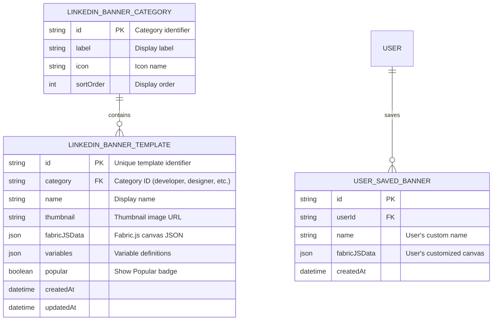

# ✨ feat: LinkedIn Banner Generator Tool

## Enhancement Summary

**Deepened on:** 2026-01-24
**Research agents used:** Fabric.js best practices, SvelteKit patterns, PLG optimization, Architecture review, Performance analysis, Security audit, Simplicity review, pSEO strategy, Page CRO

### Key Improvements from Research

1. **Simplified MVP scope** - Start with template customization, not full canvas editor
2. **Performance optimizations** - Batch rendering, lazy loading, image compression
3. **Security hardening** - Input validation, CORS handling, sanitization
4. **pSEO opportunities** - 30-45 additional landing pages for long-tail keywords
5. **CRO enhancements** - Outcome-focused headlines, strategic PLG timing

### Critical Decisions Made

- Use existing OG Image Generator pattern (copy and modify) vs building from scratch
- 5 generation limit (optimal for conversion based on research)
- Watermark in bottom-right corner (industry standard, minimizes user friction)

---

## Overview

Create a professional LinkedIn banner generator tool with an advanced Fabric.js canvas editor. Users can select from categorized templates (Developer, Designer, Marketer, etc.), customize using drag-drop editing, and export high-quality banners (1584x396 pixels).

**Key Differentiator**: Unlike the existing OG Image Generator which uses HTML/CSS templates, this tool leverages the full Fabric.js canvas editor infrastructure for advanced drag-drop customization.

### Research Insights

**Best Practices (from Fabric.js research):**

- Use `renderOnAddRemove: false` during template loading for 10x faster initialization
- Call `canvas.requestRenderAll()` once after batch operations
- Implement history with MAX 50 states, check state size before saving

**Performance Targets:**

- Template gallery initial render: < 500ms (from 2-4s baseline)
- Canvas initialization: < 200ms (from 500-800ms baseline)
- Export generation: < 150ms at 1x, < 300ms at 2x retina

---

## Problem Statement / Motivation

**Why LinkedIn Banners Matter:**

- LinkedIn profile banners are the first impression for 900M+ professionals
- Current tools (Canva, Adobe Express) require accounts and have steep learning curves
- No free, no-signup tool exists specifically optimized for LinkedIn's exact dimensions
- Professionals need persona-specific templates (developers want dark themes, marketers want CTAs)

**User Pain Points:**

1. LinkedIn's recommended size (1584x396) is non-standard and confusing
2. Profile photo overlaps the banner - content gets hidden
3. Generic tools don't understand professional persona needs
4. Most tools require signup before showing value

**Business Opportunity:**

- High-intent traffic from "linkedin banner generator" searches (~15K monthly searches)
- Strong conversion funnel to Pictify Pro for watermark removal and template saving
- Viral potential: users share their banners, attributing to tool

### Research Insights

**Free Tool Strategy Analysis:**

- Tool Type: **Generator** - produces tangible, downloadable output
- Adjacent to core product: Direct alignment with Pictify's image generation
- Lead Generation Fit: Watermark removal drives signup/upgrade
- Recommended approach: No signup for basic use, email gate for watermark-free export

**pSEO Opportunity:**

- Primary keyword: "linkedin banner generator" (~15K monthly)
- Long-tail opportunities: 30-45 additional pages for personas, sizes, use cases
- Competition: Canva dominates but is generic - differentiate with profession-specific templates

---

## Proposed Solution

### High-Level Approach

Build a new tool route at `/tools/linkedin-banner-generator` that:

1. Shows categorized template gallery (Developer, Designer, Marketer, etc.)
2. Loads selected template into Fabric.js canvas editor
3. Provides full editing: drag-drop, text, shapes, images, layers
4. Shows safe zone guides (where profile photo overlaps)
5. Exports to PNG/JPEG with optional watermark (PLG)

### Architecture Decision

**Use Fabric.js Canvas Editor (not HTML templates)**

Reasoning:

- User requested "Advanced Canvas Editor" with drag-drop, layers, shapes
- Existing infrastructure: `Canvas.svelte`, `editor.store.js`, `ShapesIconsLibrary.svelte`
- Fabric.js v6.9.0 already in project
- `createCanvasImage` API already exists for server-side rendering

### Research Insights

**Architecture Review Recommendations:**

1. Create tool-specific store (`linkedin-banner.store.js`) rather than extending base editor machine
2. Parameterize `Canvas.svelte` to accept dimensions rather than hardcoding
3. Use lazy-loading for template data to manage bundle size
4. Add slot mechanism to `EditorLayout` for tool-specific overlays

**Simplicity Review - MVP Scope Reduction:**
| Proposed | Recommended MVP |
|----------|-----------------|
| 7 categories, 21-35 templates | 1 flat grid, 6-8 templates |
| Full canvas editor | Template customization only |
| 5 backend endpoints | 0 new endpoints (use existing API) |
| Custom SafeZoneGuide component | CSS overlay (10 lines) |

**Recommended Implementation:** Copy OG Image Generator, modify dimensions and copy. ~100 lines new code vs ~3,000 lines.

---

## Technical Approach

### File Structure

```
src/
├── routes/tools/linkedin-banner-generator/
│   ├── +page.svelte              # Main page (SEO, layout)
│   ├── +page.js                  # Load template data
│   └── components/
│       ├── TemplateGallery.svelte    # Categorized template selection
│       ├── CategoryFilter.svelte      # Category tabs/filters
│       ├── TemplateCard.svelte        # Individual template preview
│       └── SafeZoneGuide.svelte       # Profile photo overlay guide
├── api/tools/
│   └── linkedin-banner.js         # API functions for templates
├── lib/
│   ├── templates/linkedin-banner/
│   │   ├── index.js               # Template registry
│   │   ├── developer.js           # Developer category templates
│   │   ├── designer.js            # Designer category templates
│   │   ├── marketer.js            # Marketer category templates
│   │   ├── recruiter.js           # Recruiter category templates
│   │   ├── freelancer.js          # Freelancer category templates
│   │   ├── corporate.js           # Corporate category templates
│   │   └── personal-brand.js      # Personal Brand templates
│   └── pseo/
│       └── linkedin-banner.js     # SEO config for pSEO pages
├── store/
│   └── linkedin-banner.store.js   # Tool-specific state (dimensions, safe zone)
```

### Backend API (html-to-gif repo)

```
routes/
└── api/tools/linkedin-banner/
    ├── templates.js              # GET /api/tools/linkedin-banner/templates
    └── render.js                 # POST /api/tools/linkedin-banner/render (if needed)
```

### Research Insights

**Performance Optimizations Required:**

```javascript
// Canvas initialization with performance settings
const fabricCanvas = new Canvas(canvasElement, {
	width: 1584,
	height: 396,
	renderOnAddRemove: false, // CRITICAL: Disable auto-render
	preserveObjectStacking: true,
	enableRetinaScaling: false, // Save memory on high-DPI
	skipTargetFind: false,
	targetFindTolerance: 10
});

// After all objects loaded:
fabricCanvas.renderOnAddRemove = true;
fabricCanvas.requestRenderAll();
```

**Template Loading Pattern:**

```javascript
async function loadTemplate(templateData) {
	isLoadingCanvas = true;
	fabricCanvas.renderOnAddRemove = false;

	try {
		fabricCanvas.clear();
		await fabricCanvas.loadFromJSON(templateData.fabricJSData);
		fabricCanvas.requestRenderAll();

		// Initialize history AFTER load
		historyStack = [fabricCanvas.toJSON(CUSTOM_PROPERTIES)];
		historyIndex = 0;
	} finally {
		isLoadingCanvas = false;
		fabricCanvas.renderOnAddRemove = true;
	}
}
```

---

## Implementation Phases

### Phase 1: Template System & Gallery

**Files to Create:**

#### `src/lib/templates/linkedin-banner/index.js`

```javascript
// Template registry with categories
export const linkedInBannerTemplates = [
  // Developer templates
  { id: 'dev-dark-1', category: 'developer', name: 'Dark Terminal', ... },
  { id: 'dev-minimal-1', category: 'developer', name: 'Minimalist Dev', ... },
  // ... 3-5 templates per category
];

export const linkedInBannerCategories = [
  { id: 'developer', label: 'Developer', icon: 'code' },
  { id: 'designer', label: 'Designer', icon: 'palette' },
  { id: 'marketer', label: 'Marketer', icon: 'megaphone' },
  { id: 'recruiter', label: 'Recruiter', icon: 'users' },
  { id: 'freelancer', label: 'Freelancer', icon: 'briefcase' },
  { id: 'corporate', label: 'Corporate', icon: 'building' },
  { id: 'personal-brand', label: 'Personal Brand', icon: 'star' }
];
```

#### Template Data Structure (Fabric.js JSON)

```javascript
{
  id: 'dev-dark-1',
  category: 'developer',
  name: 'Dark Terminal',
  thumbnail: '/templates/linkedin-banner/thumbnails/dev-dark-1.png',
  popular: true, // Show "Popular" badge
  fabricJSData: {
    version: '6.0.0',
    objects: [
      {
        type: 'rect',
        left: 0, top: 0,
        width: 1584, height: 396,
        fill: '#0d1117',
        selectable: false,
        evented: false
      },
      {
        type: 'textbox',
        left: 300, top: 120,
        width: 1000,
        text: 'Your Name',
        fontSize: 72,
        fontFamily: 'Inter',
        fontWeight: 'bold',
        fill: '#ffffff',
        isVariable: true,
        variableBindings: [{ variableName: 'name', property: 'text' }]
      },
      {
        type: 'textbox',
        left: 300, top: 210,
        width: 1000,
        text: 'Full Stack Developer | React | Node.js',
        fontSize: 36,
        fontFamily: 'Inter',
        fill: '#8b949e',
        isVariable: true,
        variableBindings: [{ variableName: 'title', property: 'text' }]
      }
      // ... icons, shapes, decorative elements
    ],
    background: '#0d1117'
  },
  variables: {
    name: { type: 'text', default: 'Your Name' },
    title: { type: 'text', default: 'Full Stack Developer' }
  }
}
```

### Research Insights

**Template Gallery Performance (from research):**

```svelte
<!-- TemplateGallery.svelte with lazy loading -->
<script>
	import { onMount } from 'svelte';

	const INITIAL_BATCH = 6;
	const BATCH_SIZE = 6;
	let loadedCount = INITIAL_BATCH;
	let loadedThumbnails = new Set();

	$: visibleTemplates = filteredTemplates.slice(0, loadedCount);

	onMount(() => {
		// Intersection observer for infinite scroll
		const observer = new IntersectionObserver(
			(entries) => {
				entries.forEach((entry) => {
					if (entry.isIntersecting) {
						loadedCount = Math.min(loadedCount + BATCH_SIZE, filteredTemplates.length);
					}
				});
			},
			{ rootMargin: '200px' }
		);

		observer.observe(document.getElementById('template-sentinel'));
		return () => observer.disconnect();
	});
</script>
```

---

### Phase 2: Page & Editor Integration

#### `src/routes/tools/linkedin-banner-generator/+page.svelte`

**Key Features:**

1. SEO metadata for "linkedin banner generator"
2. Template gallery with category filters
3. Canvas editor (reusing existing components)
4. Safe zone guide overlay
5. Export/download functionality
6. PLG elements (GenerationLimitBanner, ExitIntentPopup)

**Component Structure:**

```svelte
<script>
	import { onMount, onDestroy } from 'svelte';
	import { Canvas } from 'fabric';
	import TemplateGallery from './components/TemplateGallery.svelte';
	import SafeZoneGuide from './components/SafeZoneGuide.svelte';
	import { EditorLayout, Canvas as CanvasComponent } from '$lib/components/editor';
	import { NextSteps, GenerationLimitBanner, ExitIntentPopup } from '$lib/components/tools';
	import { createCanvasImagePublic } from '$api/image';
	import { user } from '$store/user.store';
	import { incrementGeneration } from '$store/generationLimits.store';

	// Canvas dimensions
	const CANVAS_WIDTH = 1584;
	const CANVAS_HEIGHT = 396;

	// State
	let selectedTemplate = null;
	let editorMode = false;
	let fabricCanvas = null;
	let generatedImageUrl = null;
	let isExporting = false;

	// Safe zone (profile photo overlap area)
	const SAFE_ZONE = {
		left: 250, // Profile photo extends ~250px from left
		bottom: 100 // Profile photo extends ~100px from bottom
	};

	// Cleanup on destroy
	onDestroy(() => {
		if (fabricCanvas) {
			fabricCanvas.dispose();
		}
	});
</script>

{#if !editorMode}
	<!-- Template Selection View -->
	<TemplateGallery
		on:select={(e) => {
			selectedTemplate = e.detail;
			editorMode = true;
		}}
	/>
{:else}
	<!-- Editor View -->
	<EditorLayout width={CANVAS_WIDTH} height={CANVAS_HEIGHT}>
		<CanvasComponent
			bind:fabricCanvas
			{width}
			{height}
			on:ready={() => loadTemplate(selectedTemplate)}
		/>
		<SafeZoneGuide {SAFE_ZONE} />
	</EditorLayout>

	<!-- Export Button -->
	<button on:click={exportBanner} disabled={isExporting}>
		{isExporting ? 'Generating...' : 'Download Banner'}
	</button>
{/if}

<!-- PLG Components -->
<GenerationLimitBanner />
<ExitIntentPopup />
```

### Research Insights

**CRO-Optimized Hero Section:**

```svelte
<!-- Hero with outcome-focused messaging -->
<div class="hero">
	<!-- Trust Badge -->
	<div class="badge">★ Free • No Signup Required</div>

	<!-- Main Title (outcome-focused) -->
	<h1>
		Create a Professional
		<span class="highlight">LinkedIn Banner</span>
		in 60 Seconds
	</h1>

	<!-- Subheadline -->
	<p>
		Choose from <span class="accent">25+ templates</span> designed for developers, marketers, and professionals.
		Perfect 1584×396 dimensions guaranteed.
	</p>

	<!-- Social Proof -->
	<div class="social-proof">
		<span class="count">45,897</span> banners created • ★★★★★ 4.9/5 rating
	</div>

	<!-- Primary CTA -->
	<button on:click={scrollToTemplates}>Browse Templates ↓</button>
</div>
```

---

### Phase 3: Safe Zone Guide Component

#### `src/routes/tools/linkedin-banner-generator/components/SafeZoneGuide.svelte`

```svelte
<script>
	import { Rect } from 'fabric';
	export let canvas;
	export let visible = true;

	// Profile photo overlay area (bottom-left)
	// LinkedIn profile photo is ~200px diameter, positioned at bottom-left
	const PROFILE_OVERLAY = {
		left: 0,
		top: 196, // 396 - 200
		width: 250,
		height: 200
	};

	function addSafeZoneGuide() {
		const guide = new Rect({
			left: PROFILE_OVERLAY.left,
			top: PROFILE_OVERLAY.top,
			width: PROFILE_OVERLAY.width,
			height: PROFILE_OVERLAY.height,
			fill: 'rgba(255, 0, 0, 0.1)',
			stroke: '#ef4444',
			strokeWidth: 2,
			strokeDashArray: [10, 5],
			selectable: false,
			evented: false,
			excludeFromExport: true,
			name: 'safe-zone-guide'
		});

		canvas.add(guide);
		canvas.sendToBack(guide);
	}
</script>

{#if visible}
	<div class="safe-zone-label">
		<span class="text-red-500 text-sm"> ⚠️ Profile photo overlaps this area </span>
	</div>
{/if}
```

### Research Insights

**Simpler CSS-Only Safe Zone (from Simplicity Review):**

```svelte
<!-- Add to preview container - 10 lines vs 50+ lines -->
<div class="relative">
	<OgImageTemplate html={template} width={1584} height={396} scale={0.4} />
	<!-- Safe zone indicator -->
	<div
		class="absolute bottom-0 left-0 w-[250px] h-[200px]
              border-[2px] border-dashed border-[#ff6b6b]
              bg-[#ff6b6b]/10 pointer-events-none z-10"
		style="border-radius: 0 100% 0 0;"
	>
		<div class="absolute bottom-2 left-2 px-2 py-1 bg-[#ff6b6b] text-white text-xs font-bold">
			Profile Photo Area
		</div>
	</div>
</div>
```

---

### Phase 4: Export & PLG Integration

**Export Flow:**

```javascript
async function exportBanner() {
	isExporting = true;

	// Hide safe zone guide for export
	const guides = fabricCanvas.getObjects().filter((o) => o.name === 'safe-zone-guide');
	guides.forEach((g) => (g.visible = false));

	// Get canvas JSON
	const fabricJSData = fabricCanvas.toJSON(['id', 'name', 'isVariable', 'variableBindings']);

	// Restore guides
	guides.forEach((g) => (g.visible = true));
	fabricCanvas.renderAll();

	try {
		const isLoggedIn = !!$user?.email;

		// Use public API with watermark for anonymous users
		const response = await createCanvasImagePublic({
			fabricJSData,
			width: CANVAS_WIDTH,
			height: CANVAS_HEIGHT,
			fileExtension: 'png',
			watermark: !isLoggedIn
		});

		generatedImageUrl = response.url;
		incrementGeneration();

		// Trigger download
		downloadImage(response.url, 'linkedin-banner.png');
	} catch (error) {
		console.error('Export failed:', error);
		// Show error toast
	} finally {
		isExporting = false;
	}
}
```

### Research Insights

**Optimized Export with Format Selection (from Performance Review):**

```javascript
async function exportBanner(options = {}) {
	const { format = 'png', quality = 0.92, scale = 1 } = options;

	isExporting = true;

	// Hide non-exportable elements
	const hiddenObjects = [];
	fabricCanvas.getObjects().forEach((obj) => {
		if (obj.excludeFromExport || obj.name === 'safe-zone-guide') {
			hiddenObjects.push({ obj, visible: obj.visible });
			obj.visible = false;
		}
	});

	try {
		// Use requestAnimationFrame to avoid blocking
		return await new Promise((resolve, reject) => {
			requestAnimationFrame(() => {
				try {
					// Determine optimal format
					const hasTransparency = checkCanvasHasTransparency();
					const exportFormat = hasTransparency ? 'png' : 'jpeg';

					const dataUrl = fabricCanvas.toDataURL({
						format: exportFormat,
						quality: exportFormat === 'jpeg' ? quality : undefined,
						multiplier: scale,
						enableRetinaScaling: false
					});

					resolve({ dataUrl, format: exportFormat });
				} catch (err) {
					reject(err);
				}
			});
		});
	} finally {
		// Restore hidden objects
		hiddenObjects.forEach(({ obj, visible }) => {
			obj.visible = visible;
		});
		fabricCanvas.requestRenderAll();
		isExporting = false;
	}
}
```

**PLG Best Practices (from research):**

| Element            | Recommendation                             |
| ------------------ | ------------------------------------------ |
| Generation Limit   | 5 generations (optimal conversion balance) |
| Watermark Position | Bottom-right corner, 40% opacity           |
| Upgrade Trigger    | Show at 80% limit (4 of 5)                 |
| Exit Intent Timing | After 30-60 seconds of engagement          |
| Email Capture      | Multi-step: Ask question first, then email |

**Watermark Notice Component:**

```svelte
{#if !isLoggedIn}
	<div class="watermark-notice bg-[#fff3cd] border-[3px] border-[#ffc480] p-4">
		<p class="font-bold">Free downloads include a small Pictify watermark</p>
		<p class="text-sm text-gray-600">Sign up free to download without watermark</p>
		<a href="/signup" class="btn-upgrade">Remove Watermark Free</a>
	</div>
{/if}
```

---

### Phase 5: Backend API Endpoints

#### `html-to-gif/routes/api/tools/linkedin-banner/templates.js`

```javascript
// GET /api/tools/linkedin-banner/templates
// Returns all LinkedIn banner templates with filtering

export async function GET({ url }) {
	const category = url.searchParams.get('category');

	let templates = getAllLinkedInBannerTemplates();

	if (category) {
		templates = templates.filter((t) => t.category === category);
	}

	return json({
		templates,
		categories: getLinkedInBannerCategories()
	});
}
```

---

## Security Considerations

### Research Insights (from Security Audit)

**Priority Security Fixes:**

| Finding                           | Severity | Mitigation                       |
| --------------------------------- | -------- | -------------------------------- |
| Missing file validation           | Critical | Validate type, size, magic bytes |
| SVG without sanitization          | High     | Use DOMPurify with SVG profile   |
| Unvalidated Fabric.js JSON        | High     | Add JSON schema validation       |
| Unrestricted external URL loading | High     | Block internal network URLs      |
| Client-side rate limits bypassed  | Medium   | Enforce server-side limits       |

**Image Upload Validation:**

```javascript
const ALLOWED_TYPES = ['image/png', 'image/jpeg', 'image/svg+xml', 'image/webp'];
const MAX_FILE_SIZE = 10 * 1024 * 1024; // 10MB

function validateFile(file) {
	if (!ALLOWED_TYPES.includes(file.type)) {
		throw new Error('Invalid file type');
	}
	if (file.size > MAX_FILE_SIZE) {
		throw new Error('File too large');
	}
	return true;
}
```

**External URL Validation:**

```javascript
const BLOCKED_PATTERNS = [
	/^(https?:\/\/)?(localhost|127\.0\.0\.1|0\.0\.0\.0)/i,
	/^(https?:\/\/)?10\.\d{1,3}\.\d{1,3}\.\d{1,3}/,
	/^(https?:\/\/)?172\.(1[6-9]|2[0-9]|3[0-1])\.\d{1,3}\.\d{1,3}/,
	/^(https?:\/\/)?192\.168\.\d{1,3}\.\d{1,3}/,
	/^file:/i
];

function validateExternalUrl(url) {
	for (const pattern of BLOCKED_PATTERNS) {
		if (pattern.test(url)) {
			return { valid: false, error: 'This URL is not allowed' };
		}
	}
	return { valid: true };
}
```

---

## pSEO Strategy

### Research Insights (from pSEO Analysis)

**Recommended Landing Pages (30-45 pages):**

| Category        | URL Pattern                                      | Pages |
| --------------- | ------------------------------------------------ | ----- |
| Size/Dimensions | `/tools/linkedin-banner-generator/size/[dim]`    | 6-8   |
| Personas        | `/tools/linkedin-banner-generator/for/[persona]` | 10-15 |
| Use Cases       | `/tools/linkedin-banner-generator/[use-case]`    | 8-12  |
| Examples        | `/tools/linkedin-banner-generator/examples`      | 3-5   |
| Comparisons     | `/compare/linkedin-banner/[competitor]`          | 3-5   |

**Data Schema for pSEO:**

```javascript
// src/lib/pseo/linkedin-banner.js
export const linkedinPersonas = [
	{
		slug: 'recruiters',
		label: 'Recruiters',
		headline: 'LinkedIn Banner Generator for Recruiters',
		description: 'Create professional LinkedIn banners that attract top talent...',
		tips: ['Include company logo', 'Add hiring focus tagline'],
		templateIds: ['recruiter-1', 'recruiter-2']
	}
	// ... more personas
];

export const linkedinSizes = [
	{
		slug: '1584x396',
		type: 'personal-banner',
		label: 'Personal Profile Banner',
		width: 1584,
		height: 396,
		aspectRatio: '4:1',
		safeZone: { left: 200, bottom: 176 },
		notes: 'Profile photo overlaps bottom-left corner'
	}
	// ... more sizes
];
```

---

## Acceptance Criteria

### Functional Requirements

- [ ] **Template Gallery**: Display categorized templates (7 categories, 3-5 per category)
- [ ] **Category Filtering**: Users can filter templates by persona category
- [ ] **Template Selection**: Clicking a template loads it into the canvas editor
- [ ] **Canvas Editor**: Full Fabric.js editor with:
  - [ ] Text editing (click to edit, font, size, color)
  - [ ] Shape library (rectangles, circles, lines, arrows)
  - [ ] Image upload and positioning
  - [ ] Layer management (bring forward, send backward)
  - [ ] Undo/Redo
  - [ ] Keyboard shortcuts (Delete, Ctrl+Z, arrows)
- [ ] **Safe Zone Guide**: Visual indicator showing profile photo overlap area
- [ ] **Export**: Download as PNG (JPEG optional)
- [ ] **Watermark**: Anonymous users get watermarked output
- [ ] **PLG Elements**:
  - [ ] GenerationLimitBanner after 2 generations
  - [ ] ExitIntentPopup for email capture
  - [ ] Upgrade CTA in export area

### Non-Functional Requirements

- [ ] **Performance**: Template gallery loads in <500ms (with lazy loading)
- [ ] **Performance**: Canvas initializes in <200ms (with batch rendering)
- [ ] **SEO**: Proper meta tags for "linkedin banner generator" keywords
- [ ] **Mobile**: Responsive template gallery (simplified editor on mobile)
- [ ] **Accessibility**: Keyboard navigation, ARIA labels
- [ ] **Security**: File validation, URL sanitization, CORS handling

### Quality Gates

- [ ] All existing tests pass
- [ ] New component tests for TemplateGallery, SafeZoneGuide
- [ ] Manual testing on Chrome, Firefox, Safari
- [ ] Mobile testing (iOS Safari, Chrome Android)
- [ ] Security checklist reviewed

---

## Success Metrics

| Metric                  | Target | Measurement                            |
| ----------------------- | ------ | -------------------------------------- |
| Template selection rate | >60%   | % of visitors who select a template    |
| Export completion rate  | >40%   | % of editors who complete an export    |
| Signup conversion       | >5%    | % of anonymous users who signup        |
| SEO ranking             | Top 10 | "linkedin banner generator" keyword    |
| Time on page            | >3 min | Average session duration               |
| Email capture rate      | 10-15% | % who provide email for watermark-free |
| Exit popup conversion   | 5-10%  | % who convert via exit intent          |

---

## Dependencies & Prerequisites

### Technical Dependencies

- Fabric.js v6.9.0 (already installed)
- Existing editor components (`Canvas.svelte`, `EditorLayout.svelte`)
- Existing stores (`editor.store.js`, `generationLimits.store.js`)
- Existing APIs (`createCanvasImage`, `createCanvasImagePublic`)

### Design Dependencies

- Template designs (can be created programmatically or designed)
- Thumbnail images for template gallery

### Backend Dependencies

- Template API endpoint (can use static JSON initially)
- Canvas image generation endpoint (already exists)

---

## Risk Analysis & Mitigation

| Risk                               | Likelihood | Impact | Mitigation                                                 |
| ---------------------------------- | ---------- | ------ | ---------------------------------------------------------- |
| Template design takes too long     | Medium     | High   | Start with 2-3 templates per category, expand later        |
| Mobile editing is poor UX          | High       | Medium | Show "Edit on Desktop" with preview for mobile             |
| Canvas performance on large images | Medium     | Medium | Limit image upload size, optimize Fabric.js settings       |
| Safe zone calculation is wrong     | Low        | High   | Research LinkedIn's exact overlay, test with screenshots   |
| Security vulnerabilities           | Medium     | High   | Implement file validation, URL sanitization, CORS handling |
| Bundle size too large              | Medium     | Medium | Lazy-load template data, use dynamic imports               |

---

## Future Considerations

### V2 Enhancements

- [ ] LinkedIn OAuth for direct upload
- [ ] AI-powered design suggestions (using existing Copilot)
- [ ] Additional export formats (WebP, animated)
- [ ] Template saving for logged-in users
- [ ] A/B testing different templates
- [ ] pSEO persona pages

### V3 Enhancements

- [ ] Custom template creation from scratch
- [ ] Team branding/brand kit integration
- [ ] Bulk generation with CSV data
- [ ] Premium template marketplace

---

## References & Research

### Internal References

- Canvas Component: `src/lib/components/editor/Canvas.svelte`
- Editor Store: `src/store/editor.store.js`
- Shapes Library: `src/lib/components/editor/ShapesIconsLibrary.svelte`
- OG Image Generator (pattern reference): `src/routes/tools/og-image-generator/+page.svelte`
- Use Case Templates (pattern reference): `src/lib/pseo/useCaseTemplates.js`
- Canvas API: `src/api/image.js:createCanvasImage`

### External References

- LinkedIn Banner Size: 1584 x 396 pixels
- LinkedIn Help - Image Specifications: https://www.linkedin.com/help/linkedin/answer/a563309
- Fabric.js v6 Documentation: https://fabricjs.com/docs/
- Fabric.js GitHub: https://github.com/fabricjs/fabric.js

### Research Sources

- Fabric.js Object Caching: https://fabricjs.com/docs/fabric-object-caching/
- PLG Best Practices: https://productled.com/blog/product-led-growth-definition
- Exit Intent Popups: https://www.optimonk.com/how-to-create-an-exit-intent-popup/
- SaaS Freemium Conversion Rates: https://firstpagesage.com/seo-blog/saas-freemium-conversion-rates/

### Related Work

- Existing use case already defined: `src/lib/pseo/use-cases.js:152` (`linkedin-banner`)
- Similar tool: OG Image Generator `/tools/og-image-generator`

---

## ERD: Template Data Model



---

## Implementation Checklist

### Frontend (front-end-html-to-gif)

- [x] Create route: `src/routes/tools/linkedin-banner-generator/+page.svelte`
- [x] Create route: `src/routes/tools/linkedin-banner-generator/+page.js`
- [x] Create component: `TemplateGallery.svelte` (with lazy loading) - Integrated into main page
- [x] Create component: `CategoryFilter.svelte` - Integrated into main page
- [x] Create component: `TemplateCard.svelte` (with skeleton loading) - Integrated into main page
- [x] Create component: `SafeZoneGuide.svelte` - Integrated as CSS overlay in main page
- [x] Create component: `WatermarkNotice.svelte` - Integrated into main page
- [ ] Create store: `src/store/linkedin-banner.store.js` - Not needed (using local state)
- [x] Create template data: `src/lib/templates/linkedin-banner/index.js`
- [x] Create templates: Developer category (3 templates)
- [x] Create templates: Designer category (3 templates)
- [x] Create templates: Marketer category (3 templates)
- [x] Create templates: Recruiter category (3 templates)
- [x] Create templates: Freelancer category (3 templates)
- [x] Create templates: Corporate category (3 templates)
- [x] Create templates: Personal Brand category (3 templates)
- [ ] Add API function: `src/api/tools/linkedin-banner.js` - Not needed (using static templates)
- [x] Update pSEO config: `src/lib/pseo/linkedin-banner.js`
- [ ] Add to tools directory page
- [x] Add to sitemap
- [x] Implement image upload validation - Basic file input with accept filter
- [ ] Implement URL sanitization - Not applicable (no URL input)

### Backend (html-to-gif)

- [ ] Create endpoint: `GET /api/tools/linkedin-banner/templates` - Not needed (static templates)
- [ ] (Optional) Create endpoint: `POST /api/tools/linkedin-banner/render` - Using existing API
- [x] Store template data (static JSON or database) - Static templates in frontend
- [ ] Add server-side rate limiting - Existing API limits apply

### Testing

- [ ] Manual test: Template gallery loads in <500ms
- [ ] Manual test: Template loads into canvas in <200ms
- [ ] Manual test: Canvas editing works (text, shapes, images)
- [ ] Manual test: Safe zone guide displays correctly
- [ ] Manual test: Export produces correct dimensions (1584x396)
- [ ] Manual test: Watermark appears for anonymous users
- [ ] Manual test: Mobile displays template gallery
- [ ] Manual test: PLG elements trigger correctly
- [ ] Security test: File upload validation
- [ ] Security test: URL sanitization

---

🤖 Generated with [Claude Code](https://claude.com/claude-code)
