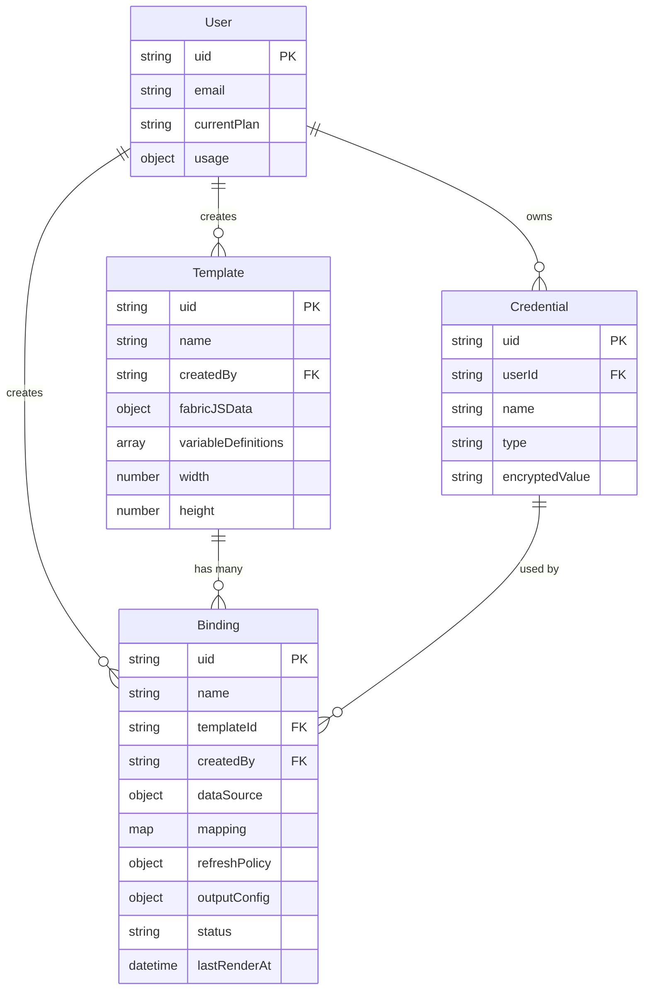

# Feature: Render Bindings - Dynamic Image Generation API

**Created:** 2026-01-17
**Type:** Enhancement (Major Feature)
**Status:** Planning
**Complexity:** High

---

## Enhancement Summary

**Deepened on:** 2026-01-17
**Review Agents Used:** Security Sentinel, Performance Oracle, Architecture Strategist, Code Simplicity Reviewer, Pattern Recognition Specialist, Agent-Native Reviewer, Data Integrity Guardian

### Key Improvements from Review

1. **CRITICAL Security Fixes Required**

   - SSRF protection module mandatory (IP blocklists, DNS rebinding prevention, HTTPS-only)
   - Credential encryption must use AES-256-GCM (not SHA-256 hashing)
   - Add request signing for webhook authentication

2. **Performance Optimizations**

   - Implement request coalescing to prevent thundering herd
   - Use Fabric.js server-side render path (bypass Puppeteer for 10-50x speedup)
   - Multi-layer caching: CDN → Local LRU → Redis

3. **Simplification Recommendations**

   - Start with HTTP data sources only (defer SQL, webhooks to v2)
   - Inline credentials as encrypted fields (defer separate Credential model)
   - Use simple variable interpolation before JSONPath complexity

4. **Agent-Native Requirements**
   - Add credentials CRUD API for automated systems
   - Add pause/resume endpoints for binding status control
   - Ensure all UI actions have API equivalents

### Critical Security Findings

| Finding                           | Severity | Mitigation                                         |
| --------------------------------- | -------- | -------------------------------------------------- |
| No SSRF protection                | CRITICAL | Implement IP blocklist, DNS validation, HTTPS-only |
| Credential storage weak           | HIGH     | Use AES-256-GCM encryption, not hashing            |
| Missing rate limiting per binding | MEDIUM   | Add Redis-based sliding window limiter             |
| Webhook signature validation      | MEDIUM   | HMAC-SHA256 with timing-safe comparison            |

### Performance Recommendations

| Optimization            | Impact                                          | Implementation                       |
| ----------------------- | ----------------------------------------------- | ------------------------------------ |
| Request coalescing      | Prevents N concurrent requests for same binding | Use `p-coalesce` or distributed lock |
| Fabric.js direct render | 10-50x faster than Puppeteer                    | Bypass browser for static templates  |
| Stale-while-revalidate  | Eliminates user-facing latency on TTL expiry    | Serve stale, refresh in background   |
| Connection pooling      | Reduces external fetch latency                  | Use `got` with keep-alive agent      |

### Architectural Guidance

- Follow existing soft-delete pattern with `active: Boolean` field
- Use existing quota middleware pattern from `plugins/quota_guard.js`
- Match API response format from `routes/templates.js`
- Integrate with existing BullMQ setup in `service/batch-processor.js`

---

## Overview

Implement a "Render Bindings" feature that enables dynamic image generation by connecting templates to external data sources. Users create bindings that automatically fetch data, apply mappings, and render images - all accessible via a single CDN URL that stays up-to-date based on refresh policies.

This transforms Pictify from a "render-on-demand" tool to a "live rendering infrastructure" where images automatically update when source data changes.

---

## Problem Statement

### Current State

- Users must manually trigger renders via API with explicit variable values
- No automatic data synchronization between external sources and templates
- Every data change requires a new API call to regenerate images
- No persistent URLs that automatically reflect current data

### Desired State

- Users configure a binding once, get a permanent URL
- URL automatically serves fresh images based on refresh policy
- Data is fetched from external sources (HTTP APIs, webhooks, etc.)
- CDN caching optimizes delivery while respecting freshness requirements

### User Pain Points

1. **Manual API Integration**: Developers must write code to fetch data AND call Pictify API
2. **Stale Images**: Without automation, images become outdated when source data changes
3. **Complex Orchestration**: Coordinating data fetches, transformations, and renders is error-prone
4. **No Live Preview**: Can't see how real data will render without full API integration

---

## Proposed Solution

### Core Concept: Render Binding

A **Render Binding** connects a template to a data source with automatic refresh:

```
┌─────────────────┐     ┌─────────────────┐     ┌─────────────────┐
│   Data Source   │────▶│    Binding      │────▶│  Rendered Image │
│  (HTTP/Webhook) │     │  (Mapping +     │     │  (CDN URL)      │
│                 │     │   Refresh)      │     │                 │
└─────────────────┘     └─────────────────┘     └─────────────────┘
```

### API Design

#### Create Binding

```http
POST /api/bindings
Authorization: Bearer {api_token}
Content-Type: application/json

{
  "template_id": "tpl_abc123",
  "name": "Product Banner - Widget Pro",
  "data_source": {
    "type": "http",
    "url": "https://api.example.com/products/42",
    "method": "GET",
    "headers": {
      "Authorization": "Bearer {{PRODUCT_API_KEY}}"
    }
  },
  "mapping": {
    "productName": "$.product.name",
    "price": "$.product.pricing.final",
    "imageUrl": "$.product.images[0].url",
    "discount": "$.product.discount || 0"
  },
  "refresh_policy": {
    "type": "ttl",
    "ttl_seconds": 300,
    "on_error": "serve_stale"
  },
  "output_config": {
    "format": "png",
    "quality": 90,
    "cache_control": "public, max-age=300"
  }
}
```

#### Response

```json
{
	"binding_id": "bind_xyz789",
	"render_url": "https://cdn.pictify.io/b/bind_xyz789.png",
	"webhook_url": "https://api.pictify.io/webhooks/bind_xyz789",
	"status": "active",
	"created_at": "2026-01-17T10:30:00Z",
	"next_refresh": "2026-01-17T10:35:00Z"
}
```

---

## Technical Approach

### Architecture

```
┌─────────────────────────────────────────────────────────────────────────────┐
│                              CDN Layer (Cloudflare)                         │
│  - Edge caching with TTL from binding                                       │
│  - Format negotiation (WebP/PNG based on Accept header)                     │
│  - Geographic distribution                                                   │
└────────────────────────────────────┬────────────────────────────────────────┘
                                     │ Cache Miss
                                     ▼
┌─────────────────────────────────────────────────────────────────────────────┐
│                              API Gateway                                     │
│  - Route: GET /b/{binding_id}.{format}                                      │
│  - Rate limiting (per binding, per IP)                                      │
│  - Request validation                                                        │
└────────────────────────────────────┬────────────────────────────────────────┘
                                     │
                                     ▼
┌─────────────────────────────────────────────────────────────────────────────┐
│                           Binding Resolver                                   │
│  ┌─────────────┐  ┌─────────────┐  ┌─────────────┐  ┌─────────────┐       │
│  │   Binding   │  │   Data      │  │   Data      │  │   Template  │       │
│  │   Lookup    │──│   Fetcher   │──│   Mapper    │──│   Renderer  │       │
│  │             │  │   (SSRF     │  │   (JSONPath)│  │  (Puppeteer)│       │
│  │             │  │   Protected)│  │             │  │             │       │
│  └─────────────┘  └─────────────┘  └─────────────┘  └─────────────┘       │
└─────────────────────────────────────────────────────────────────────────────┘
                                     │
          ┌──────────────────────────┼──────────────────────────┐
          ▼                          ▼                          ▼
┌─────────────────┐        ┌─────────────────┐        ┌─────────────────┐
│     Redis       │        │    BullMQ       │        │    MongoDB      │
│  - Data cache   │        │  - Refresh jobs │        │  - Bindings     │
│  - ETag store   │        │  - Render queue │        │  - Credentials  │
│  - Rate limits  │        │  - Webhooks     │        │  - Audit logs   │
└─────────────────┘        └─────────────────┘        └─────────────────┘
```

### Database Schema

#### Binding Model (`/html-to-gif/models/Binding.js`)

```javascript
const bindingSchema = new mongoose.Schema({
	uid: { type: String, unique: true, required: true },
	name: { type: String, required: true, maxlength: 255 },
	templateId: { type: String, required: true, ref: 'Template', index: true },
	createdBy: { type: String, required: true, ref: 'User', index: true },

	// Data Source Configuration
	dataSource: {
		type: { type: String, enum: ['http', 'webhook', 'static'], required: true },
		url: { type: String }, // For HTTP sources
		method: { type: String, enum: ['GET', 'POST'], default: 'GET' },
		headers: { type: Map, of: String },
		body: { type: mongoose.Schema.Types.Mixed },
		credentialId: { type: String, ref: 'Credential' } // Reference to encrypted credentials
	},

	// Mapping Configuration
	mapping: {
		type: Map,
		of: String, // Variable name -> JSONPath expression
		required: true
	},

	// Defaults/Fallbacks
	defaults: {
		type: Map,
		of: mongoose.Schema.Types.Mixed
	},

	// Refresh Policy
	refreshPolicy: {
		type: { type: String, enum: ['ttl', 'etag', 'webhook', 'manual'], default: 'ttl' },
		ttlSeconds: { type: Number, min: 60, max: 604800, default: 300 }, // 1 min to 7 days
		onError: {
			type: String,
			enum: ['serve_stale', 'serve_error', 'serve_default'],
			default: 'serve_stale'
		}
	},

	// Output Configuration
	outputConfig: {
		format: { type: String, enum: ['png', 'jpeg', 'webp', 'pdf'], default: 'png' },
		quality: { type: Number, min: 1, max: 100, default: 90 },
		width: { type: Number }, // Override template width
		height: { type: Number } // Override template height
	},

	// Status
	status: { type: String, enum: ['active', 'paused', 'error'], default: 'active' },
	lastFetchAt: { type: Date },
	lastRenderAt: { type: Date },
	lastError: { type: String },
	errorCount: { type: Number, default: 0 },

	// Soft delete
	active: { type: Boolean, default: true },

	// Timestamps
	createdAt: { type: Date, default: Date.now },
	updatedAt: { type: Date, default: Date.now }
});

// Indexes
bindingSchema.index({ templateId: 1, active: 1 });
bindingSchema.index({ createdBy: 1, active: 1 });
bindingSchema.index({ status: 1, 'refreshPolicy.ttlSeconds': 1 }); // For refresh scheduler
```

#### Credential Model (`/html-to-gif/models/Credential.js`)

```javascript
const credentialSchema = new mongoose.Schema({
	uid: { type: String, unique: true, required: true },
	userId: { type: String, required: true, ref: 'User', index: true },
	name: { type: String, required: true },
	type: { type: String, enum: ['api_key', 'bearer_token', 'basic_auth'], required: true },

	// Encrypted storage - NEVER return in API responses
	encryptedValue: { type: String, required: true },

	// Metadata (safe to return)
	lastUsedAt: { type: Date },
	createdAt: { type: Date, default: Date.now },

	active: { type: Boolean, default: true }
});
```

### Research Insights: Security Implementation

**Best Practices (from Security Sentinel review):**

1. **SSRF Protection Module** - MANDATORY before launch:

```javascript
// service/ssrf-protection.js
const BLOCKED_RANGES = [
	'10.0.0.0/8', // Private
	'172.16.0.0/12', // Private
	'192.168.0.0/16', // Private
	'127.0.0.0/8', // Loopback
	'169.254.0.0/16', // Link-local
	'0.0.0.0/8', // Current network
	'::1/128', // IPv6 loopback
	'fc00::/7' // IPv6 private
];

async function validateUrl(urlString) {
	const url = new URL(urlString);

	// 1. HTTPS only
	if (url.protocol !== 'https:') {
		throw new Error('Only HTTPS URLs are allowed');
	}

	// 2. Resolve DNS and check against blocklist
	const addresses = await dns.promises.resolve4(url.hostname);
	for (const addr of addresses) {
		if (isBlockedIP(addr, BLOCKED_RANGES)) {
			throw new Error('URL resolves to blocked IP range');
		}
	}

	// 3. Prevent DNS rebinding - re-resolve at fetch time
	return { url, resolvedIP: addresses[0] };
}
```

2. **Credential Encryption** - Use AES-256-GCM (authenticated encryption):

```javascript
// service/encryption-service.js
const crypto = require('crypto');

const ALGORITHM = 'aes-256-gcm';
const KEY = Buffer.from(process.env.CREDENTIAL_ENCRYPTION_KEY, 'hex'); // 32 bytes

function encrypt(plaintext) {
	const iv = crypto.randomBytes(12); // 96-bit IV for GCM
	const cipher = crypto.createCipheriv(ALGORITHM, KEY, iv);

	let encrypted = cipher.update(plaintext, 'utf8', 'hex');
	encrypted += cipher.final('hex');

	const authTag = cipher.getAuthTag();

	// Format: iv:authTag:ciphertext
	return `${iv.toString('hex')}:${authTag.toString('hex')}:${encrypted}`;
}

function decrypt(encryptedValue) {
	const [ivHex, authTagHex, ciphertext] = encryptedValue.split(':');

	const iv = Buffer.from(ivHex, 'hex');
	const authTag = Buffer.from(authTagHex, 'hex');

	const decipher = crypto.createDecipheriv(ALGORITHM, KEY, iv);
	decipher.setAuthTag(authTag);

	let decrypted = decipher.update(ciphertext, 'hex', 'utf8');
	decrypted += decipher.final('utf8');

	return decrypted;
}
```

3. **Webhook Signature Validation**:

```javascript
// service/webhook-validator.js
const crypto = require('crypto');

function validateWebhookSignature(payload, signature, secret) {
	const expectedSignature = crypto
		.createHmac('sha256', secret)
		.update(JSON.stringify(payload))
		.digest('hex');

	// Timing-safe comparison to prevent timing attacks
	return crypto.timingSafeEqual(Buffer.from(signature), Buffer.from(`sha256=${expectedSignature}`));
}
```

### Research Insights: Performance Optimization

**Best Practices (from Performance Oracle review):**

1. **Request Coalescing** - Prevent thundering herd:

```javascript
// service/binding-cache.js
const coalesce = require('p-coalesce');

// Coalesce concurrent requests for same binding
const coalescedRender = coalesce(
	async (bindingId) => {
		return await renderBinding(bindingId);
	},
	{
		key: (bindingId) => bindingId,
		ttl: 1000 // 1 second window
	}
);

// Usage: Multiple simultaneous requests → single render
app.get('/b/:bindingId.:format', async (req, res) => {
	const image = await coalescedRender(req.params.bindingId);
	res.send(image);
});
```

2. **Multi-Layer Caching**:

```javascript
// service/binding-cache.js
const LRU = require('lru-cache');

const localCache = new LRU({
	max: 500, // Max 500 items
	maxSize: 100 * 1024 * 1024, // 100MB
	sizeCalculation: (value) => value.length,
	ttl: 60 * 1000 // 1 minute local TTL
});

async function getCachedImage(bindingId) {
	// Layer 1: Local LRU (fastest, in-memory)
	const local = localCache.get(bindingId);
	if (local) return { image: local, source: 'local' };

	// Layer 2: Redis (shared across instances)
	const redis = await redisClient.get(`img:${bindingId}`);
	if (redis) {
		localCache.set(bindingId, redis); // Populate local
		return { image: redis, source: 'redis' };
	}

	// Layer 3: Render (expensive)
	return null;
}
```

3. **Fabric.js Direct Render** (bypass Puppeteer for 10-50x speedup):

```javascript
// service/fabric-renderer.js
const { createCanvas } = require('canvas');
const fabric = require('fabric').fabric;

async function renderWithFabric(template, variables) {
	// Create node-canvas instance
	const canvas = new fabric.StaticCanvas(null, {
		width: template.width,
		height: template.height
	});

	// Load template JSON and apply variables
	await new Promise((resolve) => {
		canvas.loadFromJSON(template.fabricJSData, resolve);
	});

	// Apply variable substitution
	canvas.getObjects().forEach((obj) => {
		if (obj.variableName && variables[obj.variableName]) {
			obj.set('text', variables[obj.variableName]);
		}
	});

	canvas.renderAll();

	// Export to buffer (no browser overhead!)
	return canvas.toBuffer('image/png');
}
```

### Research Insights: Data Integrity

**Best Practices (from Data Integrity Guardian review):**

1. **Referential Integrity** - Prevent orphaned bindings:

```javascript
// In Template model - prevent deletion with active bindings
templateSchema.pre('deleteOne', async function () {
	const templateId = this.getQuery()._id || this.getQuery().uid;
	const bindingCount = await Binding.countDocuments({
		templateId,
		active: true
	});

	if (bindingCount > 0) {
		throw new Error(`Cannot delete template: ${bindingCount} active bindings exist`);
	}
});

// Or cascade soft-delete
templateSchema.pre('updateOne', async function () {
	const update = this.getUpdate();
	if (update.active === false) {
		const templateId = this.getQuery()._id || this.getQuery().uid;
		await Binding.updateMany(
			{ templateId },
			{ $set: { status: 'paused', pausedReason: 'template_deleted' } }
		);
	}
});
```

2. **Credential Cleanup** - Handle credential deletion:

```javascript
// When credential is deleted, invalidate bindings using it
credentialSchema.pre('updateOne', async function () {
	const update = this.getUpdate();
	if (update.active === false) {
		const credentialId = this.getQuery()._id || this.getQuery().uid;
		await Binding.updateMany(
			{ 'dataSource.credentialId': credentialId },
			{ $set: { status: 'error', lastError: 'Credential deleted' } }
		);
	}
});
```

### ERD Diagram



---

## Implementation Phases

### Phase 1: Core Backend Infrastructure (Backend)

**Goal:** API endpoints and data model for binding CRUD

#### Files to Create/Modify:

| File                                          | Action | Description                    |
| --------------------------------------------- | ------ | ------------------------------ |
| `/html-to-gif/models/Binding.js`              | Create | Mongoose schema for bindings   |
| `/html-to-gif/models/Credential.js`           | Create | Secure credential storage      |
| `/html-to-gif/routes/bindings.js`             | Create | CRUD endpoints for bindings    |
| `/html-to-gif/service/binding-service.js`     | Create | Business logic for bindings    |
| `/html-to-gif/service/data-fetcher.js`        | Create | SSRF-protected HTTP fetcher    |
| `/html-to-gif/service/data-mapper.js`         | Create | JSONPath mapping engine        |
| `/html-to-gif/plugins/binding_quota_guard.js` | Create | Quota enforcement for bindings |

#### API Endpoints:

```
POST   /api/bindings              - Create binding
GET    /api/bindings              - List user's bindings
GET    /api/bindings/:uid         - Get binding details
PUT    /api/bindings/:uid         - Update binding
DELETE /api/bindings/:uid         - Delete binding (soft)
POST   /api/bindings/:uid/test    - Test binding with sample data
POST   /api/bindings/:uid/refresh - Force refresh binding
```

#### Acceptance Criteria:

- [ ] Binding model with all fields from schema
- [ ] CRUD endpoints with authentication
- [ ] Credential encryption at rest (AES-256)
- [ ] SSRF protection for HTTP data sources
- [ ] Input validation with Joi/Zod
- [ ] Quota limits based on user plan

---

### Phase 2: Render Pipeline (Backend)

**Goal:** Fetch data, apply mappings, render images

#### Files to Create/Modify:

| File                                        | Action | Description                       |
| ------------------------------------------- | ------ | --------------------------------- |
| `/html-to-gif/routes/binding-render.js`     | Create | Public render endpoint            |
| `/html-to-gif/service/binding-renderer.js`  | Create | Orchestrates fetch→map→render     |
| `/html-to-gif/service/binding-cache.js`     | Create | Redis caching for rendered images |
| `/html-to-gif/service/template-renderer.js` | Modify | Accept mapped variables           |

#### Render Flow:

```javascript
// binding-renderer.js pseudocode
async function renderBinding(bindingId, options = {}) {
	// 1. Load binding configuration
	const binding = await Binding.findOne({ uid: bindingId, active: true });
	if (!binding) throw new NotFoundError('Binding not found');

	// 2. Check cache (unless force refresh)
	if (!options.forceRefresh) {
		const cached = await bindingCache.get(bindingId);
		if (cached && !isExpired(cached, binding.refreshPolicy)) {
			return cached;
		}
	}

	// 3. Fetch data from source
	let sourceData;
	try {
		sourceData = await dataFetcher.fetch(binding.dataSource);
	} catch (error) {
		return handleFetchError(binding, error);
	}

	// 4. Apply mapping
	const variables = dataMapper.map(sourceData, binding.mapping, binding.defaults);

	// 5. Load template
	const template = await Template.findOne({ uid: binding.templateId });

	// 6. Render image
	const image = await templateRenderer.render(template, variables, binding.outputConfig);

	// 7. Cache result
	await bindingCache.set(bindingId, image, binding.refreshPolicy.ttlSeconds);

	// 8. Update binding metadata
	await Binding.updateOne(
		{ uid: bindingId },
		{
			lastFetchAt: new Date(),
			lastRenderAt: new Date(),
			errorCount: 0
		}
	);

	return image;
}
```

#### Acceptance Criteria:

- [ ] GET `/b/{binding_id}.{format}` returns rendered image
- [ ] Data fetched from configured source
- [ ] JSONPath mapping applied correctly
- [ ] Result cached in Redis with TTL
- [ ] Error handling: serve stale / error placeholder
- [ ] ETag support for conditional requests

---

### Phase 3: Refresh Scheduler (Backend)

**Goal:** Background jobs for TTL-based refresh

#### Files to Create/Modify:

| File                                             | Action | Description               |
| ------------------------------------------------ | ------ | ------------------------- |
| `/html-to-gif/service/binding-scheduler.js`      | Create | BullMQ job scheduling     |
| `/html-to-gif/workers/binding-refresh-worker.js` | Create | Background refresh worker |

#### Job Types:

1. **TTL Refresh Job**: Scheduled based on binding TTL
2. **Webhook Trigger Job**: Queued when webhook received
3. **Manual Refresh Job**: Queued from API call

#### Acceptance Criteria:

- [ ] Bindings refresh automatically at TTL intervals
- [ ] Refresh jobs deduplicated (no double renders)
- [ ] Failed refreshes retry with exponential backoff
- [ ] Job metrics tracked (success, failure, duration)

---

### Phase 4: Webhook Support (Backend)

**Goal:** Accept webhook triggers for instant refresh

#### Files to Create/Modify:

| File                                        | Action | Description               |
| ------------------------------------------- | ------ | ------------------------- |
| `/html-to-gif/routes/webhooks.js`           | Create | Webhook receiver endpoint |
| `/html-to-gif/service/webhook-validator.js` | Create | HMAC signature validation |

#### Webhook Flow:

```
POST /webhooks/{binding_uid}
X-Webhook-Signature: sha256=abc123...
Content-Type: application/json

{
  "event": "data.updated",
  "payload": { ... }
}
```

#### Acceptance Criteria:

- [ ] Webhook endpoint validates HMAC signature
- [ ] Valid webhooks queue refresh job
- [ ] Optional: webhook payload used as data source
- [ ] Rate limiting on webhook endpoint
- [ ] Webhook URL shown in binding response

---

### Phase 5: Frontend - Bindings Mode UI (Frontend)

**Goal:** UI for creating and managing bindings

#### Files to Create/Modify:

| File                                                           | Action | Description                       |
| -------------------------------------------------------------- | ------ | --------------------------------- |
| `/front-end/src/api/bindings.js`                               | Create | API client for bindings           |
| `/front-end/src/store/bindings.store.js`                       | Create | Svelte store for bindings state   |
| `/front-end/src/lib/components/editor/BindingsPanel.svelte`    | Create | Main bindings panel               |
| `/front-end/src/lib/components/editor/BindingForm.svelte`      | Create | Binding configuration form        |
| `/front-end/src/lib/components/editor/DataSourceConfig.svelte` | Create | Data source type selector         |
| `/front-end/src/lib/components/editor/MappingEditor.svelte`    | Create | Visual mapping interface          |
| `/front-end/src/lib/components/editor/BindingPreview.svelte`   | Create | Live preview with sample data     |
| `/front-end/src/lib/components/editor/EditorLayout.svelte`     | Modify | Add Bindings tab to right sidebar |

#### UI Components:

**BindingsPanel.svelte** - Main container

```svelte
<script>
	import { bindingStore, fetchBindings, deleteBinding } from '$store/bindings.store';
	import BindingForm from './BindingForm.svelte';
	import BindingPreview from './BindingPreview.svelte';

	export let templateId;

	let selectedBindingId = null;
	let showForm = false;

	$: bindings = $bindingStore.bindings;
</script>

<div class="bindings-panel">
	<header>
		<h3>Bindings</h3>
		<button on:click={() => (showForm = true)}>+ New Binding</button>
	</header>

	{#if showForm || selectedBindingId}
		<BindingForm
			{templateId}
			bindingId={selectedBindingId}
			on:save={() => {
				showForm = false;
				selectedBindingId = null;
			}}
			on:cancel={() => {
				showForm = false;
				selectedBindingId = null;
			}}
		/>
	{:else}
		<ul class="binding-list">
			{#each bindings as binding}
				<li class="binding-item" on:click={() => (selectedBindingId = binding.uid)}>
					<span class="name">{binding.name}</span>
					<span class="status" class:active={binding.status === 'active'}>
						{binding.status}
					</span>
					<code class="url">{binding.renderUrl}</code>
				</li>
			{/each}
		</ul>
	{/if}

	{#if selectedBindingId}
		<BindingPreview bindingId={selectedBindingId} />
	{/if}
</div>
```

**MappingEditor.svelte** - Visual mapping interface

```svelte
<script>
	import { createEventDispatcher } from 'svelte';
	import { templateStore } from '$store/template.store';

	export let mapping = {};
	export let sampleData = {};

	const dispatch = createEventDispatcher();

	$: variables = $templateStore.variableDefinitions || [];
	$: availablePaths = extractPaths(sampleData);

	function extractPaths(obj, prefix = '$') {
		// Recursively extract all JSONPaths from sample data
		// ...
	}

	function updateMapping(variableName, jsonPath) {
		mapping = { ...mapping, [variableName]: jsonPath };
		dispatch('change', { mapping });
	}
</script>

<div class="mapping-editor">
	<div class="source-panel">
		<h4>Source Data</h4>
		<pre class="json-preview">{JSON.stringify(sampleData, null, 2)}</pre>
		<ul class="path-list">
			{#each availablePaths as path}
				<li
					class="path-item"
					draggable="true"
					on:dragstart={(e) => e.dataTransfer.setData('text/plain', path)}
				>
					<code>{path}</code>
					<span class="value">{extractValue(sampleData, path)}</span>
				</li>
			{/each}
		</ul>
	</div>

	<div class="mapping-panel">
		<h4>Mapping</h4>
		{#each variables as variable}
			<div
				class="mapping-row"
				on:drop={(e) => updateMapping(variable.name, e.dataTransfer.getData('text/plain'))}
				on:dragover={(e) => e.preventDefault()}
			>
				<span class="variable-name">{variable.name}</span>
				<span class="arrow">→</span>
				<input
					type="text"
					value={mapping[variable.name] || ''}
					on:input={(e) => updateMapping(variable.name, e.target.value)}
					placeholder="$.path.to.value"
				/>
			</div>
		{/each}
	</div>
</div>
```

#### Acceptance Criteria:

- [ ] Bindings tab in editor right sidebar
- [ ] Create/Edit/Delete bindings from UI
- [ ] Data source configuration (HTTP type first)
- [ ] Visual mapping with drag-and-drop
- [ ] Sample data input or fetch from source
- [ ] Live preview of rendered binding
- [ ] Copy binding URL to clipboard
- [ ] Binding status indicators (active/error/paused)

---

### Phase 6: Credentials Management (Full Stack)

**Goal:** Secure storage and UI for API credentials

#### Files to Create/Modify:

| File                                                               | Action | Description               |
| ------------------------------------------------------------------ | ------ | ------------------------- |
| `/html-to-gif/routes/credentials.js`                               | Create | Credential CRUD endpoints |
| `/html-to-gif/service/encryption-service.js`                       | Create | AES encryption utilities  |
| `/front-end/src/lib/components/settings/CredentialsManager.svelte` | Create | Credentials UI            |

#### Security Requirements:

- [ ] Credentials encrypted at rest with AES-256
- [ ] Encryption key from environment variable
- [ ] Credentials never returned in API responses (only masked preview)
- [ ] Credential deletion requires confirmation
- [ ] Audit log for credential access

---

## Acceptance Criteria

### Functional Requirements

- [ ] Users can create bindings via API and UI
- [ ] Bindings connect templates to HTTP data sources
- [ ] JSONPath mapping extracts and transforms data
- [ ] Rendered images served via persistent CDN URLs
- [ ] Images refresh automatically based on TTL
- [ ] Webhooks can trigger immediate refresh
- [ ] Error handling: serve stale/placeholder on failure
- [ ] Credentials stored securely and never exposed

### Non-Functional Requirements

- [ ] Render latency < 2s for cache miss
- [ ] Cache hit latency < 100ms (CDN)
- [ ] Support 1000 concurrent binding renders
- [ ] 99.9% uptime for binding URLs
- [ ] SSRF protection on all external fetches
- [ ] Rate limiting: 100 requests/minute per binding

### Quality Gates

- [ ] Unit tests for data-fetcher, data-mapper, binding-renderer
- [ ] Integration tests for full render pipeline
- [ ] E2E tests for UI binding creation flow
- [ ] Security review for SSRF, credential handling
- [ ] Load testing for concurrent renders

---

## Success Metrics

| Metric                        | Target | Measurement                 |
| ----------------------------- | ------ | --------------------------- |
| Binding Creation Success Rate | >95%   | Bindings created / attempts |
| Cache Hit Rate                | >80%   | Cache hits / total requests |
| Render Success Rate           | >99%   | Successful renders / total  |
| Average Render Latency (miss) | <2s    | P50 render time             |
| Error Rate                    | <1%    | Errors / total requests     |

---

## Dependencies & Prerequisites

### Technical Dependencies

- Redis instance for caching and job queue (existing)
- BullMQ for background jobs (existing)
- Cloudflare CDN for image delivery (existing)
- JSONPath library: `jsonpath-plus`

### External Dependencies

- None (uses existing infrastructure)

### Team Dependencies

- Security review for credential storage design
- DevOps for CDN routing rules

---

## Risk Analysis & Mitigation

| Risk                              | Likelihood | Impact   | Mitigation                                  |
| --------------------------------- | ---------- | -------- | ------------------------------------------- |
| SSRF attacks via data source URLs | High       | Critical | IP blocklist, DNS validation, HTTPS only    |
| Credential exposure               | Medium     | Critical | Encryption at rest, never in responses      |
| Thundering herd on cache expiry   | Medium     | High     | Stale-while-revalidate, lock pattern        |
| Data source rate limiting         | High       | Medium   | Per-source rate limits, exponential backoff |
| Malformed JSONPath crashes        | Medium     | Medium   | Try-catch, validation, fallback values      |
| High render costs from low TTL    | Medium     | Medium   | Minimum TTL of 60s, quota limits            |

---

## Future Considerations

### v2 Enhancements

- SQL data source support (with strict parameterization)
- Google Sheets integration via OAuth
- A/B testing (multiple data sources, random selection)
- Binding analytics dashboard
- Custom domains for binding URLs
- Signed/expiring URLs for premium security

### Not in Scope (v1)

- Real-time streaming updates (WebSocket)
- GraphQL data sources
- File upload as data source
- Multi-region rendering

---

## References & Research

### Internal References

- Template Model: `/html-to-gif/models/Template.js`
- Template Renderer: `/html-to-gif/service/template-renderer.js`
- Expression Engine: `/html-to-gif/service/template-expression-engine.js`
- Batch Processor: `/html-to-gif/service/batch-processor.js`
- Variables Store: `/front-end/src/store/variables.store.js`
- Editor Layout: `/front-end/src/lib/components/editor/EditorLayout.svelte`

### External References

- JSONPath-Plus: https://www.npmjs.com/package/jsonpath-plus
- OWASP SSRF Prevention: https://cheatsheetseries.owasp.org/cheatsheets/Server_Side_Request_Forgery_Prevention_Cheat_Sheet.html
- BullMQ Documentation: https://bullmq.io/
- Cloudflare Cache Rules: https://developers.cloudflare.com/cache/

### Security Resources

- OWASP SSRF Cheat Sheet
- Node.js Crypto for AES encryption
- Cloudflare WAF rate limiting

---

## Appendix: API Schema (OpenAPI)

```yaml
openapi: 3.0.3
info:
  title: Pictify Bindings API
  version: 1.0.0

paths:
  /api/bindings:
    post:
      summary: Create a new binding
      requestBody:
        required: true
        content:
          application/json:
            schema:
              $ref: '#/components/schemas/CreateBindingRequest'
      responses:
        '201':
          description: Binding created
          content:
            application/json:
              schema:
                $ref: '#/components/schemas/Binding'
    get:
      summary: List user's bindings
      parameters:
        - name: templateId
          in: query
          schema:
            type: string
      responses:
        '200':
          description: List of bindings
          content:
            application/json:
              schema:
                type: array
                items:
                  $ref: '#/components/schemas/Binding'

  /api/bindings/{uid}:
    get:
      summary: Get binding details
      responses:
        '200':
          description: Binding details
    put:
      summary: Update binding
      responses:
        '200':
          description: Binding updated
    delete:
      summary: Delete binding
      responses:
        '204':
          description: Binding deleted

  /b/{binding_id}.{format}:
    get:
      summary: Render binding image
      parameters:
        - name: binding_id
          in: path
          required: true
          schema:
            type: string
        - name: format
          in: path
          required: true
          schema:
            type: string
            enum: [png, jpeg, webp]
      responses:
        '200':
          description: Rendered image
          content:
            image/png: {}
            image/jpeg: {}
            image/webp: {}

components:
  schemas:
    CreateBindingRequest:
      type: object
      required:
        - template_id
        - data_source
        - mapping
      properties:
        template_id:
          type: string
        name:
          type: string
        data_source:
          $ref: '#/components/schemas/DataSource'
        mapping:
          type: object
          additionalProperties:
            type: string
        refresh_policy:
          $ref: '#/components/schemas/RefreshPolicy'
        output_config:
          $ref: '#/components/schemas/OutputConfig'

    DataSource:
      type: object
      required:
        - type
      properties:
        type:
          type: string
          enum: [http, webhook, static]
        url:
          type: string
          format: uri
        method:
          type: string
          enum: [GET, POST]
        headers:
          type: object
        credential_id:
          type: string

    RefreshPolicy:
      type: object
      properties:
        type:
          type: string
          enum: [ttl, etag, webhook, manual]
        ttl_seconds:
          type: integer
          minimum: 60
          maximum: 604800
        on_error:
          type: string
          enum: [serve_stale, serve_error, serve_default]

    OutputConfig:
      type: object
      properties:
        format:
          type: string
          enum: [png, jpeg, webp, pdf]
        quality:
          type: integer
          minimum: 1
          maximum: 100

    Binding:
      type: object
      properties:
        binding_id:
          type: string
        name:
          type: string
        render_url:
          type: string
          format: uri
        webhook_url:
          type: string
          format: uri
        status:
          type: string
          enum: [active, paused, error]
        created_at:
          type: string
          format: date-time
```
