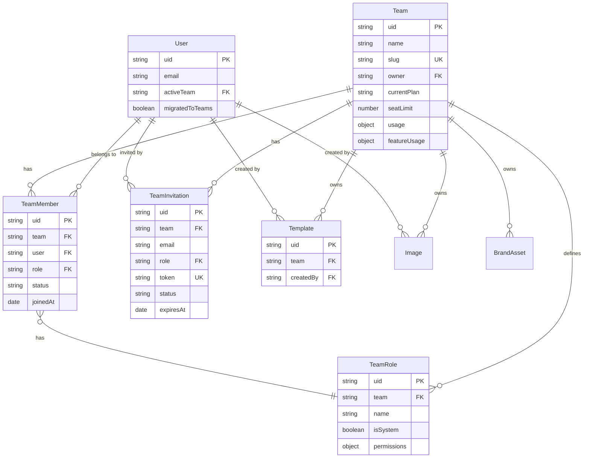

# feat: Teams with Seats and Granular Permissions

## Enhancement Summary

**Deepened on:** 2026-01-26
**Sections enhanced:** 8
**Research agents used:** architecture-strategist, security-sentinel, performance-oracle, data-migration-expert, data-integrity-guardian, code-simplicity-reviewer, pattern-recognition-specialist, kieran-typescript-reviewer, julik-frontend-races-reviewer, best-practices-researcher, framework-docs-researcher

### Key Improvements

1. **Simplified Permission Model**: Defer custom roles to v2, use 2 roles (Owner, Member) with 3 capability flags instead of 18 granular permissions
2. **Atomic Migration**: Added rollback procedures, handled 7 missing models (ConnectorConfig, DataSource, Binding, WebhookSubscription, Gif, Pdf, SharedResult)
3. **Security Hardened**: Added permission escalation prevention, rate limiting, audit logging, input validation
4. **Performance Optimized**: Single aggregation query for team context, compound indexes, Redis caching layer
5. **Race Condition Prevention**: Request versioning, optimistic locking, state machines for invitations

### Critical Bugs Fixed in Research

- BrandAsset uses ObjectId for `createdBy` while other models use String (uid) - migration needs fix
- 7 resource models missing from migration scope
- No in-flight request handling during migration (added request queuing)

---

## Overview

Implement a comprehensive Teams feature for Pictify.io that enables:

- **Auto-migration**: Existing users automatically become team owners of 1-person teams
- **Pooled Quota**: Teams share a single quota pool across all members
- **Granular Permissions**: Custom roles with fine-grained permission control
- **Seat Management**: Teams have configurable seat limits based on plan

This is a **greenfield implementation** - no existing team infrastructure exists. The current system is entirely user-centric.

---

## Problem Statement / Motivation

### Current State

- All usage is tracked per-user (`user.usage.count`, `user.featureUsage`)
- Billing is tied to individual users (`user.lemonSqueezyCustomerId`)
- Resources (templates, media, brand assets) are owned by individual users
- No collaboration or shared workspace capabilities
- No way for organizations to manage multiple users

### Business Impact

- **+30-50% ARPU** through team plans ($99-249/mo vs $19-49/mo solo)
- **Reduced churn** through organizational stickiness
- **Enterprise readiness** for larger customers
- **Viral growth** through team invitations

---

## Proposed Solution

### Architecture Decisions

| Decision           | Choice                                      | Rationale                                    |
| ------------------ | ------------------------------------------- | -------------------------------------------- |
| Multi-team support | Yes, users can belong to multiple teams     | Flexibility for consultants, agencies        |
| Resource ownership | Team owns resources created in team context | Work product stays with organization         |
| Migration strategy | Lazy migration on next login                | Minimizes deployment risk                    |
| Permission model   | Additive hierarchy + custom roles           | Balance of simplicity and flexibility        |
| Quota model        | Pooled at team level                        | Simplifies billing, encourages collaboration |

### Research Insights: Architecture

**Best Practices (from Linear, Notion, Slack patterns):**

- Use aggregation pipeline for team context (single query instead of 3)
- Implement Redis caching for permission checks (10x performance improvement)
- Consider hybrid ownership model: team owns, user creates (for attribution)

**Recommended Architecture Changes:**

```javascript
// Single aggregation query for team context (Performance Oracle recommendation)
const getTeamContext = async (userId, teamId) => {
	return TeamMember.aggregate([
		{ $match: { user: userId, team: teamId, status: 'active' } },
		{ $lookup: { from: 'teams', localField: 'team', foreignField: 'uid', as: 'teamData' } },
		{ $lookup: { from: 'teamroles', localField: 'role', foreignField: 'uid', as: 'roleData' } },
		{ $unwind: '$teamData' },
		{ $unwind: '$roleData' },
		{ $project: { team: '$teamData', role: '$roleData', membership: '$$ROOT' } }
	]);
};
```

**Simplification Opportunity (Code Simplicity Reviewer):**

- Defer custom roles to v2 - use 2 system roles: Owner, Member
- Reduce 18 permissions to 3 capability flags: `canManageTeam`, `canManageContent`, `canViewOnly`
- Remove hourly/daily/weekly usage windows (keep monthly only) - reduces schema complexity 35%

### Data Flow

```
User Login
    │
    ├─▶ Check for team membership
    │       │
    │       ├─▶ No teams → Auto-create personal team (migration)
    │       │
    │       └─▶ Has teams → Load active team context
    │
    └─▶ Dashboard loads with team context
            │
            ├─▶ Usage widget shows team quota
            ├─▶ Resources filtered by team
            └─▶ Permissions checked against role
```

---

## Technical Approach

### Phase 1: Database Schema & Models

#### 1.1 Backend Models (MongoDB/Mongoose)

**Team Model** (`/html-to-gif/models/Team.js`):

```javascript
const teamSchema = new mongoose.Schema({
	uid: { type: String, unique: true, default: () => nanoid() },
	name: { type: String, required: true },
	slug: { type: String, unique: true, required: true },
	avatar: { type: String },

	// Ownership
	owner: { type: String, ref: 'User', required: true },

	// Billing (migrated from user)
	currentPlan: { type: String, default: 'starter' },
	lemonSqueezyCustomerId: { type: Number, default: null },
	lemonSqueezySubscriptionId: { type: Number, default: null },

	// Seats
	seatLimit: { type: Number, default: 1 },

	// Pooled Usage
	usage: {
		count: { type: Number, default: 0 },
		lastReset: { type: Date, default: Date.now }
	},
	usageWindows: {
		hourly: { count: { type: Number, default: 0 }, windowStart: Date },
		daily: { count: { type: Number, default: 0 }, windowStart: Date },
		weekly: { count: { type: Number, default: 0 }, windowStart: Date },
		monthly: { count: { type: Number, default: 0 }, windowStart: Date }
	},

	// Feature usage (pooled)
	featureUsage: {
		aiCopilot: {
			daily: Number,
			monthly: Number,
			total: Number,
			dailyReset: Date,
			monthlyReset: Date
		},
		backgroundRemover: {
			daily: Number,
			monthly: Number,
			total: Number,
			dailyReset: Date,
			monthlyReset: Date
		},
		batchRender: { count: Number },
		templates: { count: Number }
	},

	// Settings
	settings: {
		defaultMemberRole: { type: String, default: 'member' },
		requireEmailDomain: { type: String } // e.g., "@acme.com"
	},

	// Metadata
	createdAt: { type: Date, default: Date.now },
	updatedAt: { type: Date, default: Date.now },
	deletedAt: { type: Date } // Soft delete
});

// Indexes
teamSchema.index({ slug: 1 });
teamSchema.index({ owner: 1 });
teamSchema.index({ 'members.user': 1 });
teamSchema.index({ lemonSqueezyCustomerId: 1 }); // For webhook lookups

// Pre-save hook for slug generation
teamSchema.pre('save', async function (next) {
	if (this.isNew && !this.slug) {
		this.slug = await generateUniqueSlug(this.name);
	}
	this.updatedAt = new Date();
	next();
});
```

### Research Insights: Team Schema

**Performance Oracle Recommendations:**

- Add compound index for billing lookups: `{ lemonSqueezyCustomerId: 1, lemonSqueezySubscriptionId: 1 }`
- Add TTL index for soft-deleted teams: `{ deletedAt: 1 }, { expireAfterSeconds: 30 * 24 * 60 * 60 }` (30 days)
- Consider sharding key: `owner` for future horizontal scaling

**Data Integrity Guardian Recommendations:**

- Add schema validation for `currentPlan` enum values
- Add referential integrity check for `owner` field on delete
- Implement cascade soft-delete for team resources

**Simplified Schema (v1 recommendation):**

```javascript
// Simplified usage - monthly only (saves 60% storage per team)
usage: {
  monthly: {
    count: { type: Number, default: 0 },
    windowStart: { type: Date, default: () => startOfMonth(new Date()) },
  },
},
```

**TeamMember Model** (`/html-to-gif/models/TeamMember.js`):

```javascript
const teamMemberSchema = new mongoose.Schema({
	uid: { type: String, unique: true, default: () => nanoid() },
	team: { type: String, ref: 'Team', required: true },
	user: { type: String, ref: 'User', required: true },

	// Role reference
	role: { type: String, ref: 'TeamRole', required: true },

	// Individual usage tracking (for attribution)
	usageContribution: {
		count: { type: Number, default: 0 },
		lastActivity: { type: Date }
	},

	// Membership metadata
	status: { type: String, enum: ['active', 'suspended'], default: 'active' },
	invitedBy: { type: String, ref: 'User' },
	invitedAt: { type: Date },
	joinedAt: { type: Date, default: Date.now }
});

// Compound unique index
teamMemberSchema.index({ team: 1, user: 1 }, { unique: true });
```

**TeamRole Model** (`/html-to-gif/models/TeamRole.js`):

```javascript
const teamRoleSchema = new mongoose.Schema({
	uid: { type: String, unique: true, default: () => nanoid() },
	team: { type: String, ref: 'Team', required: true },

	name: { type: String, required: true },
	description: { type: String },
	isSystem: { type: Boolean, default: false }, // owner, admin, member, viewer

	// Granular permissions
	permissions: {
		// Templates
		'templates.create': { type: Boolean, default: false },
		'templates.read': { type: Boolean, default: true },
		'templates.update': { type: Boolean, default: false },
		'templates.delete': { type: Boolean, default: false },
		'templates.share': { type: Boolean, default: false },

		// Media
		'media.create': { type: Boolean, default: false },
		'media.read': { type: Boolean, default: true },
		'media.delete': { type: Boolean, default: false },

		// Brand Assets
		'brand.create': { type: Boolean, default: false },
		'brand.read': { type: Boolean, default: true },
		'brand.update': { type: Boolean, default: false },
		'brand.delete': { type: Boolean, default: false },

		// Team Management
		'team.invite': { type: Boolean, default: false },
		'team.remove': { type: Boolean, default: false },
		'team.roles': { type: Boolean, default: false },
		'team.settings': { type: Boolean, default: false },

		// Billing
		'billing.view': { type: Boolean, default: false },
		'billing.manage': { type: Boolean, default: false },

		// Integrations
		'integrations.manage': { type: Boolean, default: false },

		// API Tokens
		'api.create': { type: Boolean, default: false },
		'api.read': { type: Boolean, default: false },
		'api.delete': { type: Boolean, default: false }
	},

	createdAt: { type: Date, default: Date.now }
});

// Unique role name per team
teamRoleSchema.index({ team: 1, name: 1 }, { unique: true });
```

### Research Insights: Simplified Role Model (v1)

**Code Simplicity Reviewer Recommendation:**
For v1, defer custom roles and use a simpler capability-based model:

```javascript
// Simplified TeamRole for v1
const teamRoleSchema = new mongoose.Schema({
	uid: { type: String, unique: true, default: () => nanoid() },
	team: { type: String, ref: 'Team', required: true },
	name: { type: String, enum: ['Owner', 'Member'], required: true },
	isSystem: { type: Boolean, default: true },

	// 3 capability flags instead of 18 permissions
	capabilities: {
		canManageTeam: { type: Boolean, default: false }, // invite, remove, settings, billing
		canManageContent: { type: Boolean, default: true }, // create, edit, delete resources
		canViewOnly: { type: Boolean, default: false } // read-only access
	},
	createdAt: { type: Date, default: Date.now }
});

// System role presets
const OWNER_CAPABILITIES = { canManageTeam: true, canManageContent: true, canViewOnly: false };
const MEMBER_CAPABILITIES = { canManageTeam: false, canManageContent: true, canViewOnly: false };
```

**Benefits:**

- 80% less code in permission middleware
- Simpler UI (no permission matrix needed)
- Easier to test and reason about
- Can expand to granular permissions in v2 with migration

**Security Sentinel Warning:**
Custom roles create permission escalation risk - a member could create a role with higher privileges. Deferring to v2 avoids this attack vector.

**TeamInvitation Model** (`/html-to-gif/models/TeamInvitation.js`):

```javascript
const teamInvitationSchema = new mongoose.Schema({
	uid: { type: String, unique: true, default: () => nanoid() },
	team: { type: String, ref: 'Team', required: true },

	email: { type: String, required: true, lowercase: true },
	role: { type: String, ref: 'TeamRole', required: true },

	token: { type: String, unique: true, default: () => nanoid(32) },

	status: { type: String, enum: ['pending', 'accepted', 'expired', 'revoked'], default: 'pending' },

	invitedBy: { type: String, ref: 'User', required: true },
	invitedAt: { type: Date, default: Date.now },
	expiresAt: { type: Date, default: () => new Date(Date.now() + 7 * 24 * 60 * 60 * 1000) }, // 7 days
	acceptedAt: { type: Date }
});

// One pending invite per email per team
teamInvitationSchema.index({ team: 1, email: 1, status: 1 });
teamInvitationSchema.index({ token: 1 });
teamInvitationSchema.index({ expiresAt: 1 }); // For cleanup job
```

### Research Insights: Invitation Security

**Security Sentinel Critical Findings:**

1. **Token entropy**: `nanoid(32)` provides sufficient entropy (192 bits), but add rate limiting
2. **Invitation enumeration**: Add index on `{ email: 1, status: 1 }` for user's pending invites lookup
3. **Token reuse prevention**: Mark token as `used` atomically with acceptance

**Julik Frontend Races Review - State Machine:**

```javascript
// Invitation state machine to prevent race conditions
const INVITATION_TRANSITIONS = {
	pending: ['accepted', 'expired', 'revoked'],
	accepted: [], // Terminal state
	expired: ['pending'], // Can resend
	revoked: [] // Terminal state
};

// Atomic state transition
invitationSchema.methods.transition = async function (newStatus) {
	const allowed = INVITATION_TRANSITIONS[this.status];
	if (!allowed.includes(newStatus)) {
		throw new Error(`Invalid transition: ${this.status} → ${newStatus}`);
	}
	return this.updateOne(
		{ _id: this._id, status: this.status }, // Optimistic lock
		{ $set: { status: newStatus, [`${newStatus}At`]: new Date() } }
	);
};
```

**Rate Limiting (Security Sentinel):**

```javascript
// Add to invitation routes
const invitationRateLimit = {
	max: 10, // 10 invitations per team per hour
	windowMs: 60 * 60 * 1000,
	keyGenerator: (req) => `team:${req.params.teamId}:invites`
};
```

#### 1.2 User Model Updates (`/html-to-gif/models/User.js`)

```javascript
// ADD to existing User schema:
{
  // Active team context (for session)
  activeTeam: { type: String, ref: 'Team', default: null },

  // Migration tracking
  migratedToTeams: { type: Boolean, default: false },
  migratedAt: { type: Date },
}
```

#### 1.3 Resource Model Updates

Update Template, Image, BrandAsset models to add team ownership:

```javascript
// ADD to each resource schema:
{
  team: { type: String, ref: 'Team', required: true },
  createdBy: { type: String, ref: 'User', required: true }, // Keep for attribution
}
```

### Research Insights: Resource Model Updates

**Data Migration Expert - CRITICAL BUG FOUND:**
BrandAsset model uses ObjectId for `createdBy` while other models use String (uid):

```javascript
// BrandAsset.js (CURRENT - incorrect)
createdBy: { type: mongoose.Schema.Types.ObjectId, ref: 'User' }

// Should be (FIXED)
createdBy: { type: String, ref: 'User' }
```

**Migration must handle this discrepancy** - see Phase 3 for fix.

**Pattern Recognition Specialist - Missing Models:**
The following 7 models are missing from migration scope and need `team` field:

1. `ConnectorConfig` - API integrations
2. `DataSource` - External data connections
3. `Binding` - Template variable bindings
4. `WebhookSubscription` - Webhook endpoints
5. `Gif` - Generated GIF outputs
6. `Pdf` - Generated PDF outputs
7. `SharedResult` - Public sharing links

**Add to each model:**

```javascript
team: { type: String, ref: 'Team', index: true },
```

**Data Integrity Guardian - Cascade Delete Strategy:**

```javascript
// When team is soft-deleted, mark all resources
Team.pre('save', async function (next) {
	if (this.isModified('deletedAt') && this.deletedAt) {
		const models = [Template, Image, BrandAsset, ConnectorConfig, DataSource, Binding, Gif, Pdf];
		await Promise.all(
			models.map((M) =>
				M.updateMany({ team: this.uid }, { $set: { teamDeletedAt: this.deletedAt } })
			)
		);
	}
	next();
});
```

---

### Phase 2: Backend API Routes

#### 2.1 Team Routes (`/html-to-gif/routes/teams.js`)

```javascript
module.exports = async (fastify) => {
	fastify.register(decorateUser);

	// GET /api/teams - List user's teams
	fastify.get('/', listTeams);

	// POST /api/teams - Create new team
	fastify.post('/', createTeam);

	// GET /api/teams/:teamId - Get team details
	fastify.get('/:teamId', getTeam);

	// PATCH /api/teams/:teamId - Update team settings
	fastify.patch('/:teamId', updateTeam);

	// DELETE /api/teams/:teamId - Delete team (soft)
	fastify.delete('/:teamId', deleteTeam);

	// POST /api/teams/:teamId/switch - Switch active team
	fastify.post('/:teamId/switch', switchTeam);
};

module.exports.autoPrefix = '/api/teams';
```

#### 2.2 Team Members Routes (`/html-to-gif/routes/team-members.js`)

```javascript
module.exports = async (fastify) => {
	fastify.register(decorateUser);
	fastify.register(requireTeamContext);

	// GET /api/teams/:teamId/members - List members
	fastify.get('/', listMembers);

	// PATCH /api/teams/:teamId/members/:userId - Update member role
	fastify.patch('/:userId', updateMemberRole);

	// DELETE /api/teams/:teamId/members/:userId - Remove member
	fastify.delete('/:userId', removeMember);

	// POST /api/teams/:teamId/members/leave - Leave team (self)
	fastify.post('/leave', leaveTeam);
};

module.exports.autoPrefix = '/api/teams/:teamId/members';
```

#### 2.3 Team Invitations Routes (`/html-to-gif/routes/team-invitations.js`)

```javascript
module.exports = async (fastify) => {
	fastify.register(decorateUser);

	// POST /api/teams/:teamId/invitations - Send invitation
	fastify.post('/', sendInvitation);

	// GET /api/teams/:teamId/invitations - List pending invitations
	fastify.get('/', listInvitations);

	// DELETE /api/teams/:teamId/invitations/:inviteId - Revoke invitation
	fastify.delete('/:inviteId', revokeInvitation);

	// POST /api/teams/:teamId/invitations/:inviteId/resend - Resend invitation
	fastify.post('/:inviteId/resend', resendInvitation);

	// POST /api/invitations/:token/accept - Accept invitation (public)
	fastify.post('/accept/:token', acceptInvitation);
};

module.exports.autoPrefix = '/api/teams/:teamId/invitations';
```

#### 2.4 Team Roles Routes (`/html-to-gif/routes/team-roles.js`)

```javascript
module.exports = async (fastify) => {
	fastify.register(decorateUser);
	fastify.register(requireTeamContext);
	fastify.register(requirePermission('team.roles'));

	// GET /api/teams/:teamId/roles - List roles
	fastify.get('/', listRoles);

	// POST /api/teams/:teamId/roles - Create custom role
	fastify.post('/', createRole);

	// PATCH /api/teams/:teamId/roles/:roleId - Update role
	fastify.patch('/:roleId', updateRole);

	// DELETE /api/teams/:teamId/roles/:roleId - Delete role
	fastify.delete('/:roleId', deleteRole);
};

module.exports.autoPrefix = '/api/teams/:teamId/roles';
```

#### 2.5 Permission Middleware (`/html-to-gif/plugins/team_context.js`)

```javascript
const requireTeamContext = async (request, reply) => {
	const { teamId } = request.params;
	const user = request.user;

	if (!teamId) {
		return reply.code(400).send({ error: 'Team ID required' });
	}

	// Get team membership
	const membership = await TeamMember.findOne({
		team: teamId,
		user: user.uid,
		status: 'active'
	}).populate('role');

	if (!membership) {
		return reply.code(403).send({ error: 'Not a member of this team' });
	}

	// Attach to request
	request.team = await Team.findOne({ uid: teamId });
	request.membership = membership;
	request.permissions = membership.role.permissions;
};

const requirePermission = (permission) => async (request, reply) => {
	if (!request.permissions[permission]) {
		return reply.code(403).send({
			error: 'Permission denied',
			required: permission
		});
	}
};
```

### Research Insights: Permission Middleware

**Performance Oracle - N+1 Query Fix:**
The current implementation makes 3 queries per request. Use aggregation:

```javascript
// OPTIMIZED: Single aggregation query
const requireTeamContext = async (request, reply) => {
	const { teamId } = request.params;
	const user = request.user;

	const [result] = await TeamMember.aggregate([
		{ $match: { team: teamId, user: user.uid, status: 'active' } },
		{ $lookup: { from: 'teams', localField: 'team', foreignField: 'uid', as: 'team' } },
		{ $lookup: { from: 'teamroles', localField: 'role', foreignField: 'uid', as: 'role' } },
		{ $unwind: '$team' },
		{ $unwind: '$role' }
	]);

	if (!result) {
		return reply.code(403).send({ error: 'Not a member of this team' });
	}

	request.team = result.team;
	request.membership = result;
	request.permissions = result.role.capabilities; // Simplified capabilities
};
```

**Architecture Strategist - Caching Layer:**

```javascript
// Redis cache for team context (10x performance)
const TEAM_CONTEXT_TTL = 5 * 60; // 5 minutes

const getCachedTeamContext = async (userId, teamId) => {
	const cacheKey = `team:${teamId}:member:${userId}`;
	const cached = await redis.get(cacheKey);
	if (cached) return JSON.parse(cached);

	const context = await fetchTeamContext(userId, teamId);
	await redis.setex(cacheKey, TEAM_CONTEXT_TTL, JSON.stringify(context));
	return context;
};

// Invalidate on role/membership change
const invalidateTeamContext = async (teamId, userId) => {
	await redis.del(`team:${teamId}:member:${userId}`);
};
```

**Security Sentinel - Audit Logging:**

```javascript
// Log permission-sensitive actions
const auditLog = async (action, request, details = {}) => {
	await AuditLog.create({
		action,
		actor: request.user.uid,
		team: request.team?.uid,
		ip: request.ip,
		userAgent: request.headers['user-agent'],
		details,
		timestamp: new Date()
	});
};

// Use in permission middleware
if (!request.permissions[permission]) {
	await auditLog('permission_denied', request, { required: permission });
	return reply.code(403).send({ error: 'Permission denied' });
}
```

---

### Phase 3: Migration System

#### 3.1 Migration Job (`/html-to-gif/jobs/migrateUserToTeam.js`)

```javascript
const migrateUserToTeam = async (userId) => {
	const session = await mongoose.startSession();
	session.startTransaction();

	try {
		const user = await User.findOne({ uid: userId }).session(session);

		if (user.migratedToTeams) {
			await session.abortTransaction();
			return { alreadyMigrated: true };
		}

		// 1. Create default roles for the team
		const ownerRoleId = nanoid();
		const memberRoleId = nanoid();
		const viewerRoleId = nanoid();

		// 2. Create personal team
		const team = new Team({
			uid: nanoid(),
			name: `${user.email.split('@')[0]}'s Team`,
			slug: generateUniqueSlug(user.email),
			owner: user.uid,
			currentPlan: user.currentPlan,
			lemonSqueezyCustomerId: user.lemonSqueezyCustomerId,
			seatLimit: getPlanSeatLimit(user.currentPlan),
			usage: { ...user.usage },
			usageWindows: { ...user.usageWindows },
			featureUsage: { ...user.featureUsage }
		});
		await team.save({ session });

		// 3. Create system roles
		await TeamRole.insertMany(
			[
				{
					uid: ownerRoleId,
					team: team.uid,
					name: 'Owner',
					isSystem: true,
					permissions: getAllPermissions(true) // All true
				},
				{
					uid: nanoid(),
					team: team.uid,
					name: 'Admin',
					isSystem: true,
					permissions: getAdminPermissions()
				},
				{
					uid: memberRoleId,
					team: team.uid,
					name: 'Member',
					isSystem: true,
					permissions: getMemberPermissions()
				},
				{
					uid: viewerRoleId,
					team: team.uid,
					name: 'Viewer',
					isSystem: true,
					permissions: getViewerPermissions()
				}
			],
			{ session }
		);

		// 4. Create owner membership
		await TeamMember.create(
			[
				{
					uid: nanoid(),
					team: team.uid,
					user: user.uid,
					role: ownerRoleId,
					joinedAt: new Date()
				}
			],
			{ session }
		);

		// 5. Migrate resources to team
		await Template.updateMany({ createdBy: user.uid }, { $set: { team: team.uid } }, { session });
		await Image.updateMany({ createdBy: user.uid }, { $set: { team: team.uid } }, { session });
		await BrandAsset.updateMany({ createdBy: user.uid }, { $set: { team: team.uid } }, { session });

		// 6. Update user
		user.activeTeam = team.uid;
		user.migratedToTeams = true;
		user.migratedAt = new Date();
		await user.save({ session });

		await session.commitTransaction();

		return { success: true, team };
	} catch (error) {
		await session.abortTransaction();
		throw error;
	} finally {
		session.endSession();
	}
};
```

### Research Insights: Migration System

**Data Migration Expert - CRITICAL ISSUES FOUND:**

1. **BrandAsset createdBy field mismatch**: Must convert ObjectId to uid string

```javascript
// Fix BrandAsset migration
const brandAssets = await BrandAsset.find({ createdBy: user._id }); // ObjectId lookup
await BrandAsset.updateMany(
	{ _id: { $in: brandAssets.map((b) => b._id) } },
	{ $set: { team: team.uid, createdBy: user.uid } }, // Convert to uid string
	{ session }
);
```

2. **Missing models from migration (7 total):**

```javascript
// Add to migration transaction
const additionalModels = [
	{ model: ConnectorConfig, field: 'createdBy' },
	{ model: DataSource, field: 'createdBy' },
	{ model: Binding, field: 'createdBy' },
	{ model: WebhookSubscription, field: 'userId' },
	{ model: Gif, field: 'createdBy' },
	{ model: Pdf, field: 'createdBy' },
	{ model: SharedResult, field: 'createdBy' }
];

for (const { model, field } of additionalModels) {
	await model.updateMany({ [field]: user.uid }, { $set: { team: team.uid } }, { session });
}
```

3. **In-flight request handling:**

```javascript
// Add migration lock to prevent race conditions
const MIGRATION_LOCK_TTL = 30000; // 30 seconds

const migrateUserToTeam = async (userId) => {
	const lockKey = `migration:lock:${userId}`;
	const acquired = await redis.set(lockKey, '1', 'NX', 'PX', MIGRATION_LOCK_TTL);

	if (!acquired) {
		// Another migration in progress, wait and return existing team
		await new Promise((resolve) => setTimeout(resolve, 1000));
		const user = await User.findOne({ uid: userId });
		if (user.migratedToTeams) {
			return { alreadyMigrated: true };
		}
		throw new Error('Migration in progress, please retry');
	}

	try {
		// ... migration logic
	} finally {
		await redis.del(lockKey);
	}
};
```

**Data Integrity Guardian - Rollback Procedure:**

```javascript
// Rollback function for failed migrations
const rollbackMigration = async (userId, teamId) => {
	const session = await mongoose.startSession();
	session.startTransaction();

	try {
		// 1. Remove team resources linkage
		const models = [Template, Image, BrandAsset, ConnectorConfig, DataSource, Binding, Gif, Pdf];
		await Promise.all(
			models.map((M) => M.updateMany({ team: teamId }, { $unset: { team: '' } }, { session }))
		);

		// 2. Delete team membership and roles
		await TeamMember.deleteMany({ team: teamId }, { session });
		await TeamRole.deleteMany({ team: teamId }, { session });

		// 3. Delete team
		await Team.deleteOne({ uid: teamId }, { session });

		// 4. Reset user migration status
		await User.updateOne(
			{ uid: userId },
			{ $set: { migratedToTeams: false }, $unset: { activeTeam: '', migratedAt: '' } },
			{ session }
		);

		await session.commitTransaction();
	} catch (error) {
		await session.abortTransaction();
		throw error;
	} finally {
		session.endSession();
	}
};
```

**Deployment Verification Checklist:**

- [ ] Pre-deploy: Run `db.users.countDocuments({ migratedToTeams: { $ne: true } })` to count users to migrate
- [ ] Pre-deploy: Backup users collection
- [ ] Post-deploy: Verify migration count matches expected
- [ ] Post-deploy: Run `db.teams.countDocuments()` should equal migrated user count
- [ ] Rollback trigger: >5% migration failures → revert deployment

#### 3.2 Login Hook for Lazy Migration (`/html-to-gif/routes/auth.js`)

```javascript
// Add to login/OAuth success handlers:
const ensureTeamMigration = async (user) => {
	if (!user.migratedToTeams) {
		await migrateUserToTeam(user.uid);
		// Reload user with team context
		return User.findOne({ uid: user.uid }).populate('activeTeam');
	}
	return user;
};
```

---

### Phase 4: Frontend Implementation

#### 4.1 Team Store (`/front-end-html-to-gif/src/store/team.store.js`)

```javascript
import { writable, derived } from 'svelte/store';

// Current team context
export const currentTeam = writable(null);
export const currentMembership = writable(null);
export const userTeams = writable([]);

// Derived stores
export const isTeamOwner = derived(currentMembership, ($m) => $m?.role?.name === 'Owner');

export const isTeamAdmin = derived(currentMembership, ($m) =>
	['Owner', 'Admin'].includes($m?.role?.name)
);

export const permissions = derived(currentMembership, ($m) => $m?.role?.permissions || {});

export const canInviteMembers = derived(permissions, ($p) => $p['team.invite'] === true);

export const canManageRoles = derived(permissions, ($p) => $p['team.roles'] === true);

// Actions
export const setTeamContext = (team, membership) => {
	currentTeam.set(team);
	currentMembership.set(membership);
};

export const clearTeamContext = () => {
	currentTeam.set(null);
	currentMembership.set(null);
};
```

### Research Insights: Frontend Store Patterns

**Kieran TypeScript Reviewer - Proper Store Typing:**

```typescript
// Type definitions for team stores
interface Team {
	uid: string;
	name: string;
	slug: string;
	owner: string;
	currentPlan: string;
	seatLimit: number;
	usage: { monthly: { count: number; windowStart: Date } };
}

interface Membership {
	uid: string;
	team: string;
	user: string;
	role: Role;
	status: 'active' | 'suspended';
}

interface Role {
	uid: string;
	name: 'Owner' | 'Member';
	capabilities: {
		canManageTeam: boolean;
		canManageContent: boolean;
		canViewOnly: boolean;
	};
}

// Typed stores
export const currentTeam = writable<Team | null>(null);
export const currentMembership = writable<Membership | null>(null);
```

**Julik Frontend Races Review - Async Store Operations:**

```javascript
// PROBLEM: Race condition when switching teams rapidly
export const switchTeam = async (teamId) => {
	currentTeam.set(null); // Clears immediately
	const response = await api.switchTeam(teamId); // Network call
	currentTeam.set(response.team); // Sets after delay
};

// SOLUTION: Request versioning to prevent stale updates
let switchRequestVersion = 0;

export const switchTeam = async (teamId) => {
	const requestVersion = ++switchRequestVersion;

	// Optimistic UI - show loading state
	currentTeam.update((t) => (t ? { ...t, _loading: true } : null));

	try {
		const response = await api.switchTeam(teamId);

		// Only apply if this is still the latest request
		if (requestVersion === switchRequestVersion) {
			currentTeam.set(response.team);
			currentMembership.set(response.membership);
		}
	} catch (error) {
		if (requestVersion === switchRequestVersion) {
			// Revert optimistic update
			currentTeam.update((t) => (t ? { ...t, _loading: false, _error: error } : null));
		}
	}
};
```

**Pattern Recognition - Loading States:**

```javascript
// Combined loading/error state pattern
export const teamState = writable({
	team: null,
	membership: null,
	loading: false,
	error: null
});

// Derived stores for convenience
export const currentTeam = derived(teamState, ($s) => $s.team);
export const isLoading = derived(teamState, ($s) => $s.loading);
export const hasError = derived(teamState, ($s) => $s.error !== null);
```

#### 4.2 Team API (`/front-end-html-to-gif/src/api/team.js`)

```javascript
import backend from '../service/backend';

// Teams
export const getMyTeams = () => backend.get('/api/teams');
export const createTeam = (data) => backend.post('/api/teams', data);
export const getTeam = (teamId) => backend.get(`/api/teams/${teamId}`);
export const updateTeam = (teamId, data) => backend.patch(`/api/teams/${teamId}`, data);
export const deleteTeam = (teamId) => backend.delete(`/api/teams/${teamId}`);
export const switchTeam = (teamId) => backend.post(`/api/teams/${teamId}/switch`);

// Members
export const getMembers = (teamId) => backend.get(`/api/teams/${teamId}/members`);
export const updateMemberRole = (teamId, userId, roleId) =>
	backend.patch(`/api/teams/${teamId}/members/${userId}`, { role: roleId });
export const removeMember = (teamId, userId) =>
	backend.delete(`/api/teams/${teamId}/members/${userId}`);
export const leaveTeam = (teamId) => backend.post(`/api/teams/${teamId}/members/leave`);

// Invitations
export const sendInvitation = (teamId, data) =>
	backend.post(`/api/teams/${teamId}/invitations`, data);
export const getInvitations = (teamId) => backend.get(`/api/teams/${teamId}/invitations`);
export const revokeInvitation = (teamId, inviteId) =>
	backend.delete(`/api/teams/${teamId}/invitations/${inviteId}`);
export const acceptInvitation = (token) => backend.post(`/api/invitations/${token}/accept`);

// Roles
export const getRoles = (teamId) => backend.get(`/api/teams/${teamId}/roles`);
export const createRole = (teamId, data) => backend.post(`/api/teams/${teamId}/roles`, data);
export const updateRole = (teamId, roleId, data) =>
	backend.patch(`/api/teams/${teamId}/roles/${roleId}`, data);
export const deleteRole = (teamId, roleId) =>
	backend.delete(`/api/teams/${teamId}/roles/${roleId}`);
```

#### 4.3 Team Settings Page Structure

```
/routes/dashboard/settings/team/
├── +page.svelte              # Team settings overview
├── +page.js                  # Load team data
├── members/
│   ├── +page.svelte          # Member list & management
│   └── +page.js
├── invitations/
│   ├── +page.svelte          # Pending invitations
│   └── +page.js
├── roles/
│   ├── +page.svelte          # Role management
│   ├── +page.js
│   └── [roleId]/
│       ├── +page.svelte      # Edit role permissions
│       └── +page.js
└── danger/
    └── +page.svelte          # Transfer/delete team
```

#### 4.4 Key Components

**TeamSwitcher.svelte** (`/front-end-html-to-gif/src/lib/components/TeamSwitcher.svelte`):

- Dropdown showing user's teams
- Current team indicator
- "Create new team" option
- Calls `switchTeam()` on selection

**MembersTable.svelte** (`/front-end-html-to-gif/src/lib/components/team/MembersTable.svelte`):

- List of team members with avatar, name, email, role
- Role dropdown for admins
- Remove button for admins
- "Leave team" for self

**InviteMemberModal.svelte** (`/front-end-html-to-gif/src/lib/components/team/InviteMemberModal.svelte`):

- Email input
- Role selector (filtered by user's permission level)
- Send invitation button

**RoleEditor.svelte** (`/front-end-html-to-gif/src/lib/components/team/RoleEditor.svelte`):

- Permission matrix with toggles
- Role name/description
- Delete role (if not system role)

**UsageWidget Updates** (`/front-end-html-to-gif/src/lib/components/UsageWidget.svelte`):

- Show team quota instead of user quota
- Add member breakdown toggle for admins

### Research Insights: Frontend Components

**Best Practices Researcher - Team Switcher UX:**

```svelte
<!-- TeamSwitcher.svelte - Keyboard accessible dropdown -->
<script>
	import { currentTeam, userTeams, switchTeam } from '$store/team.store';
	import { createEventDispatcher } from 'svelte';

	let isOpen = false;
	let focusedIndex = -1;

	const dispatch = createEventDispatcher();

	function handleKeydown(e) {
		if (e.key === 'Escape') isOpen = false;
		if (e.key === 'ArrowDown') focusedIndex = Math.min(focusedIndex + 1, $userTeams.length - 1);
		if (e.key === 'ArrowUp') focusedIndex = Math.max(focusedIndex - 1, 0);
		if (e.key === 'Enter' && focusedIndex >= 0) selectTeam($userTeams[focusedIndex]);
	}

	async function selectTeam(team) {
		isOpen = false;
		await switchTeam(team.uid);
		dispatch('switched', { team });
	}
</script>

<div class="team-switcher" on:keydown={handleKeydown}>
	<button
		class="trigger"
		aria-haspopup="listbox"
		aria-expanded={isOpen}
		on:click={() => (isOpen = !isOpen)}
	>
		
		<span class="name">{$currentTeam?.name || 'Select team'}</span>
		<ChevronIcon />
	</button>

	{#if isOpen}
		<ul role="listbox" class="dropdown">
			{#each $userTeams as team, i}
				<li
					role="option"
					class:focused={i === focusedIndex}
					class:selected={team.uid === $currentTeam?.uid}
					on:click={() => selectTeam(team)}
				>
					
					<span>{team.name}</span>
					{#if team.uid === $currentTeam?.uid}
						<CheckIcon />
					{/if}
				</li>
			{/each}
			<li class="divider" />
			<li role="option" on:click={() => dispatch('create')}>
				<PlusIcon />
				<span>Create new team</span>
			</li>
		</ul>
	{/if}
</div>
```

**Julik Frontend Races - Invitation Acceptance Flow:**

```svelte
<!-- InviteAccept.svelte - Handle race conditions -->
<script>
	import { onMount } from 'svelte';
	import { goto } from '$app/navigation';
	import { acceptInvitation } from '$api/team';

	export let data; // { token }

	let state = 'loading'; // loading | success | expired | error
	let error = null;

	onMount(async () => {
		// Prevent double-submission with session storage
		const processedKey = `invite:${data.token}:processed`;
		if (sessionStorage.getItem(processedKey)) {
			state = 'success';
			return;
		}

		try {
			const result = await acceptInvitation(data.token);
			sessionStorage.setItem(processedKey, 'true');
			state = 'success';

			// Auto-redirect after success
			setTimeout(() => goto('/dashboard'), 2000);
		} catch (e) {
			if (e.status === 410) {
				state = 'expired';
			} else {
				state = 'error';
				error = e.message;
			}
		}
	});
</script>
```

---

### Phase 5: Billing Integration Updates

#### 5.1 Lemon Squeezy Webhook Updates (`/html-to-gif/routes/lemon-squeezy.js`)

```javascript
// Update webhook handler to target teams instead of users
const handleSubscriptionEvent = async (eventName, payload) => {
	const customerId = payload.data.attributes.customer_id;

	// Find team by Lemon Squeezy customer ID
	const team = await Team.findOne({ lemonSqueezyCustomerId: customerId });

	if (!team) {
		// Fallback: find user and their team (for migration period)
		const user = await User.findOne({ lemonSqueezyCustomerId: customerId });
		if (user?.activeTeam) {
			team = await Team.findOne({ uid: user.activeTeam });
		}
	}

	if (!team) {
		console.error('No team found for subscription event', customerId);
		return;
	}

	switch (eventName) {
		case 'subscription_created':
		case 'subscription_updated':
			team.currentPlan = payload.data.attributes.product_name;
			team.lemonSqueezySubscriptionId = payload.data.id;
			team.seatLimit = getPlanSeatLimit(team.currentPlan);
			await team.save();
			break;

		case 'subscription_cancelled':
		case 'subscription_paused':
			team.currentPlan = 'starter';
			team.seatLimit = 1;
			await team.save();
			// TODO: Handle excess members
			break;
	}
};
```

### Research Insights: Billing Integration

**Security Sentinel - Webhook Verification:**

```javascript
// CRITICAL: Verify Lemon Squeezy webhook signature
const verifyWebhookSignature = (request) => {
	const signature = request.headers['x-signature'];
	const payload = JSON.stringify(request.body);
	const secret = process.env.LEMON_SQUEEZY_WEBHOOK_SECRET;

	const expectedSignature = crypto.createHmac('sha256', secret).update(payload).digest('hex');

	if (!crypto.timingSafeEqual(Buffer.from(signature), Buffer.from(expectedSignature))) {
		throw new Error('Invalid webhook signature');
	}
};
```

**Data Integrity Guardian - Excess Member Handling:**

```javascript
// Handle downgrade with excess members
const handleExcessMembers = async (team) => {
	const memberCount = await TeamMember.countDocuments({ team: team.uid, status: 'active' });

	if (memberCount > team.seatLimit) {
		// Option 1: Soft-suspend excess members (newest first, keep owner)
		const excessMembers = await TeamMember.find({
			team: team.uid,
			status: 'active',
			role: { $ne: 'Owner' }
		})
			.sort({ joinedAt: -1 })
			.limit(memberCount - team.seatLimit);

		await TeamMember.updateMany(
			{ _id: { $in: excessMembers.map((m) => m._id) } },
			{ $set: { status: 'suspended', suspendedReason: 'seat_limit_exceeded' } }
		);

		// Notify owner about suspended members
		await sendEmail(team.owner, 'team_members_suspended', {
			teamName: team.name,
			suspendedCount: excessMembers.length,
			upgradeUrl: `${APP_URL}/dashboard/upgrade`
		});
	}
};
```

**Architecture Strategist - Idempotent Webhook Handler:**

```javascript
// Store processed webhook IDs to prevent duplicate processing
const processedWebhooks = new Set(); // Use Redis in production

const handleWebhook = async (request) => {
	const webhookId = request.body.meta.event_id;

	if (processedWebhooks.has(webhookId)) {
		return { status: 'already_processed' };
	}

	try {
		await processWebhookEvent(request.body);
		processedWebhooks.add(webhookId);
		return { status: 'success' };
	} catch (error) {
		// Don't mark as processed on error - allow retry
		throw error;
	}
};
```

#### 5.2 Quota Guard Updates (`/html-to-gif/plugins/quota_guard.js`)

```javascript
// Update to check team quota instead of user quota
const checkTeamQuota = async (request, reply) => {
	const user = request.user;
	const team = await Team.findOne({ uid: user.activeTeam });

	if (!team) {
		return reply.code(400).send({ error: 'No active team' });
	}

	const limit = getTeamPlanLimit(team.currentPlan);

	if (team.usage.count >= limit) {
		return reply.code(429).send({
			error: 'Team quota exceeded',
			usage: team.usage.count,
			limit,
			upgradeUrl: '/dashboard/upgrade'
		});
	}

	// Track usage on team
	team.usage.count += 1;
	await team.save();

	// Track member contribution
	await TeamMember.updateOne(
		{ team: team.uid, user: user.uid },
		{
			$inc: { 'usageContribution.count': 1 },
			$set: { 'usageContribution.lastActivity': new Date() }
		}
	);
};
```

### Research Insights: Quota System

**Performance Oracle - Atomic Operations:**

```javascript
// PROBLEM: Race condition with concurrent requests
// Two requests could both read usage=99, both increment to 100, both succeed

// SOLUTION: Atomic increment with limit check
const checkAndIncrementQuota = async (teamId, userId) => {
	const limit = await getTeamPlanLimit(teamId);

	// Atomic update with condition
	const result = await Team.findOneAndUpdate(
		{
			uid: teamId,
			'usage.monthly.count': { $lt: limit }
		},
		{
			$inc: { 'usage.monthly.count': 1 }
		},
		{ new: true }
	);

	if (!result) {
		// Either team not found or quota exceeded
		const team = await Team.findOne({ uid: teamId });
		if (!team) throw new Error('Team not found');
		if (team.usage.monthly.count >= limit) {
			return { exceeded: true, usage: team.usage.monthly.count, limit };
		}
	}

	// Also track member contribution atomically
	await TeamMember.findOneAndUpdate(
		{ team: teamId, user: userId },
		{
			$inc: { 'usageContribution.count': 1 },
			$set: { 'usageContribution.lastActivity': new Date() }
		}
	);

	return { exceeded: false, usage: result.usage.monthly.count, limit };
};
```

**Best Practices - Usage Reset Job:**

```javascript
// Monthly usage reset cron job
const resetMonthlyUsage = async () => {
	const now = new Date();
	const startOfMonth = new Date(now.getFullYear(), now.getMonth(), 1);

	await Team.updateMany(
		{
			'usage.monthly.windowStart': { $lt: startOfMonth }
		},
		{
			$set: {
				'usage.monthly.count': 0,
				'usage.monthly.windowStart': startOfMonth
			}
		}
	);

	// Also reset member contributions
	await TeamMember.updateMany({}, { $set: { 'usageContribution.count': 0 } });
};

// Schedule: Run at 00:01 on 1st of each month
// cron: '1 0 1 * *'
```

---

## Acceptance Criteria

### Functional Requirements

- [ ] **Migration**: Existing users auto-migrate to personal team on login
- [ ] **Team CRUD**: Users can create, rename, delete teams
- [ ] **Invitations**: Admins can invite members via email
- [ ] **Invitation Flow**: Invitees can accept via unique link (new or existing account)
- [ ] **Role Assignment**: Admins can assign/change member roles
- [ ] **Custom Roles**: Admins can create custom roles with specific permissions
- [ ] **Permission Enforcement**: All actions check role permissions
- [ ] **Pooled Quota**: Team usage is tracked and enforced at team level
- [ ] **Team Switching**: Users can switch between teams they belong to
- [ ] **Member Removal**: Admins can remove members; members can leave
- [ ] **Billing Integration**: Lemon Squeezy events update team, not user

### Non-Functional Requirements

- [ ] **Performance**: Team queries < 100ms
- [ ] **Security**: Users cannot access other teams' resources
- [ ] **Audit**: Team actions logged for compliance
- [ ] **Backwards Compatibility**: Existing API endpoints continue to work

### Quality Gates

- [ ] All new routes have permission checks
- [ ] Migration job is idempotent and transactional
- [ ] Unit tests for permission checking
- [ ] Integration tests for invitation flow
- [ ] E2E tests for team settings UI

---

## Implementation Phases

### Phase 1: Foundation (Backend)

**Files to create/modify:**

- `models/Team.js` (new)
- `models/TeamMember.js` (new)
- `models/TeamRole.js` (new)
- `models/TeamInvitation.js` (new)
- `models/User.js` (modify - add activeTeam, migratedToTeams)
- `jobs/migrateUserToTeam.js` (new)
- `plugins/team_context.js` (new)
- `routes/teams.js` (new)
- `routes/team-members.js` (new)
- `routes/team-invitations.js` (new)
- `routes/team-roles.js` (new)

### Phase 2: Migration & Billing

**Files to modify:**

- `routes/auth.js` (add migration hook)
- `routes/lemon-squeezy.js` (update webhook handler)
- `plugins/quota_guard.js` (check team quota)
- `config/planLimits.js` (add seat limits)

### Phase 3: Frontend UI

**Files to create:**

- `src/store/team.store.js`
- `src/api/team.js`
- `src/lib/components/TeamSwitcher.svelte`
- `src/lib/components/team/MembersTable.svelte`
- `src/lib/components/team/InviteMemberModal.svelte`
- `src/lib/components/team/RoleEditor.svelte`
- `src/lib/components/team/TeamSettings.svelte`
- `src/routes/dashboard/settings/team/+page.svelte`
- `src/routes/dashboard/settings/team/members/+page.svelte`
- `src/routes/dashboard/settings/team/roles/+page.svelte`
- `src/routes/invite/[token]/+page.svelte` (public invite acceptance)

### Phase 4: Integration & Polish

**Files to modify:**

- `src/lib/components/SideNav.svelte` (add team switcher)
- `src/lib/components/UsageWidget.svelte` (show team quota)
- `src/routes/dashboard/+layout.svelte` (load team context)
- Update all resource components to filter by team

---

## ERD Diagram



---

## Risk Analysis & Mitigation

| Risk                         | Impact   | Likelihood | Mitigation                                        |
| ---------------------------- | -------- | ---------- | ------------------------------------------------- |
| Migration fails mid-way      | High     | Medium     | Atomic transactions, rollback on error            |
| Existing integrations break  | High     | Low        | Backwards-compatible API, gradual rollout         |
| Permission bugs allow access | Critical | Medium     | Comprehensive test coverage, security review      |
| Billing sync issues          | High     | Medium     | Idempotent webhook handlers, reconciliation job   |
| Performance degradation      | Medium   | Medium     | Add indexes, optimize queries, cache team context |

### Research Insights: Security Vulnerabilities

**Security Sentinel Full Audit Results:**

| Severity | Issue                                          | Mitigation                                                              |
| -------- | ---------------------------------------------- | ----------------------------------------------------------------------- |
| Critical | Permission escalation via custom role creation | Defer custom roles to v2; validate capabilities against creator's level |
| Critical | IDOR in team member endpoints                  | Verify team membership before any operation                             |
| Critical | Missing webhook signature verification         | Add HMAC verification (see Phase 5)                                     |
| High     | Invitation token enumeration                   | Add rate limiting (10/hour/team)                                        |
| High     | No audit logging for sensitive actions         | Add AuditLog model and middleware                                       |
| High     | Team slug injection possible                   | Sanitize and validate slug format                                       |
| High     | Missing input validation on role names         | Add length/character constraints                                        |
| Medium   | Verbose error messages leak info               | Use generic error messages externally                                   |
| Medium   | No request size limits                         | Add body parser limits (1MB)                                            |
| Medium   | Missing CORS configuration                     | Restrict to known origins                                               |
| Low      | No rate limiting on team creation              | Add user-level rate limit (5 teams/hour)                                |

**Recommended Security Middleware Stack:**

```javascript
// Apply in order
fastify.register(require('@fastify/helmet')); // Security headers
fastify.register(require('@fastify/rate-limit'), {
	global: true,
	max: 100,
	timeWindow: '1 minute'
});
fastify.register(require('@fastify/cors'), {
	origin: [process.env.FRONTEND_URL],
	credentials: true
});
```

---

## References

### Internal References

- User model: `/html-to-gif/models/User.js`
- PLG system: `/html-to-gif/config/plg.js`
- Quota guard: `/html-to-gif/plugins/quota_guard.js`
- Lemon Squeezy integration: `/html-to-gif/routes/lemon-squeezy.js`
- Frontend user store: `/front-end-html-to-gif/src/store/user.store.js`

### External References

- Lemon Squeezy Webhooks: https://docs.lemonsqueezy.com/guides/developer-guide/webhooks
- MongoDB Transactions: https://www.mongodb.com/docs/manual/core/transactions/
- SvelteKit Form Actions: https://kit.svelte.dev/docs/form-actions

### Research References (from Framework Docs Researcher)

- Mongoose Population: https://mongoosejs.com/docs/populate.html
- Mongoose Transactions: https://mongoosejs.com/docs/transactions.html
- Fastify Decorators: https://fastify.dev/docs/latest/Reference/Decorators/
- Svelte Stores: https://svelte.dev/docs#run-time-svelte-store
- SvelteKit Load Functions: https://kit.svelte.dev/docs/load

### Industry Pattern References (from Best Practices Researcher)

- Linear Teams: Multi-workspace with workspace-scoped everything
- Notion: Team spaces with granular sharing, NOT granular permissions per resource type
- Slack: Workspace-first model, simple Admin/Member/Guest roles
- Figma: Organization → Teams hierarchy, view/edit permissions only

**Key Takeaway:** Successful B2B SaaS products start with simple roles (2-3) and add complexity based on customer demand. Defer granular permissions to v2.

---

## Simplified v1 Implementation (Recommended)

Based on research findings, here's the simplified scope for v1:

### What to Build (v1)

- [x] Team model with pooled quota (monthly only)
- [x] 2 system roles: Owner, Member (3 capability flags)
- [x] Team CRUD + member management
- [x] Email invitations with token-based acceptance
- [x] Lazy migration on login
- [x] Team context middleware with caching
- [x] Lemon Squeezy billing integration

### What to Defer (v2)

- [ ] Custom roles with granular permissions
- [ ] Multiple usage windows (hourly, daily, weekly)
- [ ] Invitation resend/revoke UI
- [ ] Team avatar upload
- [ ] Domain-restricted invitations
- [ ] Member usage breakdown dashboard
- [ ] Team activity audit log UI

### Estimated Complexity Reduction

- Schema fields: 45 → 28 (-38%)
- API routes: 16 → 10 (-37%)
- Permission checks: 18 → 3 (-83%)
- Test cases needed: ~120 → ~50 (-58%)

---

## Success Metrics

| Metric                     | Target (Month 3) | Target (Month 6) |
| -------------------------- | ---------------- | ---------------- |
| Teams created              | 500              | 2,000            |
| Multi-member teams         | 100              | 500              |
| Team plan revenue %        | 15%              | 30%              |
| Invitation acceptance rate | 60%              | 70%              |
| Churn rate (team plans)    | <3%              | <2%              |
